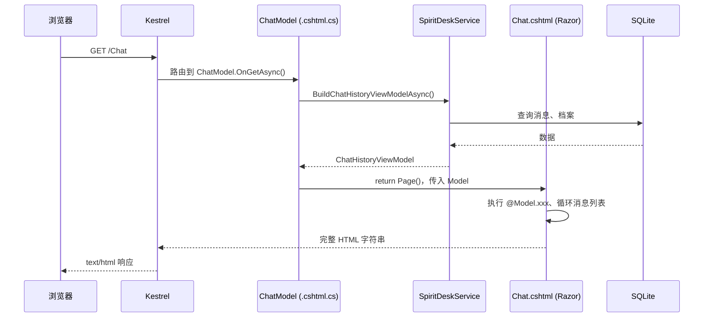

# 10 - SpiritDesk.Web 项目与 .cshtml 详解

> 回答三个常见问题：**Web 这个 csproj 到底是啥？** **`.cshtml` 到底是干什么的？** **是不是 SSR？**

---

## 1. `SpiritDesk.Web.csproj` 是做什么的？

它是 **ASP.NET Core 网站项目** 的工程文件，告诉 .NET：**按「网站」方式编译和运行**，而不是普通类库或控制台。

```xml
<Project Sdk="Microsoft.NET.Sdk.Web">
```

| 配置项 | 含义 |
|--------|------|
| `Microsoft.NET.Sdk.Web` | 启用 Web 专用能力：静态文件、`wwwroot`、Razor 编译、Kestrel 宿主等 |
| `TargetFramework net9.0` | 运行在 .NET 9 |
| `ProjectReference → SpiritDesk.Core` | 引用实体、常量，本项目的「数据形状」来自 Core |
| `EF Core Sqlite` | 操作 `spiritdesk.db` |
| `Identity.Core` | 密码哈希（注册账号用） |
| HealthChecks EF | `/healthz` 检查数据库是否可用 |

**编译后会得到什么？**

- `SpiritDesk.Web.dll` — 网站程序集（Razor 页面、Service、DbContext 都在里面）
- `wwwroot/` 整夹复制到输出目录 — 浏览器直接请求的 CSS/JS/图片
- 运行时可执行：`dotnet run` 或 Shell 内嵌启动

**它不负责什么？**

- 不做 Windows 窗口（那是 `SpiritDesk.Shell`）
- 不重复定义实体（在 `SpiritDesk.Core`）

**答辩一句话**：`SpiritDesk.Web.csproj` = **把 Core 里的数据模型，做成能浏览器访问的网站 + SQLite + 可选登录 + 给浮球用的 API**。

---

## 2. 整个 `SpiritDesk.Web` 项目职责（文件夹分工）

```
SpiritDesk.Web/
├── Program.cs              → 入口：Build + Run
├── SpiritDeskWebHost.cs    → 真正配置：DI、中间件、Razor、API、数据库路径
├── Pages/                  → 用户看到的页面（Razor Pages）
├── Services/               → 业务逻辑（任务、聊天、签到、LLM）
├── Data/                   → EF Core 连 SQLite
├── Models/                 → 页面展示用 ViewModel（不是数据库表）
├── Auth/、Helpers/         → 登录配置读取、.env、库结构修复
├── wwwroot/                → 静态文件（见 docs/basic/08-wwwroot与静态资源详解.md）
└── appsettings.json        → 是否开门禁、数据库连接串等
```

| 谁访问 | 走哪 |
|--------|------|
| 浏览器 / WebView2 | Razor Pages → 返回 **HTML** |
| 桌面浮球 | Minimal API `/api/companion/*` → 返回 **JSON** |
| 运维 | `GET /healthz` |

---

## 3. `.cshtml` 到底是什么？是不是 SSR？

### 3.1 结论（先背这句）

**是的，本项目网页是服务端渲染（SSR，Server-Side Rendering）。**

- `.cshtml` = **在服务器上**把 HTML 模板 + C# 数据 **拼成完整 HTML**，再发给浏览器。
- 浏览器收到的是 **已经填好内容的网页**，不是空壳 + 再调接口画界面（那种更像 SPA/CSR）。

### 3.2 和前端常见词对照

| 方式 | 谁渲染页面 | SpiritDesk 有没有 |
|------|------------|-------------------|
| **SSR（服务端渲染）** | 服务器（ASP.NET 执行 Razor） | ✅ **有**，全部 `.cshtml` |
| **CSR（客户端渲染）** | 浏览器里 React/Vue 跑 JS 画页面 | ❌ 没有独立前端工程 |
| **SPA 单页应用** | 一个 `index.html` + JS 路由换组件 | ❌ 不是；我们是多 URL 多页面 |
| **静态站** | 只有 HTML 文件，无 C# | ❌ 不是；数据来自 SQLite |

本项目 **有少量浏览器 JS**（`site.js`、日历），但 **页面骨架和列表数据** 仍是服务器在 `.cshtml` 里渲染好的，所以整体叫 **「Razor SSR + 轻量 JS 增强」**。

### 3.3 `.cshtml` 与 `.cshtml.cs` 各干什么

| 文件 | 运行时角色 | 编译后 |
|------|------------|--------|
| `Xxx.cshtml` | **视图模板**：HTML + `@Model`、`<form>` | 参与 Razor 编译，不单独成「页面类」 |
| `Xxx.cshtml.cs` | **PageModel**：`OnGet` / `OnPost`、调 Service、Redirect | 普通 C# 类，在 DLL 里 |

**一对文件** = 一个功能页：

- 文件名相同：`Chat.cshtml` + `Chat.cshtml.cs`
- `.cshtml` 第一行 `@model ChatModel` 必须对应 `.cshtml.cs` 里的 `class ChatModel`

### 3.4 打开 `/Chat` 时完整顺序（SSR 流程）



用户 **View Source** 能看到昵称、任务列表等已在 HTML 里——这就是 SSR 的特征。

### 3.5 `.cshtml` 里常见指令

| 写法 | 作用 |
|------|------|
| `@page` | 声明这是 Razor Page，并参与 URL 路由 |
| `@model XxxModel` | 本页强类型模型，页面里用 `@Model` |
| `@{ ... }` | C# 代码块：设 `ViewData["Title"]`、局部变量 |
| `@Model.Nickname` | 输出模型属性到 HTML |
| `<form method="post" asp-page-handler="SendMessage">` | POST 到 `OnPostSendMessageAsync` |
| `<partial name="_FloatingCompanion" />` | 嵌入共享片段 |
| `@* 注释 *@` | Razor 注释，不会出现在最终 HTML |

---

## 4. 本项目每一个 `.cshtml` 是干什么的

### 4.1 业务页面（有对应的 `.cshtml.cs`）

| 文件 | URL | 界面干什么 | 逻辑在 `.cshtml.cs` 里干什么 |
|------|-----|------------|------------------------------|
| `Pages/Index.cshtml` | `/`、`/Index` | 工作台：任务、聊天摘要、猜拳、日历区 | `OnGet` 拉桌面数据；多个 `OnPost*` 处理发消息、任务、互动 |
| `Pages/Chat.cshtml` | `/Chat` | 完整聊天记录、按精灵切换会话 | `OnGet` 加载历史；`OnPostSendMessage` 发消息 |
| `Pages/Assistant.cshtml` | `/Assistant` | 任务助手：签到、投喂等按钮 | `OnPostInteract` 调 `PerformActionAsync` |
| `Pages/Settings.cshtml` | `/Settings` | 改昵称、换精灵、重置演示数据 | `OnPostRename` / `OnPostSelectSpirit` / `OnPostResetDemoData` |
| `Pages/Spirits/Select.cshtml` | `/Spirits/Select` | 首次五选一精灵 + 填昵称 | `OnPost` 建档并 `SelectSpiritAsync` |
| `Pages/Login.cshtml` | `/Login` | 登录表单 | `OnPost` 校验账号、写 Cookie |
| `Pages/Register.cshtml` | `/Register` | 注册表单 | `OnPost` 写 `WebAccounts` 表 |
| `Pages/Logout.cshtml` | `/Logout` | 通常只有一个自动提交的 POST 表单 | `OnPost` 清 Cookie → 跳转登录 |
| `Pages/Error.cshtml` | `/Error` | 出错时显示 RequestId | `OnGet` 取追踪 ID |
| `Pages/Privacy.cshtml` | `/Privacy` | 隐私政策占位文案 | `OnGet` 空 |

### 4.2 布局与共享片段（多数没有 `.cshtml.cs`）

| 文件 | 干什么 | 谁引用 |
|------|--------|--------|
| `Pages/_ViewStart.cshtml` | 规定默认 `Layout = "_Layout"` | 自动作用于所有页面 |
| `Pages/_ViewImports.cshtml` | 全局 `@using`、Tag Helpers | 自动注入每个 `.cshtml` |
| `Pages/Shared/_Layout.cshtml` | HTML 外壳：`<head>` 引 `site.css`、`site.js`，`<body>` 里 `@RenderBody()` | 几乎所有业务页的外壳 |
| `Pages/Shared/_FloatingCompanion.cshtml` | **网页内**右下角悬浮精灵按钮（不是桌面浮球） | 工作台等页面 partial |
| `Pages/Shared/_SidebarCollapseToggle.cshtml` | 侧栏折叠按钮 | `_Layout` 或工作台 |
| `Pages/Shared/_ValidationScriptsPartial.cshtml` | jQuery 表单校验脚本 | 登录/注册等需要时引入 |

### 4.3 和 `wwwroot` 的关系（一句话）

- **`.cshtml`**：动态 HTML（数据来自数据库，每次请求可能不同）→ **SSR**
- **`wwwroot`**：固定文件（CSS、JS、PNG），路径不变 → **静态资源**，不经 Razor

详见：[basic/08-wwwroot与静态资源详解.md](./basic/08-wwwroot与静态资源详解.md)（含 **§0 wwwroot 是怎么来的、谁写的**）。

---

## 5. 老师可能追问的标准答法


**问：你们前端用的什么框架？**  
答：没有用 React/Vue。页面是 **ASP.NET Core Razor Pages**，**.cshtml 在服务器渲染成 HTML（SSR）**，样式在 `wwwroot/css/site.css`，少量交互用 `wwwroot/js/site.js`。

**问：`.cshtml` 和 `.html` 有啥区别？**  
答：`.html` 通常是静态的；`.cshtml` 里可以写 C#（`@Model`），**每次请求在服务器执行**，把数据库里的昵称、任务列表嵌进 HTML 再返回。

**问：`SpiritDesk.Web` 和 `Shell` 关系？**  
答：Web 是网站和 API；Shell 是 WPF 壳，**WebView2 打开的就是 Web 站点**，业务不重复写两套。

---

## 6. 相关文档

| 文档 | 内容 |
|------|------|
| [00-项目结构与排布.md](./00-项目结构与排布.md) §1.3 | Razor Pages 入门（已扩充 SSR） |
| [05-CSharp-Razor-Pages与页面模型.md](./05-CSharp-Razor-Pages与页面模型.md) | PageModel、Handler、表单 |
| [02-CSharp-Web启动与SpiritDeskWebHost.md](./02-CSharp-Web启动与SpiritDeskWebHost.md) | 宿主、中间件 |
| [basic/08-wwwroot与静态资源详解.md](./basic/08-wwwroot与静态资源详解.md) | 静态资源专篇 |
