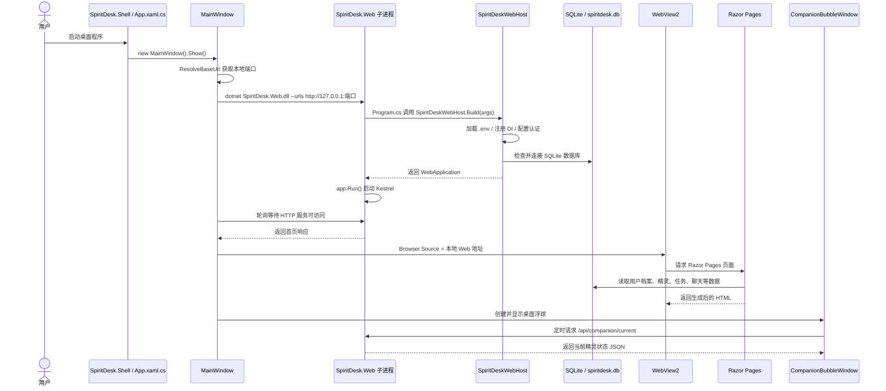
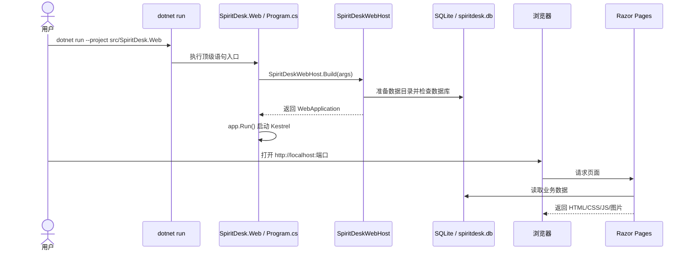
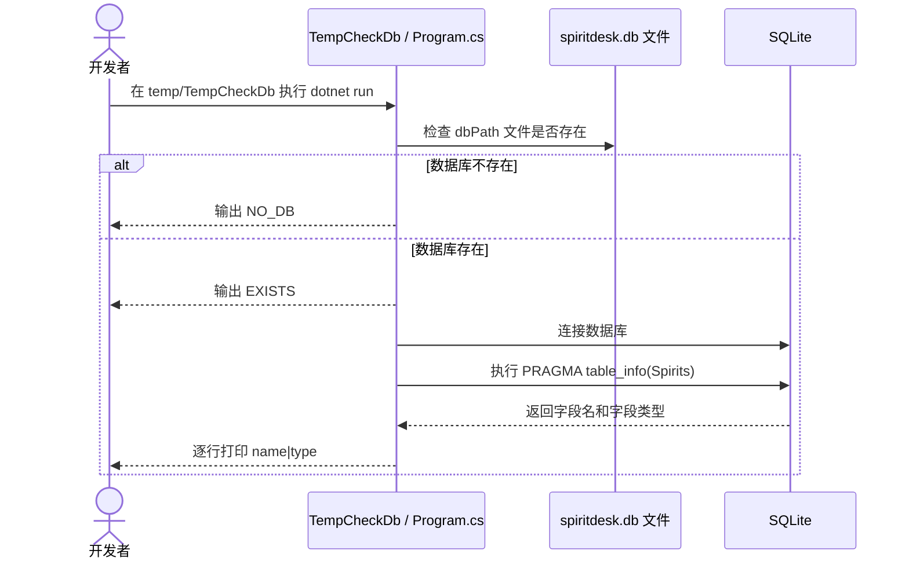

# Program 入口与桌面 Web 运行原理

本文专门解释三个容易混淆的问题：

- `temp/TempCheckDb/Program.cs` 是干什么的；
- `src/SpiritDesk.Web/Program.cs` 里“Web 应用入口”是什么意思；
- 为什么这是桌面程序，却还要启动 Web 服务，以及“顶级语句 / 无 Main 方法”是什么。

## 1. 先说结论

这个项目不是单纯的传统桌面程序，也不是单纯的网站，而是一个“桌面壳 + 本地 Web 服务”的组合：

- `SpiritDesk.Shell` 是桌面外壳，负责 WPF 窗口、WebView2、桌面浮球；
- `SpiritDesk.Web` 是网页服务，负责 Razor Pages 页面、登录注册、数据库、业务逻辑、API；
- 桌面窗口里看到的主要界面，其实是 WebView2 加载本地 Web 服务页面；
- `temp/TempCheckDb` 只是临时排错工具，不参与主程序运行。

所以“Web 应用入口”不是说这个项目只能作为浏览器网站运行，而是说 `SpiritDesk.Web` 这个子项目本身是一个 ASP.NET Core Web 服务。桌面程序运行时也会用到它。

## 2. `temp/TempCheckDb/Program.cs` 是干什么的

`temp/TempCheckDb/Program.cs` 是一个临时数据库检查工具。它的作用是：开发或排错时，手动连接某个 `spiritdesk.db` SQLite 数据库，然后打印 `Spirits` 表的字段名和字段类型。

它不是主项目入口，也不是桌面程序入口。

### 代码做了什么

核心逻辑如下：

```csharp
var dbPath = @"d:\software_construction\program\src\SpiritDesk.Shell\bin\Debug\net9.0-windows\data\spiritdesk.db";

Console.WriteLine(System.IO.File.Exists(dbPath) ? "EXISTS" : "NO_DB");

if (!System.IO.File.Exists(dbPath))
    return;

using var conn = new SqliteConnection($"Data Source={dbPath}");
conn.Open();

using var cmd = conn.CreateCommand();
cmd.CommandText = "PRAGMA table_info(Spirits);";
```

逐步解释：

1. `dbPath` 是要检查的 SQLite 数据库路径。
2. 先判断数据库文件是否存在。
3. 如果不存在，打印 `NO_DB` 并退出。
4. 如果存在，用 `SqliteConnection` 连接数据库。
5. 执行 SQLite 的 `PRAGMA table_info(Spirits);`。
6. 读取返回结果，打印每个字段的字段名和字段类型。

### 为什么放在 `temp`

因为它只是临时排错用的工具，主要用于确认：

- Shell 运行时是否真的生成了 `spiritdesk.db`；
- `Spirits` 表里有哪些字段；
- 数据库结构和 EF Core 实体类是否一致。

它不应该被理解为 SpiritDesk 的正式功能模块。

### 答辩怎么讲

可以这样说：

> `temp/TempCheckDb` 是开发阶段的临时 SQLite 检查工具，用来快速查看本地数据库表结构。它不参与主程序运行，也不是用户会打开的功能，只是调试数据库结构时用的辅助控制台程序。

## 3. `src/SpiritDesk.Web/Program.cs` 是什么入口

`src/SpiritDesk.Web/Program.cs` 只有两行核心代码：

```csharp
var app = SpiritDesk.Web.SpiritDeskWebHost.Build(args);
app.Run();
```

它是 `SpiritDesk.Web` 这个 ASP.NET Core Web 子项目的入口。它负责启动 Web 服务，也就是启动 Kestrel 服务器，让 Razor Pages、静态资源、API 能被访问。

这里的“Web 应用入口”更准确地说是“Web 服务入口”。

### 什么是 Kestrel

Kestrel 是 ASP.NET Core 自带的 Web 服务器。可以把它理解为程序内部启动的一个 HTTP 服务。

当 `app.Run()` 执行后，Web 服务开始监听地址，例如：

```text
http://127.0.0.1:5188
```

之后浏览器、WebView2、浮球的 `HttpClient` 都可以通过 HTTP 请求访问它。

## 4. 不是桌面程序吗，为什么还有 Web 入口

因为本项目采用的是“桌面壳承载 Web 页面”的架构。

传统 WPF 桌面程序通常是这样：

```text
WPF 窗口
  ↓
XAML 控件直接画界面
  ↓
C# 事件处理业务
```

而本项目更像这样：

```text
WPF 桌面壳
  ↓
启动本地 Web 服务
  ↓
WebView2 加载 http://127.0.0.1:端口
  ↓
Razor Pages 生成页面
  ↓
用户在桌面窗口里操作网页界面
```

也就是说：用户看到的是桌面窗口，但窗口里面嵌的是网页页面。

这种方式的好处是：

- 页面 UI 可以用 Web 技术写，样式、布局更灵活；
- 同一套 `SpiritDesk.Web` 既可以被浏览器打开，也可以被桌面壳打开；
- 登录、注册、数据库、API 等逻辑集中在 Web 项目里；
- WPF Shell 专注于桌面能力，例如窗口、浮球、WebView2、启动本地服务。

## 5. 两个正式入口分别是谁

### 桌面入口：`SpiritDesk.Shell`

桌面程序入口在：

```text
src/SpiritDesk.Shell/App.xaml
src/SpiritDesk.Shell/App.xaml.cs
```

`App.xaml.cs` 里有：

```csharp
protected override void OnStartup(StartupEventArgs e)
{
    base.OnStartup(e);
    var window = new MainWindow();
    window.Show();
}
```

这表示 WPF 程序启动后创建 `MainWindow` 并显示。

### Web 入口：`SpiritDesk.Web`

Web 服务入口在：

```text
src/SpiritDesk.Web/Program.cs
```

它负责：

- 调用 `SpiritDeskWebHost.Build(args)`；
- 注册数据库、认证、Razor Pages、业务服务、API；
- 调用 `app.Run()` 启动 Web 服务。

### 两者的关系

`SpiritDesk.Shell` 是外壳，`SpiritDesk.Web` 是内容服务。

桌面模式运行时，Shell 会启动或连接 Web 服务，然后把 Web 页面显示在 WebView2 里。

## 6. 顶级语句是什么

“顶级语句”是 C# 9 开始支持的一种简化写法。以前 C# 程序入口通常要这样写：

```csharp
using SpiritDesk.Web;

namespace SpiritDesk.Web;

public class Program
{
    public static void Main(string[] args)
    {
        var app = SpiritDeskWebHost.Build(args);
        app.Run();
    }
}
```

现在可以简化成：

```csharp
var app = SpiritDesk.Web.SpiritDeskWebHost.Build(args);
app.Run();
```

这两种写法本质上差不多。顶级语句只是省略了外层的 `Program` 类和 `Main` 方法，由编译器在背后自动生成。

## 7. 无 Main 方法为什么还能运行

不是没有 `Main`，而是源码里没有显式写出来。

使用顶级语句时，编译器会自动生成一个类似这样的入口：

```csharp
internal class Program
{
    private static void Main(string[] args)
    {
        var app = SpiritDesk.Web.SpiritDeskWebHost.Build(args);
        app.Run();
    }
}
```

所以 `dotnet run` 或双击程序时，.NET 仍然知道从哪里开始执行。

答辩时可以这样说：

> C# 顶级语句是一种入口简写。源码里没有显式写 `Main`，但编译器会自动生成隐式 `Program.Main`。所以程序仍然有入口，只是写法更简洁。

## 8. `SpiritDeskWebHost.Build` 为什么要单独抽出来

如果所有 Web 启动配置都写在 `Program.cs`，Web 项目自己运行没问题，但桌面 Shell 想复用就不方便。

现在项目把复杂启动逻辑放在：

```text
src/SpiritDesk.Web/SpiritDeskWebHost.cs
```

`Program.cs` 只负责：

```csharp
var app = SpiritDesk.Web.SpiritDeskWebHost.Build(args);
app.Run();
```

这样好处是：

- 浏览器模式可以直接运行 `SpiritDesk.Web`；
- 桌面 Shell 也能启动同一套 Web 服务；
- 数据库、认证、Razor Pages、API 的注册逻辑只有一份；
- 入口文件保持很短，真正配置集中在 `SpiritDeskWebHost`。

## 9. 桌面模式运行时序图

下面是用户启动桌面程序时的大致流程：



## 10. 浏览器直接运行 Web 的时序图

如果不启动桌面 Shell，而是直接运行 Web 项目，流程会更短：



## 11. 临时数据库工具运行时序图

`temp/TempCheckDb` 的流程和主程序无关，它只是手动检查数据库：



## 12. 一句话总结

可以把整个项目理解成：

> `SpiritDesk.Shell` 是桌面外壳，负责打开窗口和浮球；`SpiritDesk.Web` 是本地 Web 服务，负责页面、业务、数据库和 API；桌面窗口通过 WebView2 显示 Web 页面；`temp/TempCheckDb` 只是临时数据库检查工具，不属于正式运行链路。

