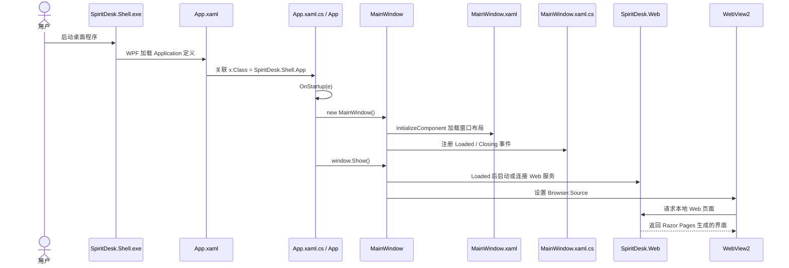

# WPF App.xaml 与 App.xaml.cs 详解

本文专门解释：

- `src/SpiritDesk.Shell/App.xaml.cs` 是干什么的；
- `@src/SpiritDesk.Shell/App.xaml.cs:2` 里的 `:2` 是什么意思；
- 为什么 WPF 里经常同时存在 `.xaml` 和 `.xaml.cs` 两个文件；
- 本项目桌面 Shell 是如何从 `App` 启动到 `MainWindow` 的。

## 1. `App.xaml.cs` 是干什么的

`App.xaml.cs` 是 WPF 桌面程序的应用级代码文件。它对应旁边的 `App.xaml`，共同组成本项目的 WPF 应用对象 `SpiritDesk.Shell.App`。

本项目里的代码是：

```csharp
using System.Windows;

namespace SpiritDesk.Shell;

public partial class App : Application
{
    protected override void OnStartup(StartupEventArgs e)
    {
        base.OnStartup(e);
        var window = new MainWindow();
        window.Show();
    }
}
```

它的核心职责很简单：

1. 表示这是一个 WPF 应用程序类；
2. 在程序启动时执行 `OnStartup`；
3. 创建主窗口 `MainWindow`；
4. 调用 `window.Show()` 把窗口显示出来。

所以可以把 `App.xaml.cs` 理解成：

> 桌面程序启动后最先执行的应用级逻辑。它不负责页面具体内容，而是负责把主窗口启动起来。

## 2. `@src/SpiritDesk.Shell/App.xaml.cs:2` 是什么意思

`@src/SpiritDesk.Shell/App.xaml.cs:2` 是一种“文件路径 + 行号”的引用写法。

拆开看：

| 部分 | 含义 |
|------|------|
| `src/SpiritDesk.Shell/App.xaml.cs` | 文件路径 |
| `:2` | 第 2 行 |

所以它的意思是：

> 打开 `src/SpiritDesk.Shell/App.xaml.cs` 这个文件，并定位到第 2 行。

第 2 行内容是：

```csharp
// App.xaml.cs — WPF 应用程序入口（对应 App.xaml 的 Application 定义）
```

这是一行注释，意思是：这个文件是 WPF 应用程序入口相关代码，它和 `App.xaml` 里的 `Application` 定义是一对。

这里的 `:2` 不是 C# 语法，也不是代码的一部分，只是编辑器或文档里常见的定位方式。

## 3. 什么是 XAML

XAML 全称是 Extensible Application Markup Language，可以理解为 WPF 用来描述界面的 XML 语言。

它主要负责写“界面长什么样”，例如：

- 窗口；
- 按钮；
- 文本；
- 网格布局；
- 颜色；
- 字体；
- 控件层级；
- 资源样式。

例如 `MainWindow.xaml` 里有：

```xml
<Window x:Class="SpiritDesk.Shell.MainWindow"
        Title="SpiritDesk"
        Width="1600"
        Height="980">
    <Grid>
        <TextBlock Text="SpiritDesk" />
    </Grid>
</Window>
```

这类内容更像是在声明 UI 结构。

## 4. 什么是 `.xaml.cs`

`.xaml.cs` 通常叫“代码后置文件”，英文是 code-behind。

它负责写“界面背后的 C# 逻辑”，例如：

- 窗口启动后做什么；
- 按钮点击后做什么；
- 事件绑定；
- 调用服务；
- 修改控件属性；
- 启动 WebView2；
- 关闭窗口时释放资源。

例如 `MainWindow.xaml.cs` 里会写：

```csharp
public MainWindow()
{
    InitializeComponent();
    Loaded += OnLoaded;
    Closing += OnClosing;
}
```

这表示窗口构造时先加载 XAML 里定义的控件，然后注册加载和关闭事件。

## 5. 为什么 `.xaml` 和 `.xaml.cs` 要同时存在

因为 WPF 把“界面声明”和“行为逻辑”分开了。

可以这样理解：

| 文件 | 负责什么 | 类比 |
|------|----------|------|
| `.xaml` | 界面结构和样式 | HTML / XML 布局 |
| `.xaml.cs` | C# 事件和业务逻辑 | JavaScript / 后台代码 |

这种拆分的好处是：

- UI 布局更直观；
- C# 逻辑更清晰；
- 设计器可以读取 XAML 显示预览；
- 程序员不用在 C# 里手写大量控件创建代码；
- 一个窗口的“长相”和“行为”可以放在两个文件里管理。

## 6. `App.xaml` 与 `App.xaml.cs` 怎么连起来

`App.xaml` 里有：

```xml
<Application x:Class="SpiritDesk.Shell.App"
             xmlns="http://schemas.microsoft.com/winfx/2006/xaml/presentation"
             xmlns:x="http://schemas.microsoft.com/winfx/2006/xaml">
    <Application.Resources>
    </Application.Resources>
</Application>
```

关键是这一句：

```xml
x:Class="SpiritDesk.Shell.App"
```

它告诉 WPF：

> 这个 XAML 文件对应的 C# 类是 `SpiritDesk.Shell.App`。

然后 `App.xaml.cs` 里有：

```csharp
namespace SpiritDesk.Shell;

public partial class App : Application
{
}
```

关键是：

```csharp
partial class App
```

`partial` 表示“分部类”。也就是说，`App` 这个类不是只写在一个文件里，而是可以分成多个文件共同组成。

在 WPF 里：

- `App.xaml` 会被 XAML 编译器转换成一部分 C# 代码；
- `App.xaml.cs` 是我们自己写的另一部分 C# 代码；
- 两部分最终合并成同一个 `SpiritDesk.Shell.App` 类。

## 7. 为什么代码里没有 `InitializeComponent`

很多 WPF 窗口的 `.xaml.cs` 构造函数里都会看到：

```csharp
InitializeComponent();
```

例如 `MainWindow.xaml.cs`：

```csharp
public MainWindow()
{
    InitializeComponent();
    Loaded += OnLoaded;
    Closing += OnClosing;
}
```

`InitializeComponent()` 是 XAML 编译器生成的方法，用来读取并初始化 `.xaml` 里声明的控件。

但本项目的 `App.xaml.cs` 里没有显式调用 `InitializeComponent()`：

```csharp
protected override void OnStartup(StartupEventArgs e)
{
    base.OnStartup(e);
    var window = new MainWindow();
    window.Show();
}
```

原因是这个 `App.xaml` 目前只定义了空的 `Application.Resources`，没有复杂资源，也没有在 XAML 里指定 `StartupUri`。项目选择在 `OnStartup` 里手动创建 `MainWindow`，启动逻辑更直接。

## 8. `Application` 是什么

`Application` 是 WPF 提供的应用程序基类，来自：

```csharp
using System.Windows;
```

`App` 继承它：

```csharp
public partial class App : Application
```

意思是：`App` 是一个 WPF 应用程序对象。

它可以管理：

- 程序启动；
- 程序关闭；
- 全局资源；
- 全局异常；
- 应用生命周期事件。

本项目目前主要用它处理启动事件。

## 9. `OnStartup` 是什么

`OnStartup` 是 WPF 应用启动时会调用的方法。

本项目重写它：

```csharp
protected override void OnStartup(StartupEventArgs e)
{
    base.OnStartup(e);
    var window = new MainWindow();
    window.Show();
}
```

逐行解释：

| 代码 | 作用 |
|------|------|
| `protected override void OnStartup(StartupEventArgs e)` | 重写 WPF 启动方法 |
| `base.OnStartup(e);` | 先执行 WPF 默认启动逻辑 |
| `var window = new MainWindow();` | 创建主窗口对象 |
| `window.Show();` | 显示主窗口 |

`StartupEventArgs e` 可以拿到命令行参数，但本项目暂时没有使用。

## 10. 为什么不用 `StartupUri`

WPF 也可以在 `App.xaml` 里写：

```xml
<Application x:Class="SpiritDesk.Shell.App"
             StartupUri="MainWindow.xaml">
</Application>
```

这样 WPF 会自动打开 `MainWindow`。

但本项目选择在 `App.xaml.cs` 里手动写：

```csharp
var window = new MainWindow();
window.Show();
```

这样更适合后续扩展，例如：

- 启动前读取配置；
- 启动前检查环境；
- 根据参数决定打开哪个窗口；
- 初始化日志；
- 捕获启动异常；
- 以后接入托盘、单实例、更新检查等桌面能力。

## 11. 本项目从 App 到主界面的启动流程



## 12. `App.xaml`、`MainWindow.xaml` 的区别

| 文件 | 级别 | 作用 |
|------|------|------|
| `App.xaml` | 应用级 | 定义整个 WPF 应用、全局资源 |
| `App.xaml.cs` | 应用级 | 处理启动逻辑，创建主窗口 |
| `MainWindow.xaml` | 窗口级 | 定义主窗口界面结构 |
| `MainWindow.xaml.cs` | 窗口级 | 处理主窗口逻辑，启动 Web 服务和 WebView2 |

简单说：

- `App` 管“程序怎么启动”；
- `MainWindow` 管“主窗口里面怎么显示和运行”。

## 13. 答辩怎么讲

### Q1：`App.xaml.cs` 是什么？

可以答：

> `App.xaml.cs` 是 WPF 应用的代码后置文件，和 `App.xaml` 共同组成 `App` 应用类。本项目在这里重写 `OnStartup`，程序启动后手动创建并显示 `MainWindow`。

### Q2：为什么有 `.xaml` 又有 `.xaml.cs`？

可以答：

> WPF 使用 XAML 写界面结构，用 `.xaml.cs` 写对应的 C# 逻辑。两者通过 `x:Class` 和 `partial class` 绑定成同一个类。这样可以把界面和行为分开，代码更清晰。

### Q3：`:2` 是什么意思？

可以答：

> `:2` 是文件定位里的行号，表示这个路径对应文件的第 2 行，不是 C# 语法。

### Q4：这个文件是不是整个项目的唯一入口？

可以答：

> 它是桌面 Shell 的应用入口之一，负责启动 WPF 主窗口。但项目里还有 `SpiritDesk.Web/Program.cs`，那是 Web 服务入口。桌面程序会启动或连接 Web 服务，然后用 WebView2 显示页面。

## 14. 一句话总结

`App.xaml` 负责声明 WPF 应用对象和全局资源，`App.xaml.cs` 负责应用启动时的 C# 逻辑；两者通过 `x:Class` 和 `partial class` 合成同一个 `App` 类。本项目在 `App.xaml.cs` 里创建 `MainWindow`，再由主窗口启动 Web 服务并用 WebView2 显示页面。

