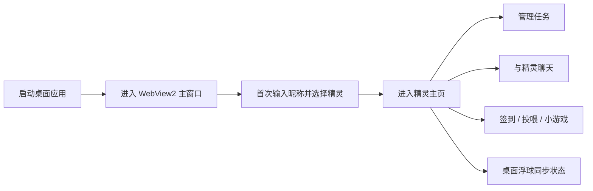
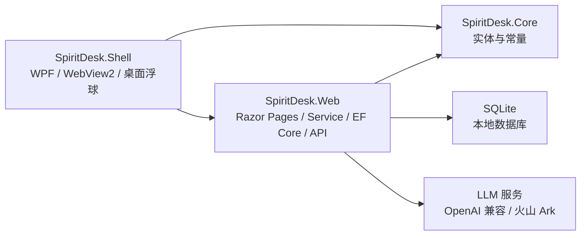
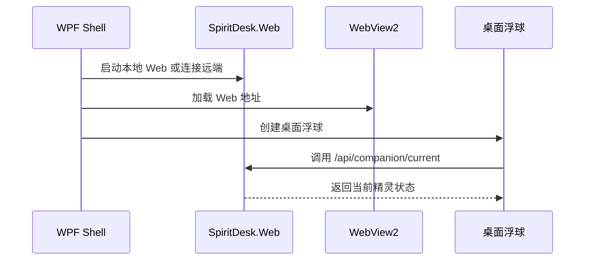
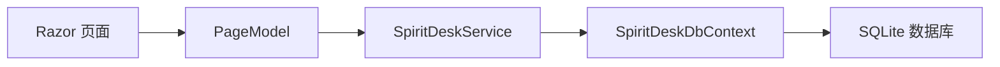
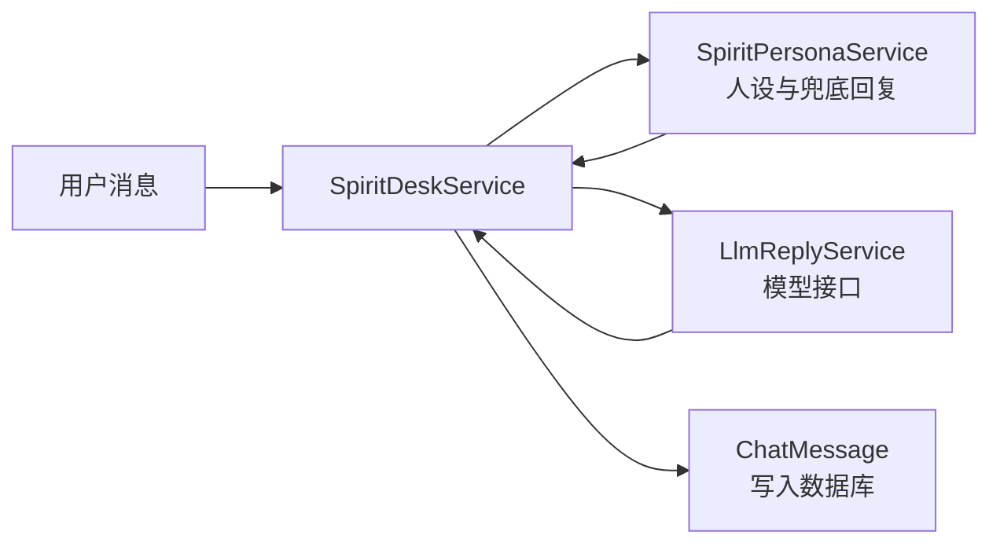

# SpiritDesk 系统介绍 PPT 写作提纲

## 是否需要写得很详细？

不需要像《项目汇总：架构层次、类关系与控件交互流程》那样写得非常细。

PPT 的目标是“让听众快速理解系统做什么、怎么用、技术上有什么亮点”，不是完整技术文档。因此建议采用“功能演示为主，技术解释为辅”的写法：

- 系统功能要讲清楚：用户能做什么、解决什么问题、演示流程是什么。
- 关键技术要讲到位：说明为什么选 WPF、WebView2、ASP.NET Core Razor Pages、EF Core、SQLite、LLM 接入等。
- 页面效果直接用截图呈现：每张截图只配 2 到 4 个重点说明，不要堆代码。
- 架构和类关系只放简化版：说明三层工程关系和核心数据流即可，不需要展开每一个类和方法。
- 时序流程只保留关键闭环：启动流程、任务流程、聊天流程、浮球同步流程即可。

推荐比例：

| 内容类型 | 建议占比 | 写法 |
| --- | --- | --- |
| 系统背景与定位 | 10% | 说明项目是什么、面向什么场景 |
| 系统功能与页面截图 | 45% | 以截图和演示流程为主 |
| 关键技术与架构 | 30% | 讲核心技术栈、分层、数据流 |
| 总结与亮点 | 15% | 强调桌面 + Web 融合、数据持久化、LLM 兜底等 |

## PPT 总体结构建议

建议控制在 12 到 16 页。如果是课程答辩或项目展示，最好不要超过 18 页。

整体叙事顺序：

1. 先说明项目定位：这是一个“桌面精灵伴侣 Agent”。
2. 再展示功能效果：桌面壳、浮球、首页、聊天、任务、互动、设置。
3. 然后讲技术实现：三工程结构、Web + Shell 融合、EF Core + SQLite、LLM 回复。
4. 最后总结亮点和可扩展方向。

## 第 1 页：封面

标题建议：

> SpiritDesk 桌面精灵伴侣系统

副标题建议：

> 基于 WPF + WebView2 + ASP.NET Core 的桌面陪伴 Agent 应用

页面内容：

- 项目名称：SpiritDesk / DesktopCompanion
- 成员姓名、班级、课程名称
- 日期

建议截图：

- 可以放桌面浮球或系统首页截图作为视觉背景。

讲解重点：

- 一句话说明系统：这是一个将 Web 应用嵌入桌面端，并通过桌面浮球提供陪伴、任务管理和聊天互动的系统。

## 第 2 页：项目背景与目标

标题建议：

> 项目背景与设计目标

页面内容：

- 传统待办工具偏工具化，缺少持续陪伴感。
- 普通聊天机器人缺少任务、日常互动和本地桌面入口。
- 本项目希望把“任务管理 + 精灵陪伴 + 聊天 Agent + 桌面浮球”结合起来。

可以写成三点目标：

- 提供桌面级陪伴入口：系统级浮球常驻屏幕。
- 提供轻量任务管理：新建、编辑、完成、删除、到期提醒。
- 提供个性化精灵互动：五种精灵人设、聊天、投喂、签到和小游戏。

建议截图：

- 暂无必要，可用图标或简化概念图。

讲解重点：

- 强调系统不是单纯网页，也不是单纯聊天机器人，而是“桌面 + Web + Agent”的组合。

## 第 3 页：系统总体功能

标题建议：

> 系统功能总览

页面内容：

可以用功能模块图或列表：

| 功能模块 | 说明 |
| --- | --- |
| 首次建档 | 输入昵称，选择一位精灵伙伴 |
| 精灵主页 | 展示当前精灵、养成数值、今日任务、提醒和聊天摘要 |
| 任务管理 | 新增、编辑、完成、删除任务，支持截止时间 |
| 精灵聊天 | 按精灵分线程保存聊天历史，支持 LLM 或规则兜底回复 |
| 日常互动 | 签到、投喂、鼓励、陪学、休息提醒 |
| 猜拳小游戏 | 与精灵互动，影响金币和亲密度 |
| 桌面浮球 | 常驻桌面，支持展开面板、切换精灵、状态同步 |
| 登录注册 | 可配置的演示门禁，支持 Cookie 登录 |

建议截图：

- 可以放一张首页总览截图，标注主要区域。

讲解重点：

- 这一页不要讲技术细节，主要让听众知道系统有哪些可演示功能。

## 第 4 页：系统使用流程

标题建议：

> 用户使用流程

页面内容：

推荐画成流程：

建议截图：

- 可放 2 到 3 张小截图：启动主窗口、选择精灵、主页。

讲解重点：

- 这页用于连接后面的功能截图，告诉老师演示顺序。

## 第 5 页：桌面端入口与浮球效果

标题建议：

> 桌面端入口：WPF Shell 与桌面浮球

页面内容：

- `SpiritDesk.Shell` 是 Windows 桌面宿主。
- 主窗口使用 WebView2 加载 Web 系统。
- 桌面浮球独立于网页窗口存在，支持置顶、拖拽、展开/收起。
- 浮球通过 Web API 获取当前精灵状态。

建议截图：

- 桌面浮球收起状态截图。
- 浮球展开面板截图。
- 主窗口 WebView2 截图。

讲解重点：

- 强调“系统级浮球”和“网页内悬浮组件”不同：真正贴在桌面上的浮球来自 WPF Shell。

## 第 6 页：首次建档与精灵选择

标题建议：

> 首次建档：五位精灵伙伴

页面内容：

- 用户输入昵称。
- 从五位精灵中选择一个作为当前伙伴。
- 每位精灵有不同 MBTI、人设、主题色、对话风格和数值加成。

五位精灵可简要列出：

| 精灵 | 定位 | 特点 |
| --- | --- | --- |
| 卷卷晴 | 效率型陪伴 | 任务推进、完成任务亲密度加成 |
| 嘻嘻滴 | 情绪型陪伴 | 快乐反馈、投喂心情加成 |
| 贴贴朵 | 社交型陪伴 | 温和倾听、签到奖励加成 |
| 慢慢壤 | 疗愈型陪伴 | 情绪养护、回归补偿 |
| 新新星 | 探索型陪伴 | 新思路、小游戏次数加成 |

建议截图：

- `/Spirits/Select` 页面截图。

讲解重点：

- 说明精灵不是只换图片，而是影响文案、聊天风格和部分数值机制。

## 第 7 页：精灵主页页面效果

标题建议：

> 精灵主页：状态、任务与聊天聚合

页面内容：

- 顶部展示问候语、当前精灵和快捷入口。
- 成长卡片展示心情值、亲密度、等级、金币。
- 任务区展示今日待办和 24 小时内到期任务。
- 聊天摘要展示最近对话。
- 页面主题色跟随当前精灵变化。

建议截图：

- `/Index` 首页完整截图。
- 可以用框标注：精灵状态区、任务区、聊天区、日历区。

讲解重点：

- 强调首页是系统的核心工作台，聚合了养成、任务和聊天三类信息。

## 第 8 页：任务管理与日历视图

标题建议：

> 任务管理：待办、提醒与日历视图

页面内容：

- 支持任务新增、编辑、删除、完成。
- 支持截止时间，用于到期提醒。
- 日历视图支持日、周、月切换。
- 完成任务会影响精灵亲密度、心情值、金币和等级。

建议截图：

- 首页任务管理区域截图。
- 日历周视图或月视图截图。
- 任务编辑框截图。

讲解重点：

- 任务不是孤立功能，它和精灵养成系统联动，完成任务会获得即时反馈。

## 第 9 页：精灵聊天功能

标题建议：

> 精灵聊天：按人设生成回复

页面内容：

- 聊天页按精灵分线程展示对话。
- 用户消息和精灵回复都会保存到 SQLite。
- `SpiritPersonaService` 负责构造不同精灵的人设和规则回复。
- `LlmReplyService` 可调用 OpenAI 兼容接口或火山 Ark。
- 未配置 API Key 或请求失败时，系统使用规则回复兜底，保证演示可用。

建议截图：

- `/Chat` 页面截图。
- 聊天输入框和聊天历史区域截图。

讲解重点：

- 不需要展示 LLM 请求代码，只说明“模型回复 + 规则兜底”的设计，体现可靠性。

## 第 10 页：互动与小游戏

标题建议：

> 日常互动：签到、投喂与猜拳小游戏

页面内容：

- 用户可以进行签到、投喂、鼓励、陪学、休息提醒等互动。
- 每日互动次数通过 `DailyActionLog` 记录。
- 猜拳小游戏通过随机出拳计算胜负，并奖励金币/亲密度。
- 不同精灵会影响部分奖励机制。

建议截图：

- 猜拳小游戏弹窗截图。
- 互动按钮区域截图。
- 操作成功后的提示条截图。

讲解重点：

- 说明互动系统让应用不只是“管理任务”，而是有养成反馈和陪伴感。

## 第 11 页：设置与登录注册

标题建议：

> 设置与账号：昵称、精灵切换和演示门禁

页面内容：

- 设置页支持修改昵称。
- 支持切换当前精灵。
- 支持重置演示数据。
- 登录注册功能可通过配置开启或关闭。
- Cookie 登录状态可被 WebView2 使用，桌面浮球调用 API 时也能带上登录 Cookie。

建议截图：

- `/Settings` 设置页截图。
- `/Login` 登录页截图。
- `/Register` 注册页截图。

讲解重点：

- 如果答辩重点不是认证，可以简要讲，只强调这是“可配置演示门禁”。

## 第 12 页：系统总体架构

标题建议：

> 系统架构：Core + Web + Shell 三层工程

页面内容：

建议放简化架构图：

说明文字：

- `Core`：放实体模型和精灵 ID 常量。
- `Web`：负责页面、业务逻辑、数据库和 API。
- `Shell`：负责桌面窗口、WebView2 和系统级浮球。

建议截图：

- 可以不用截图，使用架构图即可。

讲解重点：

- 这页只讲“谁依赖谁、谁负责什么”，不展开所有类。

## 第 13 页：关键技术一：WPF + WebView2 桌面融合

标题建议：

> 关键技术：WPF 与 WebView2 融合

页面内容：

- WPF 提供原生桌面能力：窗口、置顶、透明浮窗、拖拽、系统级入口。
- WebView2 复用 Web 页面：桌面端不需要重写一套 UI。
- `MainWindow` 启动或连接 Web 服务，再将地址加载到 WebView2。
- `CompanionBubbleWindow` 独立调用 Web API 同步状态。

建议流程图：

建议截图：

- 主窗口 + 浮球同屏截图。

讲解重点：

- 这是项目的一个亮点：Web 负责内容，WPF 负责桌面体验。

## 第 14 页：关键技术二：Razor Pages + EF Core + SQLite

标题建议：

> 关键技术：Razor Pages 与本地数据持久化

页面内容：

- Razor Pages 使用 `cshtml + PageModel` 管理页面与表单。
- `SpiritDeskService` 统一处理任务、聊天、互动、精灵选择等业务。
- EF Core 通过 `SpiritDeskDbContext` 映射实体到 SQLite。
- SQLite 保存登录账号、用户档案、任务、聊天、每日互动；注册账号会绑定自己的 `UserProfile`。

建议简化数据流：

建议截图：

- 可以放数据库文件位置或任务完成后数据保留的演示截图。

讲解重点：

- 强调“重启后数据仍然保留”，体现持久化价值。

## 第 15 页：关键技术三：精灵人设与 LLM 兜底机制

标题建议：

> 关键技术：精灵人设与智能回复

页面内容：

- `SpiritDefinition` 保存精灵名称、定位、人设、主题色、机制加成。
- `SpiritPersonaService` 根据当前精灵生成问候语、提示语、互动回复和 LLM system prompt。
- `LlmReplyService` 负责调用外部模型接口。
- 如果没有配置模型 Key 或请求失败，系统返回规则脚本回复，保证演示稳定。

建议流程图：

建议截图：

- 聊天页中不同精灵对话截图。

讲解重点：

- 讲“设计思想”即可，不必展示 HTTP 请求细节。

## 第 16 页：系统亮点总结

标题建议：

> 系统亮点与创新点

页面内容：

可以总结为 5 点：

- 桌面 + Web 双形态：同一套 Web 系统既能浏览器运行，也能被 WPF 桌面壳承载。
- 系统级桌面浮球：提供常驻陪伴入口，支持拖拽、置顶、展开面板和精灵切换。
- 账号档案隔离：注册用户拥有独立昵称、精灵、任务、聊天和每日互动数据。
- 任务与养成联动：任务完成会影响心情、亲密度、金币和等级。
- 多精灵人设：五位精灵拥有不同风格、文案和数值机制。
- 稳定可演示：SQLite 本地持久化，LLM 未配置时仍有规则兜底。

建议截图：

- 可以放 3 张拼图：桌面浮球、首页、聊天页。

讲解重点：

- 这一页要从“实现了什么”和“为什么有价值”两个角度总结。

## 第 17 页：不足与后续优化

标题建议：

> 后续优化方向

页面内容：

可以写：

- 多设备同步：当前账号档案保存在本地 SQLite，后续可扩展云端同步。
- 更完整的任务提醒：增加系统通知、定时提醒、任务分类和优先级。
- 更丰富的精灵互动：增加动画、语音、更多小游戏。
- 更完善的 LLM 能力：支持多轮上下文摘要、工具调用、任务自动拆解。
- 数据同步：支持本地与云端数据同步。

建议截图：

- 可不放截图。

讲解重点：

- 不足不要写得太负面，重点放在“未来可扩展方向”。

## 第 18 页：结束页

标题建议：

> 谢谢观看

页面内容：

- 项目名称
- 一句话总结：SpiritDesk 将任务管理、精灵陪伴和桌面入口结合，形成一个轻量级桌面 Agent 应用。
- Q&A

建议截图：

- 放一张浮球或首页截图作为收尾。

## 截图清单

建议至少准备以下截图：

| 截图 | 用途 |
| --- | --- |
| 桌面浮球收起状态 | 展示系统级桌面入口 |
| 桌面浮球展开面板 | 展示浮球状态同步和快捷操作 |
| WPF 主窗口 + WebView2 | 展示桌面端承载 Web 系统 |
| 首次选择精灵页面 | 展示 onboarding 和五精灵 |
| 首页完整页面 | 展示系统核心工作台 |
| 任务管理区域 | 展示任务 CRUD |
| 日历视图 | 展示任务可视化 |
| 聊天页面 | 展示精灵对话和历史记录 |
| 猜拳小游戏弹窗 | 展示互动玩法 |
| 设置页 | 展示昵称、切换精灵、重置演示数据 |
| 登录页/注册页 | 展示可配置认证门禁 |

## 讲解顺序建议

如果现场需要演示，可以按这个顺序：

1. 启动桌面应用，展示 WPF 主窗口和桌面浮球。
2. 如果是首次运行，展示昵称和精灵选择。
3. 进入首页，说明当前精灵状态和成长数值。
4. 新建一个任务，再完成任务，展示提示和数值变化。
5. 打开聊天页，发送一条消息，展示精灵回复。
6. 打开猜拳小游戏，完成一次互动。
7. 展示浮球右键切换精灵，说明浮球通过 API 同步状态。
8. 最后切到架构 PPT，讲技术实现。

## 每页 PPT 写作注意事项

- 每页只讲一个中心点，不要把项目文档原文整段复制进去。
- 技术页使用简化图，少放大段代码。
- 功能页优先放截图，文字控制在 3 到 5 条。
- 页面截图要尽量清晰，最好统一窗口尺寸。
- 如果截图中有登录账号、路径或环境变量，注意不要暴露敏感信息。
- 讲技术栈时要说明“为什么这样选”，不要只列名词。
- 答辩时优先讲完整闭环：启动、建档、任务、聊天、互动、数据保留。

## 可直接使用的 PPT 目录

1. 封面
2. 项目背景与设计目标
3. 系统功能总览
4. 用户使用流程
5. 桌面端入口与浮球效果
6. 首次建档与精灵选择
7. 精灵主页页面效果
8. 任务管理与日历视图
9. 精灵聊天功能
10. 互动与小游戏
11. 设置与登录注册
12. 系统总体架构
13. 关键技术：WPF + WebView2
14. 关键技术：Razor Pages + EF Core + SQLite
15. 关键技术：精灵人设与 LLM 兜底机制
16. 系统亮点总结
17. 不足与后续优化
18. 结束页 / Q&A
