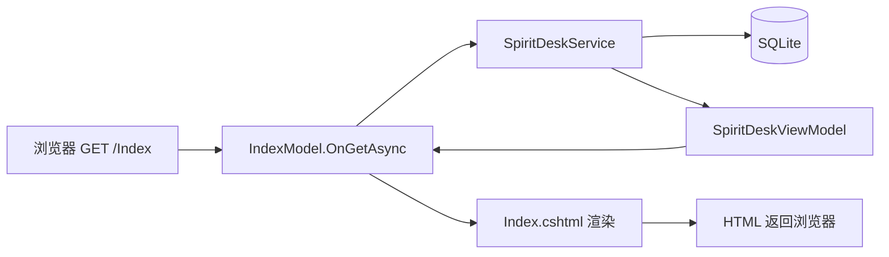

# 09 - MVC 还是 MVVM？我们项目用的哪种？

> 答辩常问架构模式。SpiritDesk **两套界面、两种写法**，不要一句话说成「全盘 MVC」或「全盘 MVVM」。  
> **完全没接触过 MVC/MVVM？** 请先读 **[10-MVC与MVVM从零讲起.md](./10-MVC与MVVM从零讲起.md)**，本文是速查与答辩答法。

---

## 1. 先记结论（30 秒版）

| 部分 | 官方/准确说法 | 和老师口语对照 |
|------|----------------|----------------|
| **SpiritDesk.Web（网站）** | **Razor Pages**（ASP.NET Core 的一种页面架构） | 像 **MVC 的简化版**：有 Model、有 View，但用 **PageModel** 代替 Controller |
| **SpiritDesk.Web 里 `Models/*ViewModel.cs`** | 页面展示用 **DTO/聚合对象** | 名字带 ViewModel，**不是** WPF 那套 MVVM 绑定框架 |
| **SpiritDesk.Shell（桌面浮球/主窗）** | **WPF + 代码后置（Code-Behind）** | **没有** 单独的 `CompanionBubbleViewModel.cs` 那种标准 MVVM |
| **业务核心** | **Service 层**（`SpiritDeskService`） | 不论 Web 还是 API，复杂逻辑在这里，页面尽量薄 |

**推荐答辩句：**

> 网站部分我们用的是 **ASP.NET Core Razor Pages**，属于 **MVC 思想的分页变体**（PageModel + View + Model），不是经典的三层 Controller；类名里的 ViewModel 只是**给页面准备数据的展示模型**。桌面 Shell 是 **WPF 代码后置**，没有严格做 MVVM。业务集中在 **Service**。

---

## 2. MVC、MVVM 各是什么（对照表）

| 模式 | 三部分 | 谁驱动界面更新 | 典型场景 |
|------|--------|----------------|----------|
| **MVC** | **M**odel 数据 · **V**iew 界面 · **C**ontroller 控制器 | Controller 读 Model，选 View 返回 | ASP.NET MVC、`Controllers/` + `Views/` |
| **MVVM** | **M**odel 数据 · **V**iew 界面 · **VM** ViewModel | View 通过**绑定**自动跟 ViewModel 属性同步 | WPF、Silverlight、部分 Vue/React 思想 |

| 概念 | MVC 里 | MVVM 里 |
|------|--------|---------|
| View | `.cshtml` / HTML | `.xaml` / UI 树 |
| 逻辑入口 | `HomeController` | `MainViewModel`（实现 `INotifyPropertyChanged`） |
| 和 View 的关系 | Controller **返回** View | View **绑定** ViewModel 属性 |

---

## 3. SpiritDesk.Web：不是经典 MVC，也不是 MVVM

### 3.1 我们没有 `Controllers/` 文件夹

经典 **ASP.NET MVC** 长这样：

```text
Controllers/HomeController.cs   → 处理 /Home/Index
Views/Home/Index.cshtml         → 视图
Models/...                      → 数据
```

本项目 **没有** `Controllers/`，因此不要说「我们用的是 ASP.NET MVC 模板」。

### 3.2 我们用的是 Razor Pages（PageModel 模式）

```text
Pages/Index.cshtml          → View（视图，SSR）
Pages/Index.cshtml.cs       → PageModel（≈ 这一页的 Controller）
SpiritDesk.Core/Entities/   → Model（数据库实体）
SpiritDesk.Web/Models/      → 页面展示模型（*ViewModel，见下）
Services/SpiritDeskService  → 业务服务（比 PageModel 更厚的逻辑）
```

| MVC 角色 | SpiritDesk 对应 |
|----------|-----------------|
| **Model** | `Core/Entities` + EF `SpiritDeskDbContext` |
| **View** | `Pages/*.cshtml` |
| **Controller** | **`Pages/*.cshtml.cs` 里的 `XxxModel : PageModel`**（如 `IndexModel`、`LoginModel`） |

一次请求（以首页为例）：



所以：**思想上接近 MVC**（分离数据、界面、控制），**实现上是 Razor Pages**。

### 3.3 `Models/ChatHistoryViewModel.cs` 里的 ViewModel 是什么？

容易误会成 **MVVM 的 VM**，在本项目里实际是：

| 项目 | 说明 |
|------|------|
| 文件位置 | `SpiritDesk.Web/Models/*.cs` |
| 作用 | 把多张表、多个字段**拼成一页要显示的结构**（如 `SpiritDeskViewModel`） |
| 谁创建 | `SpiritDeskService.BuildViewModelAsync()` 等 |
| 谁消费 | PageModel 赋给属性 → `.cshtml` 里 `@Model.Desk.xxx` |
| 有没有 WPF 式双向绑定 | **没有**；Razor 是**服务端渲染一次**，不是属性变更自动刷新 UI |

**命名习惯**：微软文档和许多 ASP.NET 项目会把「给 View 用的模型」叫 **ViewModel**；这是 **MVC/Razor 生态的用语**，不等于「我们整个站是 MVVM 架构」。

---

## 4. SpiritDesk.Shell：WPF，但不是标准 MVVM

桌面部分：

| 文件 | 角色 |
|------|------|
| `MainWindow.xaml` | View |
| `MainWindow.xaml.cs` | **Code-Behind**（事件、启动 WebView2） |
| `CompanionBubbleWindow.xaml` / `.cs` | 同上 |

标准 **WPF MVVM** 通常会另有：

- `MainViewModel.cs`（实现 `INotifyPropertyChanged`）
- XAML 里 `DataContext="{Binding ...}"`、`<Button Command="{Binding ...}"/>`

本项目 **没有** 为浮球/主窗单独建 ViewModel 类，逻辑写在 **`.xaml.cs`** 里，HTTP 调 Web API 拿数据。

| 说法 | 是否准确 |
|------|----------|
| 「桌面是 MVVM」 | ❌ 不准确（未严格分层 VM） |
| 「桌面是 WPF + 代码后置，业务仍靠 Web」 | ✅ 准确 |

---

## 5. 三层对照：老师问「你们几层架构？」

可以这样说（和 MVC/MVVM 不冲突）：

```text
表现层   Pages/*.cshtml + PageModel     （Web）
         MainWindow / CompanionBubble   （Shell，薄壳）

业务层   Services/SpiritDeskService、LlmReplyService、SpiritPersonaService

数据层   Data/SpiritDeskDbContext + Core/Entities + SQLite
```

**Service 层** 是 SpiritDesk 里最重要的一层：PageModel 只负责 HTTP 入参、调用 Service、选 Redirect 或 `return Page()`。

---

## 6. 和「前后端分离」的关系

| 架构 | SpiritDesk 是否采用 |
|------|---------------------|
| 前后端分离（Vue + REST，纯 CSR） | ❌ 主站是 **Razor SSR** |
| 经典 MVC（Controller + View） | ❌ 无 Controller，用 **PageModel** |
| Razor Pages | ✅ **是** |
| MVVM（整站） | ❌ |
| MVVM（WPF 严格绑定） | ❌ Shell 未做 |
| 桌面调 Web API | ✅ 浮球用 `/api/companion/*`（仅 Shell，不是整站 API 化） |

---

## 7. 老师提问标准答法

**Q：你们用的是 MVC 还是 MVVM？**  
A：网站是 **Razor Pages**，按页分成 `.cshtml`（视图）和 `.cshtml.cs`（PageModel，相当于这一页的控制器），数据在 **Core 实体 + Service**，整体是 **MVC 思想**，不是带 `Controllers` 文件夹的经典 MVC。`Models` 里带 ViewModel 后缀的类只是**页面展示数据**，不是 WPF 的 MVVM。桌面 **WPF** 是 **代码后置**，业务仍由 Web 提供。

**Q：为什么有 ViewModel 又说不是 MVVM？**  
A：ViewModel 在这里是**命名**，表示「给视图用的模型」；MVVM 是一种**绑定驱动 UI 更新的架构**。我们是服务器渲染 HTML，没有 View 绑定 ViewModel 属性那一套。

**Q：那和 MVC 差在哪？**  
A：差在**入口**：经典 MVC 是一个 Controller 管多个 Action、多个 View；我们是 **一个 URL 一对 Page + PageModel**，更贴页面。

---

## 8. 相关文档

| 文档 | 内容 |
|------|------|
| [10-MVC与MVVM从零讲起.md](./10-MVC与MVVM从零讲起.md) | **零基础**：概念、前后端、类比、误区 |
| [10-SpiritDesk.Web项目与cshtml详解.md](../10-SpiritDesk.Web项目与cshtml详解.md) | SSR、PageModel、每个 cshtml |
| [04-src里面每个项目.md](./04-src里面每个项目.md) | Web / Shell 文件夹 |
| [05-CSharp-Razor-Pages与页面模型.md](../05-CSharp-Razor-Pages与页面模型.md) | PageModel 代码级说明 |
| [07-老师提问怎么答.md](./07-老师提问怎么答.md) | 答辩话术汇总 |

---

上一篇：[08-wwwroot与静态资源详解.md](./08-wwwroot与静态资源详解.md)  
下一篇：[10-MVC与MVVM从零讲起.md](./10-MVC与MVVM从零讲起.md)（零基础详解）→ [07-老师提问怎么答.md](./07-老师提问怎么答.md) 练口述
