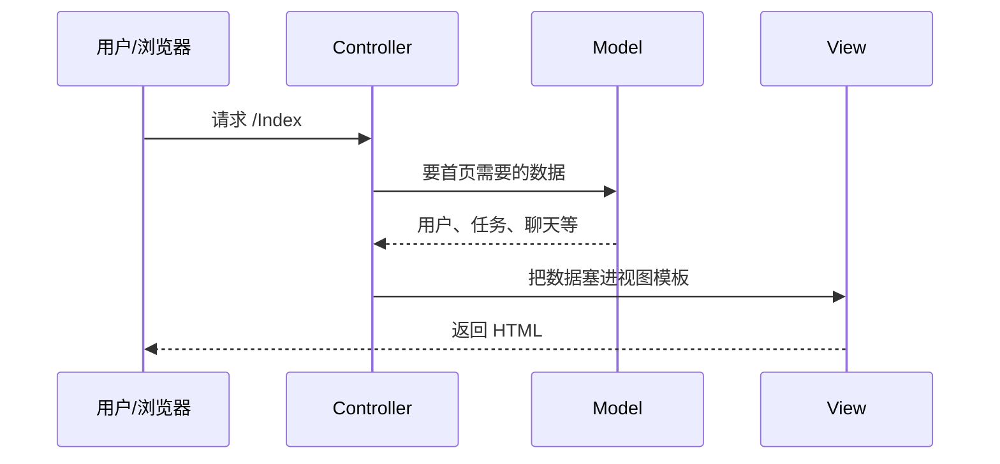
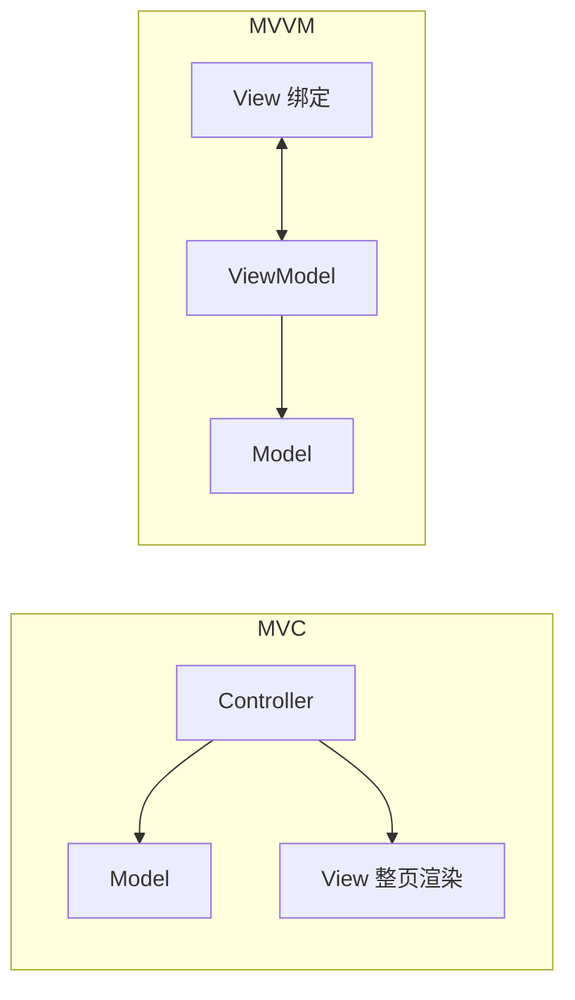
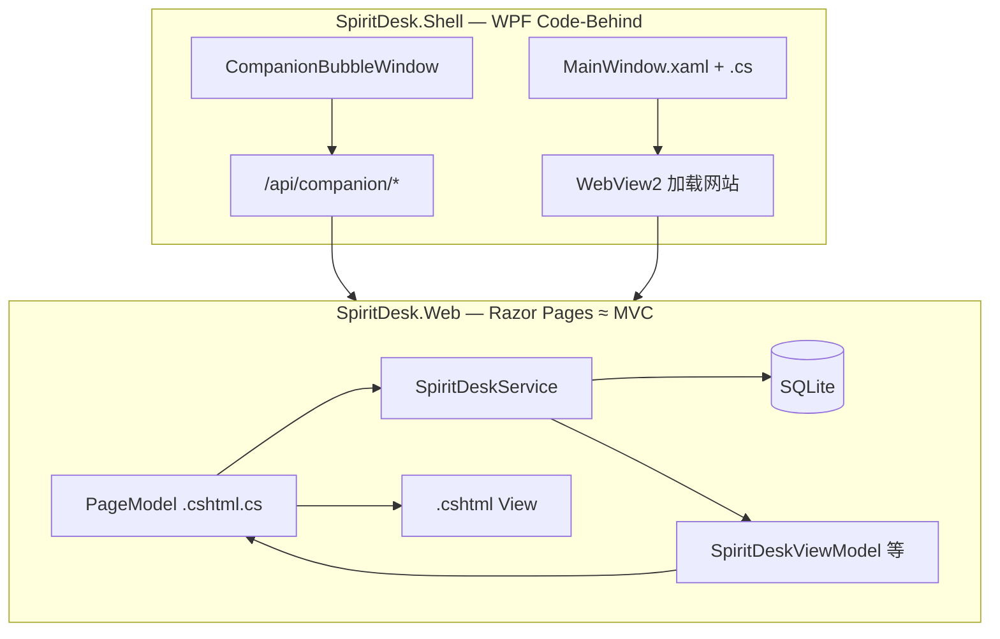

# 10 - MVC 与 MVVM：从零讲起（前端还是后端？和本项目的关系）

> 写给**完全没接触过**这两个词的同学。读完后你应该能回答：  
> ① MVC/MVVM 是什么；② 它们是前端还是后端；③ SpiritDesk 到底更像哪一种。

**和 [09-MVC还是MVVM我们用的哪种.md](./09-MVC还是MVVM我们用的哪种.md) 的分工：**

| 文档 | 适合 |
|------|------|
| **本文（10）** | 先搞懂概念、类比、常见误区 |
| **[09](./09-MVC还是MVVM我们用的哪种.md)** | 答辩速查：SpiritDesk 结论 + 标准答法 |

---

## 1. 一句话：它们不是「前端架构」或「后端架构」

**MVC、MVVM 是「怎么组织界面和逻辑」的通用套路**，叫**表现层架构模式**（Presentation Pattern）。

| 说法 | 对不对 |
|------|--------|
| 「MVC 是后端专用的」 | ❌ 不对。后端可以用（如 ASP.NET），前端也可以用（早期 jQuery 时代、部分框架） |
| 「MVVM 是前端专用的」 | ❌ 不对。最早大量用在 **WPF 桌面**；后来 Vue/React 也借用了类似思想 |
| 「它们是编程语言」 | ❌ 不是。C#、JavaScript 都能按 MVC 或 MVVM 来写 |
| 「选了 MVC 就不能用数据库」 | ❌ 无关。数据库、API、Service 是**另一层**（业务层 / 数据层） |

可以记：

```text
MVC / MVVM  →  主要管「用户看到的界面」和「谁负责改界面」
Service / EF / SQLite  →  管「业务规则」和「存数据」（SpiritDesk 里都有，和 MVC/MVVM 不冲突）
```

---

## 2. 为什么要分 Model、View、Controller（或 ViewModel）？

写小 demo 时，所有代码塞在一个文件里也能跑。项目变大后会出现：

- 改界面怕动到数据库代码  
- 改业务逻辑要翻几千行 HTML  
- 同一份数据要在列表页、详情页、API 里各写一遍  

**分层的目的**：各干各的、改一块少牵连别的块。

下面用**开餐馆**类比（和写代码不是一一对应，但好记）。

---

## 3. MVC 是什么？

### 3.1 三个字母：干什么 + 为什么叫这个名字

| 字母 | 英文 | 干什么 | 餐馆类比 |
|------|------|--------|----------|
| **M** | Model | **业务对象 + 规则**（任务有哪些字段、能不能完成）；**真正落盘在数据库**（见下节） | 厨房里的**菜谱和当前订单内容**（食材实体在**仓库**=数据库） |
| **V** | View | **用户看到的东西**（网页 HTML、按钮、表格） | **端给客人的菜和菜单样子** |
| **C** | Controller | **接请求、做决定、叫 Model 取数、选哪个 View 显示** | **服务员**：客人点菜 → 告诉厨房 → 端菜上来 |

名字不是随便起的，三个英文词各自有本义，和「在 MVC 里负责什么」是对得上的：

#### 为什么叫 **Model**（模型）？

英文 **model** 在这里不是「模特」，而是**对现实世界的一种抽象表示**——用程序里的数据结构去**建模**你的业务。

| 本义 | 在 MVC 里 |
|------|-----------|
| 模型、样板（model of reality） | 程序里对「用户、任务、订单」等**是什么、当前状态如何**的描述 |
| 例如 | `TaskItem` 实体、`UserProfile`；规则常在 `SpiritDeskService` |

所以叫 Model：**它描述的是「这个世界（你的应用）里有什么、状态怎样」**，还不关心页面长什么样。  
SpiritDesk 里 `SpiritDesk.Core/Entities/TaskItem.cs` 是 **Model（实体）**；**保存到硬盘**是 `SpiritDeskDbContext` + SQLite，见上一节「到底是谁在存」。

#### 为什么叫 **View**（视图）？

英文 **view** 作名词就是**看到的画面、视角、界面**（a view of the data = 数据的一种呈现方式）。

| 本义 | 在 MVC 里 |
|------|-----------|
| 看见、视野、视图 | 用户**眼睛能看到的**那一层：HTML、按钮、表格、颜色 |
| 例如 | `Pages/Index.cshtml` 渲染出来的首页 |

所以叫 View：**只负责「怎么展示」**，不负责决定「点删除后数据库怎么改」——那是 Controller + Model 的事。  
同一个 Model（比如任务列表）可以对应多个 View：列表页一种样子、手机端另一种样子。

#### 为什么叫 **Controller**（控制器）？

英文 **control** 有**控制、指挥流程**的意思。Controller = **控制者**，夹在用户和 Model/View 中间**指挥这一场交互怎么走**。

| 本义 | 在 MVC 里 |
|------|-----------|
| 控制流程、调度 | 收到「打开首页」「提交登录」→ 决定调哪个 Model → 选哪个 View 返回 |
| 例如 | `IndexModel.OnGetAsync()`、`LoginModel.OnPostAsync()`（Razor Pages 里 PageModel 干的也是这类活） |

所以叫 Controller：**它一般不负责「把数据永久写到硬盘」**，也不画界面（那是 View），而是**指挥这一次请求**：该调谁、该返回哪一页。  
早期论文里把 MVC 画成：用户操作 → **Controller** → 更新 Model → Model 通知 → 更新 View。C 是**交通指挥**，不是仓库管理员，也不是盘子。

#### Model 会「保存」业务数据吗？到底是谁在存？

上一句说「业务数据在 Model」容易误会成 **Model = 数据库**。需要拆开说：

| 容易产生的误会 | 更准确的说法 |
|----------------|--------------|
| Model 把数据存在自己肚子里 | ❌ Model **不是**硬盘上的那个库 |
| 只有 Model 能碰数据 | ❌ 通常是 **Controller 调 Service/Model，再由数据访问层写库** |
| Controller 也存数据 | ❌ Controller **一般不长期保存**任何东西，请求结束它的临时变量就没了 |

**真正「落盘、长期保存」的，是数据库（或文件）**，不是 MVC 三个字母里的某一块「自带存储」。

可以分成四层记（SpiritDesk 里都能对上号）：

```text
┌─────────────────────────────────────────────────────────────┐
│  Controller / PageModel   这一次请求的入口、流程指挥          │
│  例：IndexModel.OnPostAddTaskAsync()                         │
└───────────────────────────┬─────────────────────────────────┘
                            │ 调用
                            ▼
┌─────────────────────────────────────────────────────────────┐
│  Service（业务层）         规则：能不能删、怎么算好感度等       │
│  例：SpiritDeskService.AddTaskAsync()                        │
└───────────────────────────┬─────────────────────────────────┘
                            │ 读写
                            ▼
┌─────────────────────────────────────────────────────────────┐
│  Model（狭义）             内存里的「业务对象长什么样」         │
│  例：TaskItem、UserProfile（C# 类，对应表结构）               │
└───────────────────────────┬─────────────────────────────────┘
                            │ 通过 EF 映射
                            ▼
┌─────────────────────────────────────────────────────────────┐
│  持久化（真正保存）         SQLite 文件 spiritdesk.db          │
│  谁执行写入：SpiritDeskDbContext.SaveChangesAsync()          │
└─────────────────────────────────────────────────────────────┘
```

| 角色 | 在 SpiritDesk 里是谁 | 会不会「长期保存」 |
|------|----------------------|-------------------|
| **数据库（SQLite）** | `spiritdesk.db` 文件 | ✅ **最终数据在这** |
| **数据访问 / ORM** | `SpiritDeskDbContext` + EF Core | ✅ 执行 `INSERT/UPDATE/DELETE` |
| **Model（实体类）** | `Core/Entities/TaskItem.cs` 等 | ❌ 只是**描述**一条任务有哪些字段；对象在内存里，进程结束就没了，除非被写入数据库 |
| **Service** | `SpiritDeskService` | ⚠️ 不「拥有」硬盘，但**负责**改 Model 对象并调用 `SaveChanges` |
| **Controller / PageModel** | `Index.cshtml.cs` | ❌ 一般不直接 `SaveChanges`，而是 `await spiritDeskService.AddTaskAsync(...)` |
| **View** | `Index.cshtml` | ❌ 只出 HTML，**绝不**写库 |

**MVC 里的 Model 到底指什么？**

教科书里的 **Model** 是个**笼统角色**，可以包括：

1. **数据结构**（实体类、表对应的对象）— SpiritDesk 的 `TaskItem`  
2. **业务规则**（能不能签到、删任务要不要确认）— 多在 `SpiritDeskService`  
3. **有时还把读写的代码算进 Model**（小项目里 Service 和 Model 揉在一起）

所以更准确的说法是：

> **Model = 应用里对「业务世界」的抽象（对象 + 规则），不等于数据库文件本身。**  
> **持久化 = 数据库 + DbContext（或 Repository）负责真正保存。**  
> **Controller = 不保存，只调度这一次请求。**

以「添加一条任务」为例，谁干什么：

```text
用户点「添加」
  → PageModel（Controller 角色）收到表单
  → 调用 SpiritDeskService.AddTaskAsync(...)
       → new TaskItem { ... }          ← 在内存里构造 Model 对象
       → _db.Tasks.Add(task)           ← 交给 DbContext
       → await _db.SaveChangesAsync()  ← 写入 SQLite（真正保存）
  → Redirect 回首页
  → OnGetAsync 再从库读出列表 → 塞进 View 显示
```

**和餐馆类比修正一下：**

| MVC | 餐馆 | 持久化 |
|-----|------|--------|
| Model | 菜谱 + 当前订单内容（**描述**） | 仓库 / 冷库 = **数据库** |
| Controller | 服务员传话 | 不存菜 |
| View | 端盘子的样子 | 不存菜 |
| DbContext + SQLite | （类比里没有单独字母） | **仓库记账、进货出货** |

#### 三个名字合在一起

```text
Model      →  这个世界（数据/规则）长什么样
View       →  用户看到的样子
Controller →  谁在处理这一次操作、把 Model 和 View 串起来
```

记一句：**Model 管「是什么」，View 管「长什么样」，Controller 管「这一次怎么办」。**

### 3.2 一次用户操作怎么走（以「打开首页」为例）



要点：

1. **用户不直接碰 Model**（不直接改数据库表）。  
2. **View 尽量「笨」**：主要负责展示，少写复杂 if/else 业务。  
3. **Controller 是入口**：路由到了谁，谁去协调 Model 和 View。

### 3.3 MVC 常见出现在哪里？

| 场景 | 例子 |
|------|------|
| **服务端渲染网站** | ASP.NET MVC、`HomeController` + `Views/Home/Index.cshtml` |
| **本项目的变体** | ASP.NET **Razor Pages**（用 PageModel 代替 Controller，思想仍是 MVC，见第 7 节） |
| **移动端 / 桌面** | 早期 iOS、Android 文档里也常提 MVC |
| **纯前端** | 早年 Backbone 等；现在更多用组件化 + 状态管理，但「数据 / 界面 / 控制」三分思想还在 |

所以：**MVC 既可以在后端（服务器拼 HTML），也可以在前端（JS 里分模块）**，取决于你的技术栈。

---

## 4. MVVM 是什么？

### 4.1 三个字母

| 字母 | 英文 | 干什么 | 和 MVC 的差别 |
|------|------|--------|----------------|
| **M** | Model | 同样是**数据 / 业务实体** | 与 MVC 类似 |
| **V** | View | **界面**（WPF 的 XAML、Vue 的模板） | 与 MVC 类似 |
| **VM** | ViewModel | **专门给界面用的「展示状态」**，带可绑定属性 | MVC 里没有这一层；由 **View 双向绑定** 到 VM |

### 4.2 核心区别：谁更新界面？

| | MVC | MVVM |
|---|-----|------|
| 界面更新方式 | Controller **算完数据 → 选 View → 整页返回**（常见） | View **绑定** ViewModel 属性；属性变了，界面**自动**跟着变 |
| 典型技术 | 服务端 Razor、ASP.NET MVC | WPF `INotifyPropertyChanged`、Vue 的 `ref` / 计算属性 |
| 控制器角色 | **Controller 很显眼** | 往往弱化；用户点按钮 → 改 ViewModel 上的 **Command** |



### 4.3 MVVM 常见出现在哪里？

| 场景 | 例子 |
|------|------|
| **Windows 桌面** | WPF、UWP、MAUI（推荐 MVVM） |
| **前端 SPA** | Vue、Knockout（官方就叫 MVVM 风格） |
| **React** | 一般不贴 MVVM 标签，但有「状态 → UI」的类似关系 |

**SpiritDesk 桌面 Shell**：用的是 WPF，但**没有**单独写 `MainViewModel.cs`、也没有 XAML 里大量 `Binding`，而是 **Code-Behind**（`.xaml.cs` 里写事件）。所以：**技术栈是 WPF，架构上不算标准 MVVM**（详见第 7.2 节）。

---

## 5. 和「前端 / 后端」怎么对应？

先分清两个词：

| 词 | 指什么 |
|----|--------|
| **前端** | 浏览器里跑的 HTML/CSS/JS，或桌面窗口里用户看到的 UI |
| **后端** | 服务器上的 C#、数据库、API |

**MVC/MVVM 描述的是「界面这一侧内部怎么分工」**，可以叠在任何前后端组合上：

| 项目类型 | 常见组合 | MVC/MVVM 落在哪 |
|----------|----------|-----------------|
| 传统网站（SpiritDesk Web） | 后端 C# **渲染 HTML** 给浏览器 | **后端** Razor Pages ≈ MVC 思想；浏览器收到的已是成品 HTML |
| 前后端分离（Vue + .NET API） | 后端只返回 JSON；前端 Vue 拼页面 | **前端** Vue 偏 MVVM；**后端** 常叫三层：Controller + Service + Repository（这里的 Controller 是 **API 控制器**，不是 MVC 里的 C，容易混） |
| 桌面 WPF | 界面在本地，数据可本地或调 API | **桌面 UI 层** 可用 MVVM；调 API 属于网络层 |

**SpiritDesk 主站**：不是「Vue 前端 + 纯 API」那种前后端分离，而是 **后端 Razor 直接出页面** → 讨论 MVC 时，主要讲 **SpiritDesk.Web** 这一侧。

---

## 6. 容易搞混的几个词

### 6.1 `ViewModel` 这个名字

在 **ASP.NET / Razor** 项目里，经常把「给某一页展示用的 C# 类」命名为 `XxxViewModel`，例如本项目的：

```text
SpiritDesk.Web/Models/SpiritDeskViewModel.cs
```

这里的 ViewModel **只是类名习惯**（View 用的 Model），**不等于**整个项目采用了 **MVVM 架构**。

| | MVVM 里的 ViewModel | 本项目 `SpiritDeskViewModel` |
|---|---------------------|------------------------------|
| 作用 | 和 View **双向绑定**，属性变 UI 就变 | Service **组装一次**，交给 `.cshtml` **渲染一次** |
| 典型 API | `INotifyPropertyChanged` | 普通 POCO 属性 |
| 更新 UI | 改属性即可 | 要 **重新请求页面** 或 POST 后 Redirect |

### 6.2 `Controller` 的两种含义

| 含义 | 在哪 | SpiritDesk 有没有 |
|------|------|-------------------|
| **MVC 的 Controller** | 处理页面路由，返回 View | 经典形式：`Controllers/HomeController.cs` → **我们没有这个文件夹** |
| **Web API 的 Controller** | 只返回 JSON，如 `/api/companion/...` | 有少量 API 给桌面浮球用，**不是**整站主架构 |

### 6.3 Razor Pages 的 PageModel

```text
Pages/Index.cshtml       → View
Pages/Index.cshtml.cs    → PageModel（这一页的「控制器」）
```

`IndexModel : PageModel` 里的 `OnGetAsync`、`OnPostSendMessageAsync` 干的活，就是 MVC 里 **Controller** 干的活，只是 **按「页」拆分**，不是按「Controller 类 + 多个 Action」拆分。

---

## 7. SpiritDesk 分别像什么？（对照表 + 真实文件）

### 7.1 SpiritDesk.Web（网站）— 像 MVC，实现叫 Razor Pages

| MVC 角色 | SpiritDesk 里是什么 | 举例 |
|----------|---------------------|------|
| **Model** | 数据库实体 + EF | `SpiritDesk.Core/Entities/TaskItem.cs`、`SpiritDesk.Web/Data/SpiritDeskDbContext.cs` |
| **View** | Razor 页面 | `Pages/Index.cshtml` |
| **Controller** | **PageModel** | `Pages/Index.cshtml.cs` 里的 `IndexModel` |
| **更厚的业务** | Service（不算 MVC 字母，但很重要） | `Services/SpiritDeskService.cs` |
| **给 View 的展示数据** | 名叫 ViewModel 的 DTO | `Models/SpiritDeskViewModel.cs` |

首页请求链（和代码对应）：

```text
浏览器 GET /Index
  → IndexModel.OnGetAsync()                    ← 像 Controller
  → spiritDeskService.BuildViewModelAsync()    ← 业务 + 读库
  → 得到 SpiritDeskViewModel                   ← 展示用数据（名字带 ViewModel，不是 MVVM）
  → return Page() → 渲染 Index.cshtml          ← View
  → 浏览器收到 HTML
```

`IndexModel` 里节选（真实项目）：

```csharp
public class IndexModel(SpiritDeskService spiritDeskService) : PageModel
{
    public SpiritDeskViewModel Desk { get; private set; } = default!;

    public async Task<IActionResult> OnGetAsync()
    {
        Desk = await spiritDeskService.BuildViewModelAsync();
        return Page();
    }
}
```

**结论**：网站 = **Razor Pages（MVC 思想 + 按页分的 PageModel）**，**不是**整站 MVVM，**也不是**带 `Controllers/` 的经典 ASP.NET MVC 模板。

### 7.2 SpiritDesk.Shell（桌面）— WPF，但不是标准 MVVM

| 标准 MVVM 会有 | 本项目 |
|----------------|--------|
| `MainViewModel.cs` | ❌ 没有 |
| XAML `{Binding ...}` | ❌ 很少 / 没有 |
| 逻辑在 ViewModel | 逻辑在 `MainWindow.xaml.cs`、`CompanionBubbleWindow.xaml.cs`（**Code-Behind**） |

桌面窗口主要是 **嵌 WebView2 打开网站** + **浮球调 HTTP API**，业务仍由 **SpiritDesk.Web** 承担。

**结论**：桌面 = **WPF + 代码后置**，**不是**严格 MVVM。

### 7.3 一张总图



---

## 8. 和其他模式一句话对比（知道即可）

| 模式 | 一句话 |
|------|--------|
| **MVP** | View 更被动，Presenter 代替 Controller 直接「推」数据到 View（Android 早期常见） |
| **三层架构** | 表现层 / 业务层 / 数据层（SpiritDesk 的 Service + EF 就是业务层和数据层） |
| **前后端分离** | 前端 SPA + 后端 REST；SpiritDesk **主站不是这种**（是服务端渲染） |

**三层**和 **MVC** 不矛盾：SpiritDesk 可以是「表现层用 Razor Pages（MVC 思想）+ 业务层 Service + 数据层 EF」。

---

## 9. 自测：你是否真的懂了？

| 问题 | 参考答案 |
|------|----------|
| MVC 是前端还是后端？ | **都可以**；我们是**后端 Razor 渲染**，MVC 思想在后端 |
| MVVM 核心是什么？ | View 和 ViewModel **绑定**，状态变 UI 自动更新 |
| 为什么有 `SpiritDeskViewModel` 还说不是 MVVM？ | 那只是**给视图准备数据的类名**，没有 WPF/SPA 那套绑定 |
| 我们没有 `Controllers` 文件夹，还算 MVC 吗？ | **思想算**（Model + View + 控制入口），**实现是 Razor Pages** |
| 桌面是 MVVM 吗？ | **不是**严格 MVVM，是 Code-Behind + WebView |

---

## 10. 答辩怎么说（背两句即可）

> 我们网站用的是 **ASP.NET Core Razor Pages**：`.cshtml` 是视图，`.cshtml.cs` 里的 **PageModel** 负责处理请求，和 MVC 里的 Controller 类似；实体和数据库在 **Core + EF**，复杂逻辑在 **Service**。类名里的 ViewModel 只是**页面展示数据**，不是 WPF 那种 MVVM。桌面是 **WPF 代码后置**，主要嵌浏览器和调 API，没有单独做 ViewModel 绑定层。

更短的速查表见 **[09-MVC还是MVVM我们用的哪种.md](./09-MVC还是MVVM我们用的哪种.md)**。

---

## 11. 相关文档

| 文档 | 内容 |
|------|------|
| [09-MVC还是MVVM我们用的哪种.md](./09-MVC还是MVVM我们用的哪种.md) | 本项目对照 + 老师提问标准答法 |
| [08-wwwroot与静态资源详解.md](./08-wwwroot与静态资源详解.md) | 静态 JS/CSS 和 SSR 的关系 |
| [../10-SpiritDesk.Web项目与cshtml详解.md](../10-SpiritDesk.Web项目与cshtml详解.md) | 每个 cshtml 文件说明 |
| [../05-CSharp-Razor-Pages与页面模型.md](../05-CSharp-Razor-Pages与页面模型.md) | PageModel 代码级说明 |
| [000-ASP.NET学习.md](./000-ASP.NET学习.md) | ASP.NET 入门 |

---

上一篇：[09-MVC还是MVVM我们用的哪种.md](./09-MVC还是MVVM我们用的哪种.md)  
下一篇：[07-老师提问怎么答.md](./07-老师提问怎么答.md)（综合答辩）
