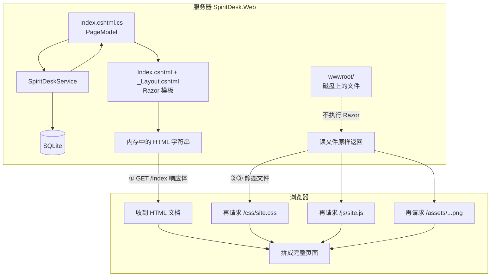
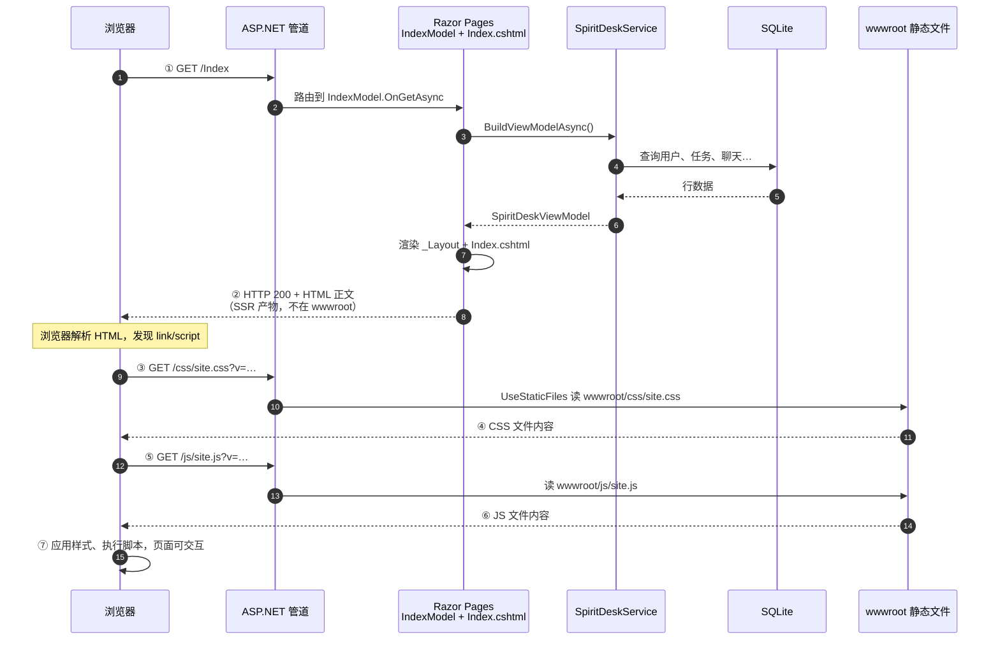
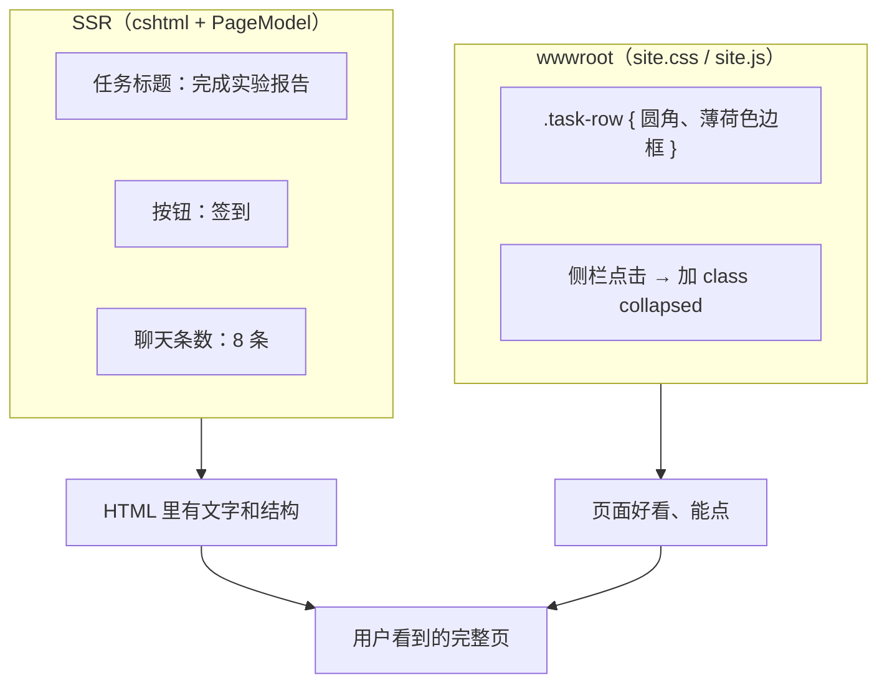

# 11 - cshtml（SSR）与 wwwroot：一次请求如何生成页面

> 专讲：**打开首页时，服务器和浏览器各干什么**；为什么 **wwwroot 不是 cshtml 渲染出来的文件**。

**相关文档：**

| 文档 | 内容 |
|------|------|
| [08-wwwroot与静态资源详解.md](./08-wwwroot与静态资源详解.md) | wwwroot 目录里有什么、`~/` 含义 |
| [10-SpiritDesk.Web项目与cshtml详解.md](../10-SpiritDesk.Web项目与cshtml详解.md) | 每个 cshtml 文件说明 |
| [10-MVC与MVVM从零讲起.md](./10-MVC与MVVM从零讲起.md) | MVC、View、Controller 概念 |

---

## 0. 先记结论（30 秒）

| 误区 | 正解 |
|------|------|
| wwwroot 里存着 SSR 生成的 HTML | ❌ **不是**。SSR 的 HTML 在**内存里拼好**，作为 **HTTP 响应正文** 直接发给浏览器 |
| wwwroot 和 cshtml 是同一条流水线 | ❌ **两条线**：cshtml **动态生成**页面；wwwroot **原样提供** CSS/JS/图 |
| 改任务列表要改 site.css | ❌ 列表内容在 **Index.cshtml** 的 `@Model`；**外观**才在 **site.css** |

**一句话：**

> **cshtml** 负责「这次请求生成什么 **HTML**」；**wwwroot** 负责「浏览器额外下载哪些固定的 **css/js/图**」。

---

## 1. 两条线总览（大图）



**图例：**

- **实线箭头**：SSR 主路径（带数据、每次可不同）
- **虚线**：wwwroot 不参与 Razor 执行，只在浏览器要 CSS/JS 时被 `UseStaticFiles` 读出

---

## 2. 各自是什么（对照表）

| | `Pages/*.cshtml`（SSR） | `wwwroot/` |
|---|-------------------------|------------|
| **是什么** | 服务器上的 **Razor 模板**（HTML + C# 语法） | 磁盘上的 **静态文件**（CSS、JS、图片） |
| **怎么处理** | 每次请求在服务器 **执行**，拼出 **HTML 字符串** | **不执行 C#**，按 URL 路径 **原样读文件** 返回 |
| **浏览器收到** | 一次 HTTP 响应的 **正文**（整页 HTML） | **另发**多次请求：`GET /css/site.css`、`GET /js/site.js` … |
| **会变吗** | 不同用户、不同数据 → HTML 内容可以 **每次不同** | 同一路径，文件内容 **固定**（改文件后要重新运行/发布才生效） |
| **SpiritDesk 例子** | `Pages/Index.cshtml`、`Shared/_Layout.cshtml` | `wwwroot/css/site.css`、`wwwroot/js/site.js` |

---

## 3. 一次打开首页：时间线（sequence 图）

以 **`GET /` 或 `GET /Index`** 为例（未登录时可能先跳登录，逻辑相同，只是换页面文件）。



**对应本项目代码：**

| 步骤 | 文件 / 配置 |
|------|-------------|
| 开启静态文件 | `SpiritDeskWebHost.cs` → `app.UseStaticFiles()` |
| 开启 Razor 页 | `app.MapRazorPages()` |
| 读数据 | `Index.cshtml.cs` → `OnGetAsync()` → `spiritDeskService.BuildViewModelAsync()` |
| 嵌数据到 HTML | `Index.cshtml` 里 `@Model.Desk.xxx` |
| 引用静态资源 | `Shared/_Layout.cshtml` 里 `~/css/site.css`、`~/js/site.js` |

---

## 4. 服务器内部：请求先走哪条路？

```mermaid
flowchart LR
    REQ["HTTP 请求"]
    REQ --> ROUTE{"路径是什么？"}

    ROUTE -->|"/css/site.css"<br/>"/js/site.js"<br/>"/assets/..."| STATIC["UseStaticFiles<br/>从 wwwroot 读文件"]
    ROUTE -->|"/Index" "/Login"<br/>等 Razor 路由| RAZOR["MapRazorPages<br/>执行 PageModel + cshtml"]

    STATIC --> RES1["返回 CSS/JS/图片<br/>Content-Type: text/css 等"]
    RAZOR --> RES2["返回 HTML<br/>Content-Type: text/html"]
```

**要点：**

- `/css/site.css` **不会**去执行 `Index.cshtml`。
- `/Index` **不会**把 `site.css` 的内容嵌进响应（只在 HTML 里写 **链接**）。

中间件顺序（本项目）：

```text
UseRouting → UseStaticFiles → … → MapRazorPages
```

---

## 5. SSR 这一步到底生成了什么？

### 5.1 参与渲染的文件（按顺序）

```text
_ViewStart.cshtml          → 指定用 _Layout
Shared/_Layout.cshtml      → 外壳：<head> 里引 CSS，<body> 末尾引 JS
Pages/Index.cshtml         → 主页内容插入 @RenderBody()
Index.cshtml.cs            → 先跑 OnGetAsync，准备好 Model.Desk
```

`_Layout.cshtml` 里引用 wwwroot（**只是 URL，不是把文件内容拷进 cshtml**）：

```html
<link rel="stylesheet" href="~/css/site.css" asp-append-version="true" />
...
<script src="~/js/site.js" asp-append-version="true"></script>
```

`~/` 在运行时映射为 **wwwroot 的 Web 路径根**，例如 `~/css/site.css` → 浏览器请求 **`/css/site.css`**。

### 5.2 `Index.cshtml` 里 SSR 填数据（节选）

```csharp
@model IndexModel
@{
    var profile = Model.Desk.Profile;
    var spirit = Model.Desk.CurrentSpirit;
    // ...
}
```

页面上会出现 **已经带真实昵称、任务条数** 的 HTML 标签，例如（示意）：

```html
<h1>下午好，小明的卷卷晴</h1>
<ul>
  <li>完成实验报告</li>
  <li>复习 MVC 文档</li>
</ul>
```

这段 **列表文字** 来自 **数据库 → Service → PageModel → Razor**，不是 `site.js` 里 `fetch` 回来的（本项目主页以 SSR 为主）。

### 5.3 SSR 产物存在哪？

| 存储位置 | 有没有 SSR 生成的整页 HTML |
|----------|----------------------------|
| 服务器内存 | ✅ 请求处理过程中短暂存在 |
| HTTP 响应发给浏览器 | ✅ 浏览器收到 |
| `wwwroot/` 文件夹 | ❌ **没有** `index.html` 这种生成物 |
| 数据库 | ❌ 只存业务数据，不存渲染后的 HTML |

---

## 6. wwwroot 这一步：浏览器第二次要东西

### 6.1 浏览器看到 HTML 里的「钩子」

SSR 返回的 HTML 类似（简化）：

```html
<!DOCTYPE html>
<html>
<head>
  <link rel="stylesheet" href="/css/site.css?v=xxxxxxxx" />
</head>
<body>
  <!-- 这里是 Index.cshtml 渲染出的工作台结构 -->
  <div class="workbench">…任务、聊天…</div>
  <script src="/js/site.js?v=xxxxxxxx"></script>
</body>
</html>
```

### 6.2 浏览器自动再请求

| 请求 | 服务器行为 | 结果 |
|------|------------|------|
| `GET /css/site.css` | 打开磁盘 `wwwroot/css/site.css`，原样返回 | 薄荷色、布局、侧栏样式生效 |
| `GET /js/site.js` | 打开 `wwwroot/js/site.js` | 侧栏折叠、猜拳弹窗等交互 |
| `GET /assets/images/xxx.png` | 打开对应 PNG | 精灵立绘显示 |

**这些文件内容** 和 **cshtml 里 `@Model` 填的字** 是分开的：  
CSS 不管任务叫啥，只规定「任务行长什么样」；任务 **叫什么** 仍是 SSR 写进 HTML 的。

### 6.3 结构 vs 样式（最容易混）



| 你想改… | 主要改哪里 |
|---------|------------|
| 任务列表显示哪几条 | `Index.cshtml` + `SpiritDeskService` |
| 任务行颜色、间距、字体 | `wwwroot/css/site.css` |
| 侧栏收起动画 | `wwwroot/js/site.js` |

---

## 7. 和「前后端分离 / Vue」对比（帮助记忆）

| | SpiritDesk（现在） | Vue + API（常见企业方案） |
|---|-------------------|---------------------------|
| 第一次请求 | 服务器返回 **完整 HTML**（SSR） | 服务器常返回 **`index.html` 壳** + 很小 |
| 任务列表数据 | 已嵌在 HTML 里（`@Model`） | 浏览器 `fetch('/api/tasks')` 再画 DOM |
| CSS/JS | `wwwroot` 静态文件 | `npm build` 后的 `dist/assets/*.js` |
| wwwroot 角色 | 手写 `site.css` / `site.js` | 往往是 **构建产物** 目录 |

**共同点：** 浏览器都是 **先拿 HTML，再按里面的 link/script 拉静态资源**。  
**不同点：** SpiritDesk 的 HTML **里已经带好业务数据**（SSR）；Vue 方案 HTML 往往较空，数据靠 JS 请求 API。

---

## 8. 自己验证：用浏览器开发者工具

1. 运行 `SpiritDesk.Web`，打开首页。  
2. **F12 → Network（网络）**，刷新页面。  
3. 你会看到类似：

| Name | Type | 谁产生的 |
|------|------|----------|
| `Index` 或 `/` | document (html) | **Razor SSR** |
| `site.css` | stylesheet | **wwwroot** |
| `site.js` | script | **wwwroot** |
| 精灵 PNG | png | **wwwroot/assets/...** |

4. 点 **`Index` → Response**：能看到带昵称、任务文字的 HTML → 证明 **SSR 在响应体里**。  
5. 点 **`site.css` → Response**：只有 CSS 规则，没有 `@Model` → 证明 **wwwroot 是独立文件**。

---

## 9. 老师常问 · 标准答法

**Q：wwwroot 是 cshtml 生成的吗？**  
A：**不是。** cshtml 在服务器渲染出 **HTML 响应**；wwwroot 里的 CSS/JS 是 **事先放在磁盘上的静态文件**，HTML 里用 `<link>`、`<script>` **引用**，浏览器再单独下载。

**Q：SSR 的结果存在哪？**  
A：存在 **这次 HTTP 响应的正文**里，发给浏览器；一般不写入 `wwwroot` 目录。

**Q：为什么分两套？**  
A：**动态内容**（谁登录、有哪些任务）每次不同，适合服务器用 Razor 生成；**样式和通用脚本** 全站共用、内容固定，适合放 wwwroot 缓存、减轻重复逻辑。

**Q：wwwroot 算前端吗？**  
A：算 **浏览器端资源**（CSS/JS/图）。但 **页面结构和数据** 还在 **cshtml**，所以前端工作不只在 wwwroot，而是 **cshtml 定结构与数据 + wwwroot 定样式与交互**。

---

## 10. 文件速查（SpiritDesk）

```text
SpiritDesk.Web/
├── Pages/
│   ├── Index.cshtml              ← SSR 视图（结构 + @Model 数据）
│   ├── Index.cshtml.cs           ← PageModel（OnGet 准备 Desk）
│   └── Shared/_Layout.cshtml     ← 引用 ~/css、~/js
├── wwwroot/
│   ├── css/site.css              ← 静态样式（不参与 Razor）
│   ├── js/site.js                ← 静态脚本
│   └── lib/                      ← 第三方（jQuery 等）
└── SpiritDeskWebHost.cs          ← UseStaticFiles + MapRazorPages
```

---

## 11. 上一篇 / 下一篇

- 上一篇：[08-wwwroot与静态资源详解.md](./08-wwwroot与静态资源详解.md)  
- 相关：[10-MVC与MVVM从零讲起.md](./10-MVC与MVVM从零讲起.md)  
- 下一篇：[07-老师提问怎么答.md](./07-老师提问怎么答.md)
