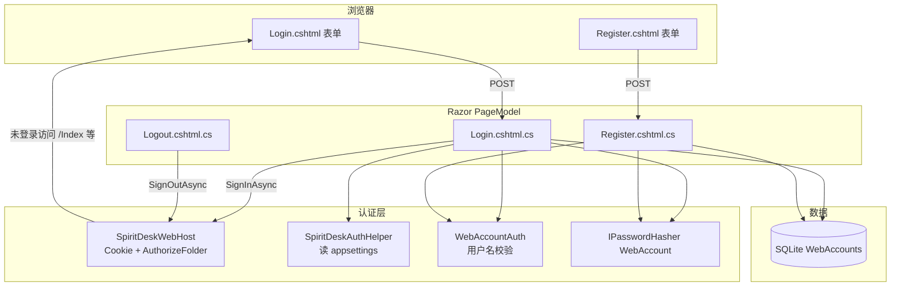
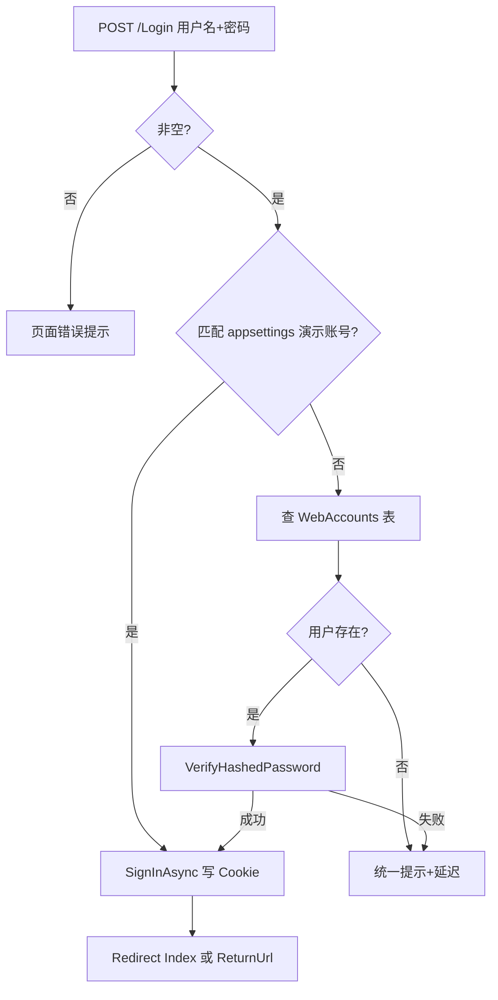

# 15 - 登录注册功能详解（答辩专篇）

> **建议用途**：向老师重点讲解「账号系统怎么做的」——页面、后端、数据库、Cookie 门禁一条线讲清楚。  
> **零基础分篇阅读**请先走 [auth/ 登录注册专题文件夹](./auth/README.md)（基础 → 项目 → 数据库 → 踩坑）。  
> 技术实现细节（与 Shell、部署的关系）还可对照 [06-CSharp-认证与登录注册.md](../06-CSharp-认证与登录注册.md)。

---

## 0. 一分钟开场（先背）

> 我负责 **登录 / 注册页面** 和 **后端校验逻辑**。  
> 技术上是 **ASP.NET Core Razor Pages**：`Login.cshtml` + `Login.cshtml.cs` 处理登录，`Register` 处理注册；密码用框架的 **`IPasswordHasher` 哈希** 后存入 SQLite 的 **`WebAccounts` 表**，明文不进库。  
> 登录成功后 ASP.NET Core 签发 **`SpiritDesk.Auth` Cookie**，未登录用户访问站内页面会被重定向到 `/Login`。  
> Shell **本地自启 Web** 时会关掉门禁；**连云端** 或单独 `dotnet run` Web 则要登录。Shell 还用 `BuildAuthCookieHeaderAsync` 把 WebView2 里的登录 Cookie 带给浮球 API。

---

## 1. 功能定位：演示门禁，不是完整用户中心

| 做了 | 没做（课程范围外） |
|------|-------------------|
| 用户名 + 密码登录 | 邮箱验证、手机验证码 |
| 自助注册写入数据库 | 找回密码、OAuth（微信/GitHub） |
| Cookie 保持登录约 12 小时 | 复杂角色权限、多租户组织管理 |
| 注册账号绑定独立 `UserProfile` | 云端多设备同步 |
| 配置可开关、可关注册 | 商业级账号中心 |

**答辩说法**：这是 **可配置的演示门禁**，保护云端演示站不被随便访问；不是商业级多租户账号系统，但流程完整：**注册 → 存库 → 登录 → Cookie → 登出**。

---

## 2. 整体架构（一张图）



**记忆口诀**：**页面收集输入 → PageModel 校验 → 数据库或配置账号 → 成功写 Cookie → 中间件拦未登录请求**。

---

## 3. 涉及哪些文件（答辩指着仓库说）

### 3.1 我负责 / 答辩可强调的前端与页面

| 文件 | 作用 |
|------|------|
| `Pages/Login.cshtml` | 登录 UI：品牌区、错误提示、用户名密码表单、跳转注册链接 |
| `Pages/Register.cshtml` | 注册 UI：用户名、密码、确认密码、样式与登录页统一（薄荷主题） |
| `wwwroot/css/site.css` | `.login-shell`、`.login-card`、`.action-button.mint` 等全站与登录页样式 |

### 3.2 后端逻辑（与页面对应）

| 文件 | 作用 |
|------|------|
| `Pages/Login.cshtml.cs` | GET 显示登录；POST 校验 → `SignInAsync` → 跳转首页或 `ReturnUrl` |
| `Pages/Register.cshtml.cs` | POST 校验格式与重复 → `HashPassword` → `SaveChangesAsync` → 跳转登录 |
| `Pages/Logout.cshtml.cs` | POST 清除 Cookie → 回登录页 |
| `Pages/Settings.cshtml` | 已登录时显示「退出登录」按钮（POST 到 `/Logout`） |

### 3.3 认证与数据（协作代码，也要会讲）

| 文件 | 作用 |
|------|------|
| `Auth/SpiritDeskAuthHelper.cs` | 读 `SpiritDesk:Auth`：是否开门禁、演示账号、是否允许注册 |
| `Auth/WebAccountAuth.cs` | 用户名正则 3～32、规范化为小写存库 |
| `SpiritDeskWebHost.cs` | 注册 Cookie 认证、`AuthorizeFolder("/")`、密码哈希服务 |
| `Core/Entities/WebAccount.cs` | 账号实体：Id、Username、PasswordHash、CreatedAt |
| `Data/SpiritDeskDbContext.cs` | `WebAccounts` 表 + 用户名唯一索引 |

---

## 4. 配置开关：什么时候要登录

### 4.1 `appsettings.json`（默认：本地免登录）

```json
"SpiritDesk": {
  "Auth": {
    "Enabled": false,
    "Username": "",
    "Password": "",
    "AllowRegistration": true
  }
}
```

`Enabled: false` 时：

- 访问 `/Login`、`/Register` 会 **直接重定向首页**（`OnGet` 里判断）。
- **不注册** Cookie 中间件，全站页面匿名可访问。

### 4.2 `appsettings.Development.json`（开发 / 云端演示：要登录）

```json
"SpiritDesk": {
  "Auth": {
    "Enabled": true,
    "Username": "spiritdesk",
    "Password": "spiritdesk",
    "AllowRegistration": true
  }
}
```

| 配置项 | 含义 |
|--------|------|
| `Enabled` | `true` = 全站门禁（除登录/注册/登出/错误/隐私页） |
| `Username` / `Password` | **引导账号**：不必先注册，配置对上即可登录（适合老师一键演示） |
| `AllowRegistration` | `false` 时隐藏注册入口，只能走配置账号 |

环境变量覆盖写法（Shell **本地自启 Web** 时用）：`SpiritDesk__Auth__Enabled=false`（双下划线表示 JSON 层级）。

### 4.3 桌面 Shell 与登录（两种模式，别混）

Shell **不是「没有登录」**，而是 **看连的是本地 Web 还是云端**：

| 模式 | 条件 | 要不要登录 | 代码位置 |
|------|------|------------|----------|
| **本地一体** | 未设 `SPIRITDESK_REMOTE_BASEURL`，Shell 自己 `dotnet` 起 Web | **不要**（子进程里强制 `Auth.Enabled=false`） | `StartWebProcess` 设环境变量 |
| **连云端** | 设置了 `SPIRITDESK_REMOTE_BASEURL` | **要**（跟云端站点配置一致，常见为开启 Auth） | 不启动本地 Web，WebView2 打开远程 URL |

本地模式在 `MainWindow.xaml.cs` 里：**默认**写入 `SpiritDesk__Auth__Enabled=false`（免登录）。设环境变量 **`SPIRITDESK_REQUIRE_AUTH=1`** 则不覆盖，沿用 `appsettings.Development.json` 的 `Auth.Enabled=true`。

| 启动方式 | 是否出现登录/注册 |
|----------|-------------------|
| `.\run-shell.ps1` | 否（默认） |
| `.\run-shell-with-auth.ps1` | 是（Shell + WebView2 先 `/Login`） |
| `.\run-web.ps1` 或 `dotnet run` Web 项目 | 是（Development 配置） |

连云端时，用户在 **WebView2 里照常登录**；桌面浮球调 `/api/companion/*` 不能自动带 Cookie，因此有 **`BuildAuthCookieHeaderAsync`**：从 WebView2 读出 `SpiritDesk.Auth`，附到浮球的 HTTP 请求上（否则浮球会 401）。

**答辩**：Shell 本地演示关门禁是为了少一步登录；连服务器时登录仍在，且 Shell 负责把浏览器登录态同步给浮球 API。

---

## 5. 数据库：`WebAccounts` 表

实体定义（`SpiritDesk.Core`）：

```13:24:src/SpiritDesk.Core/Entities/WebAccount.cs
public class WebAccount
{
    public int Id { get; set; }
    public string Username { get; set; } = string.Empty;
    public string PasswordHash { get; set; } = string.Empty;
    public DateTimeOffset CreatedAt { get; set; }
}
```

EF 映射要点（`SpiritDeskDbContext`）：

- 表名：`WebAccounts`
- `Username`：**唯一索引**，最长 64，存 **规范化小写**
- `PasswordHash`：必填，最长 500，**只存哈希**

与 `UserProfiles`（昵称、精灵、心情）**分开两张表**：登录只管「能不能进站」；游戏进度通过 `UserProfile.AccountUsername` 绑定规范化用户名。任务、聊天和每日互动再通过 `UserProfileId` 归属到具体档案。

---

## 6. 注册流程（逐步讲给老师讲）

### 6.1 用户操作

1. 打开 `/Register`（门禁开启且允许注册时）。
2. 填写用户名、密码、确认密码 → 点「注册」。
3. 成功 → 自动跳转 `/Login`，顶部绿色提示「账号已创建，请登录」。

### 6.2 后端 `RegisterModel.OnPostAsync` 做了什么

```
① 门禁未开 / 不允许注册 / 已登录 → 重定向（不处理注册）
② WebAccountAuth.IsValidUsername → 3～32 位字母数字下划线连字符
③ 密码长度 6～128，且与确认密码一致
④ 用户名不能与 appsettings 演示账号同名（预留 spiritdesk）
⑤ EF AnyAsync 查重 → 重复则提示并短延迟（降低撞库节奏）
⑥ new WebAccount + passwordHasher.HashPassword → Add → SaveChangesAsync
⑦ TempData["LoginNotice"] + RedirectToPage("/Login")
```

核心代码：

```125:137:src/SpiritDesk.Web/Pages/Register.cshtml.cs
        var displayName = Username.Trim();
        var account = new WebAccount
        {
            Username = normalized,
            CreatedAt = DateTimeOffset.UtcNow
        };
        account.PasswordHash = passwordHasher.HashPassword(account, Password);

        dbContext.WebAccounts.Add(account);
        await dbContext.SaveChangesAsync().ConfigureAwait(false);

        TempData["LoginNotice"] = $"账号「{displayName}」已创建，请登录。";
        return RedirectToPage("/Login");
```

**用户名规范化**（登录注册共用，避免 `Admin` 和 `admin` 注册两个号）：

```21:26:src/SpiritDesk.Web/Auth/WebAccountAuth.cs
    public static string NormalizeUsername(string username) => username.Trim().ToLowerInvariant();

    public static bool IsValidUsername(string username)
    {
        var t = username.Trim();
        return UsernamePattern().IsMatch(t);
    }
```

### 6.3 注册页 UI 要点（可指着屏幕说）

- `Register.cshtml` 与 `Login.cshtml` 共用 `.login-shell` / `.login-card`，视觉统一。
- `input` 带 `minlength`、`maxlength`、`placeholder`，与后端规则一致。
- 底部链接 `asp-page="/Login"` 回到登录。

---

## 7. 登录流程（逐步讲给老师讲）

### 7.1 未登录访问受保护页

`SpiritDeskWebHost` 在 `Auth.Enabled = true` 时：

```80:90:src/SpiritDesk.Web/SpiritDeskWebHost.cs
        builder.Services.AddRazorPages(options =>
        {
            if (authEnabled)
            {
                options.Conventions.AuthorizeFolder("/");
                options.Conventions.AllowAnonymousToPage("/Login");
                options.Conventions.AllowAnonymousToPage("/Register");
                options.Conventions.AllowAnonymousToPage("/Logout");
                options.Conventions.AllowAnonymousToPage("/Error");
                options.Conventions.AllowAnonymousToPage("/Privacy");
            }
        });
```

Cookie 选项（节选）：

| 选项 | 值 | 作用 |
|------|-----|------|
| `LoginPath` | `/Login` | 未授权 → 跳登录 |
| `ExpireTimeSpan` | 12 小时 | 会话有效期 |
| `SlidingExpiration` | true | 活动则续期 |
| `Cookie.Name` | `SpiritDesk.Auth` | 浏览器里看到的 Cookie 名 |
| `HttpOnly` | true | JS 读不到，减 XSS 风险 |

### 7.2 POST 登录校验顺序（两种账号源）



**演示账号**（不进数据库，配置即用）：

```86:91:src/SpiritDesk.Web/Pages/Login.cshtml.cs
        if (SpiritDeskAuthHelper.TryGetBootstrapCredentials(configuration, out var bootUser, out var bootPass)
            && string.Equals(normalized, WebAccountAuth.NormalizeUsername(bootUser), StringComparison.Ordinal)
            && string.Equals(Password, bootPass, StringComparison.Ordinal))
        {
            await SignInAsync(trimmedUser).ConfigureAwait(false);
            return RedirectToLocal(ReturnUrl);
```

**数据库账号**：`AsNoTracking` 查用户 → `passwordHasher.VerifyHashedPassword`；失败时 **统一文案**「用户名或密码不正确」+ **120～280ms 随机延迟**（不暴露是用户名错还是密码错）。

### 7.3 登录成功：Cookie 里写了什么

```124:130:src/SpiritDesk.Web/Pages/Login.cshtml.cs
    private async Task SignInAsync(string displayName)
    {
        var claims = new List<Claim> { new(ClaimTypes.Name, displayName) };
        var identity = new ClaimsIdentity(claims, CookieAuthenticationDefaults.AuthenticationScheme);
        await HttpContext.SignInAsync(
            CookieAuthenticationDefaults.AuthenticationScheme,
            new ClaimsPrincipal(identity)).ConfigureAwait(false);
    }
```

当前只放了 **`ClaimTypes.Name`**（显示用用户名）；未放角色、用户 Id。设置页用 `User.Identity?.IsAuthenticated` 判断是否显示退出按钮。

### 7.4 登录页 UI

- `TempData["LoginNotice"]`：注册成功跳转后的 **一次性绿条提示**。
- `ReturnUrl` 隐藏域：从受保护页被拦下来时，登录后回到原页面（且 `Url.IsLocalUrl` 防开放重定向）。
- `ShowRegisterLink`：配置允许注册才显示「没有账号？注册」。

---

## 8. 登出

- 入口：`Settings.cshtml` 里 **POST** 表单 `asp-page="/Logout"`。
- `LogoutModel.OnPostAsync`：`SignOutAsync` 删除 `SpiritDesk.Auth` Cookie → `RedirectToPage("/Login")`。
- `Logout.cshtml` 本身几乎无 UI，仅作为 POST 端点。

---

## 9. 安全相关（老师爱问）

| 措施 | 实现位置 |
|------|----------|
| 密码不明文存储 | `IPasswordHasher<WebAccount>.HashPassword` / `VerifyHashedPassword` |
| 登录失败不区分原因 | 统一错误文案 + `Task.Delay` |
| Cookie HttpOnly | `SpiritDeskWebHost` Cookie 选项 |
| 用户名唯一 | EF 唯一索引 + 注册前 `AnyAsync` |
| 演示密码不进 Git 生产配置 | 生产 `Enabled:false` 或服务器环境变量注入 |
| 开放重定向防护 | `RedirectToLocal` 检查 `Url.IsLocalUrl` |

**可主动说明的局限**：未做验证码、未限制登录尝试次数、注册无邮箱；课程演示足够。

---

## 10. 与 EF、静态资源的关系（串联讲）

1. **注册** → EF `dbContext.WebAccounts.Add` → SQLite `data/spiritdesk.db`（见 [14-数据库文件与迁移详解.md](./14-数据库文件与迁移详解.md)）。
2. **登录** → 不一定写库（演示账号只写 Cookie）。
3. **样式** → `site.css` 的 login 系列 class，与全站薄荷绿一致（美术 + 前端分工可提）。

---

## 11. 现场演示脚本（约 3 分钟）

**前提**：`dotnet run --project src/SpiritDesk.Web` 且使用 Development 配置（`Auth.Enabled=true`）。

| 步骤 | 操作 | 讲解要点 |
|------|------|----------|
| 1 | 浏览器开 `/Index`，被跳到 `/Login` | 全站 `AuthorizeFolder` 生效 |
| 2 | 点「注册」，建账号 `demo01` / 密码 `123456` | PageModel 校验 + 哈希入库 |
| 3 | 登录页看到绿条「已创建」 | `TempData` 跨重定向 |
| 4 | 用 `demo01` 登录进首页 | Cookie 签发，后续请求带 `SpiritDesk.Auth` |
| 5 | 打开「精灵设置」→「退出登录」 | `SignOutAsync`，再回到登录页 |
| 6 |（可选）用 `spiritdesk` / `spiritdesk` 登录 | 配置引导账号，无需先注册 |

**对比演示 A**：Shell 本地模式 → 直进主页 → `SpiritDesk__Auth__Enabled=false`。  
**对比演示 B**（可选）：设 `SPIRITDESK_REMOTE_BASEURL` 或只 `dotnet run` Web → 出现 `/Login` → 演示注册/登录与设置页退出。

---

## 12. 老师常见问题（标准答）

**Q：登录注册用的什么技术？**  
> ASP.NET Core **Razor Pages**，不是 MVC Controller。页面 `cshtml` 负责 HTML，`.cshtml.cs` 的 `PageModel` 负责 POST 逻辑。

**Q：密码怎么存的？**  
> 用 ASP.NET Core Identity 的 **`IPasswordHasher<WebAccount>`** 生成哈希字符串，只把哈希写入 `WebAccounts.PasswordHash`，验证时用 `VerifyHashedPassword`。

**Q：登录状态怎么保持？**  
> **Cookie 认证**。登录成功 `SignInAsync`，浏览器后续请求自动带 Cookie；中间件 `UseAuthentication` + `[Authorize]` / `AuthorizeFolder` 识别已登录用户。

**Q：注册和登录表一样吗？**  
> 账号认证都看 **`WebAccounts`**：注册是插入账号和密码哈希，登录是查账号并比对哈希。注册时还会创建同名 **`UserProfile`**，登录后任务、聊天、互动都会按这个档案隔离。

**Q：Shell 要不要登录？**  
> **分情况**：Shell 自己起本地 Web 时，子进程环境变量 **`SpiritDesk__Auth__Enabled=false`**，WebView2 不进登录页；若 Shell 通过 **`SPIRITDESK_REMOTE_BASEURL` 连云端**，和浏览器访问服务器一样要登录，浮球靠 **`BuildAuthCookieHeaderAsync`** 转发 `SpiritDesk.Auth` Cookie。

**Q：你具体写了什么？**  
> **Login/Register 页面结构与样式**、表单字段与错误提示；**Register/Login PageModel** 的校验与数据库写入；与队友约定的 **`WebAccountAuth` 用户名规则**；登录页与设置页的 **退出登录** 入口。

---

## 13. 相关文档

| 文档 | 内容 |
|------|------|
| [06-CSharp-认证与登录注册.md](../06-CSharp-认证与登录注册.md) | 实现向精简版 |
| [07-老师提问怎么答.md](./07-老师提问怎么答.md) | 答辩总表 |
| [13-EF是什么详解.md](./13-EF是什么详解.md) | EF 与 `WebAccounts` |
| [08-wwwroot与静态资源详解.md](./08-wwwroot与静态资源详解.md) | `site.css` 静态资源 |
| [11-cshtml与wwwroot一次请求如何生成页面.md](./11-cshtml与wwwroot一次请求如何生成页面.md) | SSR 请求过程 |

上一篇：[14-数据库文件与迁移详解.md](./14-数据库文件与迁移详解.md)
