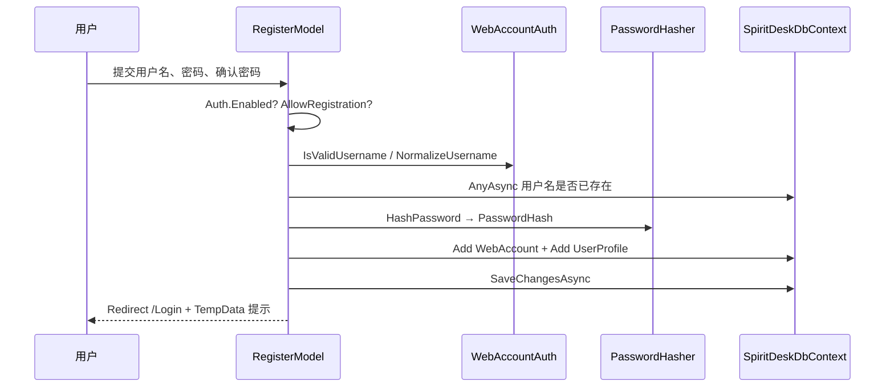

# 02 - 本项目登录注册怎么做

> 若觉得本文仍偏零散，请优先读 **[07-登录注册代码全景与逐行导读.md](./07-登录注册代码全景与逐行导读.md)**（一篇里收齐全部代码 + 时序图 + 数据库步骤）。

本文说明 SpiritDesk **具体用哪些文件、什么配置、注册/登录/登出怎么走**。

## 1. 技术选型一览

| 项目 | SpiritDesk 用法 |
|------|-----------------|
| Web 框架 | ASP.NET Core Razor Pages |
| 认证方式 | Cookie Authentication |
| 密码处理 | `IPasswordHasher<WebAccount>` |
| 数据库 | SQLite + EF Core |
| 账号表 | `WebAccounts` |
| 业务档案表 | `UserProfiles`（字段 `AccountUsername` 绑定登录名） |
| Cookie 名 | `SpiritDesk.Auth` |

## 2. 相关文件地图

```text
src/SpiritDesk.Web/
├── Auth/
│   ├── SpiritDeskAuthHelper.cs    ← 读配置：门禁开不开、演示账号、能否注册
│   └── WebAccountAuth.cs          ← 用户名校验、规范化（转小写）
├── Pages/
│   ├── Login.cshtml / Login.cshtml.cs
│   ├── Register.cshtml / Register.cshtml.cs
│   └── Logout.cshtml / Logout.cshtml.cs
├── Data/
│   └── SpiritDeskDbContext.cs     ← EF 映射 WebAccounts、UserProfiles
└── SpiritDeskWebHost.cs           ← 注册 Cookie 认证、页面授权规则

src/SpiritDesk.Core/Entities/
├── WebAccount.cs                  ← 登录账号实体
└── UserProfile.cs                 ← 养成档案实体
```

## 3. 配置：门禁开关

`appsettings.json`：

```json
"SpiritDesk": {
  "Auth": {
    "Enabled": true,
    "Username": "",
    "Password": "",
    "AllowRegistration": true
  }
}
```

`appsettings.Development.json`（开发环境会覆盖/合并）：

```json
"SpiritDesk": {
  "Auth": {
    "Enabled": true,
    "Username": "spiritdesk",
    "Password": "spiritdesk",
    "AllowRegistration": true
  }
}
```

| 配置项 | 含义 |
|--------|------|
| `Enabled` | `true` = 要登录才能进大部分页面；`false` = 免登录 |
| `Username` / `Password` | 可选「演示账号」，不配则只靠数据库账号 |
| `AllowRegistration` | 是否显示注册页、允许自助注册 |

读取配置的代码在 `SpiritDeskAuthHelper.cs`：

```csharp
public static bool IsDemoAuthEnabled(IConfiguration configuration)
{
    return configuration.GetSection("SpiritDesk:Auth").GetValue<bool>("Enabled");
}
```

## 4. 启动时：认证和页面授权怎么挂上

`SpiritDeskWebHost.Build` 里（门禁开启时）会做：

1. `AddAuthentication().AddCookie(...)` — 注册 Cookie 认证；
2. `AddRazorPages` + `AuthorizeFolder("/")` — 默认所有页面要登录；
3. `AllowAnonymousToPage("/Login")` 等 — 登录/注册/登出页例外。

Cookie 主要设置：

| 项 | 值 |
|----|-----|
| 登录页 | `/Login` |
| Cookie 名 | `SpiritDesk.Auth` |
| 有效期 | 12 小时，滑动续期 |
| HttpOnly | 是 |

## 5. 注册流程（本项目）

**页面**：`/Register` → `Register.cshtml` + `Register.cshtml.cs`



要点：

- 用户名规范化：`Trim` + `ToLowerInvariant()`，避免大小写重复注册；
- 密码只存 `PasswordHash`，明文不落库；
- **同时创建** `WebAccount` 和 `UserProfile`，`AccountUsername` 与账号用户名一致；
- **注册成功不自动登录**，跳登录页。

核心代码位置：`Register.cshtml.cs` 的 `OnPostAsync`。

## 6. 登录流程（本项目）

**页面**：`/Login` → `Login.cshtml` + `Login.cshtml.cs`

两种账号来源（按顺序）：

### 6.1 配置演示账号

若 `appsettings` 里配置了 `Username` / `Password`，且用户输入匹配 → 直接 `SignInAsync`，**不查数据库**。

开发环境默认：`spiritdesk` / `spiritdesk`。

### 6.2 数据库账号

否则到 `WebAccounts` 表按规范化用户名查询，用 `VerifyHashedPassword` 校验。

成功后：

```csharp
await HttpContext.SignInAsync(
    CookieAuthenticationDefaults.AuthenticationScheme,
    new ClaimsPrincipal(identity));
```

Claims 里放 `ClaimTypes.Name` = 显示用用户名，后续 `SpiritDeskService` 用它找档案。

## 7. 登出流程

**页面**：`/Logout` → POST → `Logout.cshtml.cs`

```csharp
await HttpContext.SignOutAsync(CookieAuthenticationDefaults.AuthenticationScheme);
return RedirectToPage("/Login");
```

清除 `SpiritDesk.Auth` Cookie。

## 8. 登录后业务数据用哪份档案

`SpiritDeskService`（首页、任务、聊天都走它）：

```csharp
private string? GetCurrentAccountUsername()
{
    var userName = httpContextAccessor.HttpContext?.User.Identity?.Name;
    return string.IsNullOrWhiteSpace(userName)
        ? null
        : WebAccountAuth.NormalizeUsername(userName);
}
```

| 情况 | 用的档案 |
|------|----------|
| 已登录 | `UserProfiles` 里 `AccountUsername == 当前用户名` 的那条 |
| 未登录（门禁关） | `AccountUsername == null` 的**默认演示档案**（大家共用） |

所以：**门禁关闭时看起来像「默认用户」**，并不是注册功能坏了，而是没走账号隔离。

## 9. 和桌面 Shell 的关系

| 启动方式 | 登录注册是否出现 |
|----------|------------------|
| `run-shell.ps1` | 默认**不出现**（Shell 子进程设 `SpiritDesk__Auth__Enabled=false`） |
| `run-shell-with-auth.ps1` | **出现**（`SPIRITDESK_REQUIRE_AUTH=1`） |
| `run-web.ps1` | **出现**（Development + Enabled=true） |

桌面壳 `MainWindow.xaml.cs` 启动 Web 子进程时会注入环境变量覆盖配置，详见 [04-不同启动方式与常见踩坑.md](./04-不同启动方式与常见踩坑.md)。

## 10. 答辩可用一句话

> 注册页把账号哈希写入 `WebAccounts`，并创建绑定的 `UserProfile`；登录页校验配置演示账号或数据库密码，成功后 ASP.NET Core 签发 `SpiritDesk.Auth` Cookie；`SpiritDeskWebHost` 配置未登录不能访问站内页面，Shell 本地模式可通过环境变量关闭门禁方便演示。

下一篇：[03-登录注册如何连接数据库.md](./03-登录注册如何连接数据库.md)
