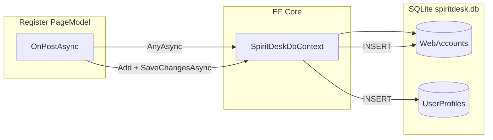
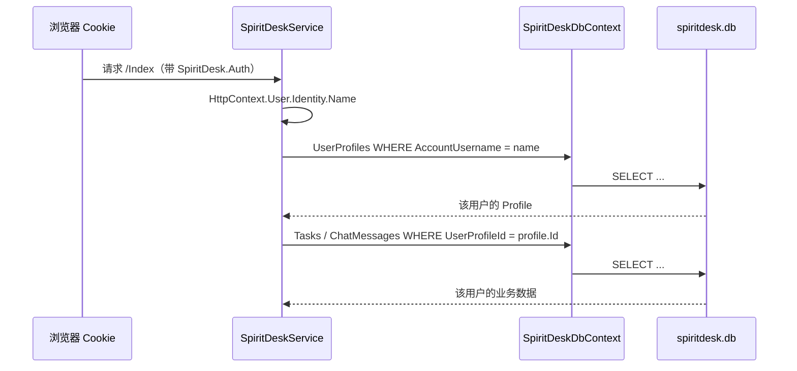

# 03 - 登录注册如何连接数据库

本文专门回答：**注册/登录的代码是怎么连上 SQLite、读写哪张表、一次请求里数据怎么流动**。

## 1. 数据库文件在哪

默认路径（未配置 `SpiritDesk:DataDirectory` 时）：

```text
{程序运行目录}/data/spiritdesk.db
```

例如：

```text
src/SpiritDesk.Web/bin/Debug/net9.0/data/spiritdesk.db
src/SpiritDesk.Web/bin/Release/net9.0/data/spiritdesk.db
```

连接在 `SpiritDeskWebHost.Build` 里注册：

```csharp
var databasePath = Path.Combine(dataDirectory, "spiritdesk.db");
builder.Services.AddDbContext<SpiritDeskDbContext>(optionsBuilder =>
    optionsBuilder.UseSqlite($"Data Source={databasePath}"));
```

**要点**：谁启动 Web 进程，`AppContext.BaseDirectory` 就指向谁的 `bin/...`，数据库文件也可能不同。

## 2. EF Core 在中间做什么

可以把 EF Core 理解成 **「C# 类和 SQLite 表之间的翻译官」**。

| C# | SQLite |
|----|--------|
| `WebAccount` 类 | `WebAccounts` 表 |
| `UserProfile` 类 | `UserProfiles` 表 |
| `SpiritDeskDbContext` | 所有表的访问入口 |

PageModel 和 Service **不直接写 SQL 字符串**（登录注册主流程），而是用：

```csharp
dbContext.WebAccounts.Add(account);
await dbContext.SaveChangesAsync();
```

EF 负责生成 `INSERT` / `SELECT` 等 SQL。

## 3. 登录注册涉及的两张表

### 3.1 `WebAccounts` — 只管登录

实体：`SpiritDesk.Core.Entities.WebAccount`

| 字段 | 类型 | 作用 |
|------|------|------|
| `Id` | int | 主键，自增 |
| `Username` | string | 规范化小写用户名，**唯一** |
| `PasswordHash` | string | 密码哈希，不是明文 |
| `CreatedAt` | DateTimeOffset | 注册时间 |

DbContext 配置（`SpiritDeskDbContext.OnModelCreating`）：

```csharp
entity.HasIndex(x => x.Username).IsUnique();
```

### 3.2 `UserProfiles` — 管游戏/养成数据

实体：`SpiritDesk.Core.Entities.UserProfile`

| 字段 | 作用 |
|------|------|
| `Id` | 档案主键 |
| `Nickname` | 显示昵称 |
| `AccountUsername` | **绑定登录账号**（规范化用户名）；`null` = 免登录默认档案 |
| `CurrentSpiritId` | 当前精灵 |
| `Mood` / `Affinity` / `Level` / `Coins` | 养成数值 |
| … | 任务、聊天通过 `UserProfileId` 关联 |

```csharp
entity.HasIndex(x => x.AccountUsername).IsUnique();
```

一个登录名对应**最多一份**业务档案。

### 3.3 两表如何关联

本项目**没有** EF 外键导航属性，而是用**相同字符串**关联：

```text
WebAccounts.Username  ==  UserProfiles.AccountUsername
```

都是 `WebAccountAuth.NormalizeUsername` 处理后的值。

## 4. 表是怎么创建出来的

两条路径配合：

| 步骤 | 谁做 | 做什么 |
|------|------|--------|
| 1 | `DatabaseBootstrapper` | 启动前检查旧库结构，必要时备份删除 |
| 2 | `EnsureWebAccountsTable` | 老库补建 `WebAccounts` 表（手写 SQL） |
| 3 | `dbContext.Database.EnsureCreatedAsync()` | EF 按实体创建/确保其余表存在 |

注册写数据前，表必须已经存在；首次运行 `EnsureInitializedAsync` 会触发 `EnsureCreatedAsync`。

## 5. 注册时：代码如何连库

`Register.cshtml.cs` 注入：

```csharp
public class RegisterModel(
    IConfiguration configuration,
    SpiritDeskDbContext dbContext,           // ← 数据库入口
    IPasswordHasher<WebAccount> passwordHasher) : PageModel
```

### 5.1 查重

```csharp
var normalized = WebAccountAuth.NormalizeUsername(Username);

if (await dbContext.WebAccounts.AnyAsync(u => u.Username == normalized))
{
    ErrorMessage = "该用户名已被注册。";
    return Page();
}
```

EF 翻译成类似：

```sql
SELECT EXISTS (
  SELECT 1 FROM "WebAccounts" WHERE "Username" = @normalized
);
```

### 5.2 插入账号 + 档案

```csharp
var account = new WebAccount
{
    Username = normalized,
    CreatedAt = DateTimeOffset.UtcNow
};
account.PasswordHash = passwordHasher.HashPassword(account, Password);

dbContext.WebAccounts.Add(account);
dbContext.UserProfiles.Add(new UserProfile
{
    AccountUsername = normalized,
    Nickname = displayName,
    CurrentSpiritId = string.Empty,
    Mood = 76,
    Affinity = 18,
    Level = 1,
    Coins = 30
});
await dbContext.SaveChangesAsync();
```

`SaveChangesAsync()` 时 EF 向 SQLite 执行 **INSERT**（通常在一个事务里）。

### 5.3 注册流程数据流图



## 6. 登录时：代码如何连库

`Login.cshtml.cs` 同样注入 `SpiritDeskDbContext`。

### 6.1 演示账号（不连库）

配置匹配则直接 `SignInAsync`，**不访问** `WebAccounts`。

### 6.2 数据库账号

```csharp
var account = await dbContext.WebAccounts.AsNoTracking()
    .FirstOrDefaultAsync(u => u.Username == normalized);

var verify = passwordHasher.VerifyHashedPassword(
    account, account.PasswordHash, Password);
```

| 方法 | 作用 |
|------|------|
| `AsNoTracking()` | 只读查询，不改跟踪状态 |
| `FirstOrDefaultAsync` | 按用户名找一条 |
| `VerifyHashedPassword` | 比对密码与哈希 |

验证成功后 **不写 Cookie 到数据库** — Cookie 在浏览器里，数据库只存账号密码。

若哈希算法需要升级，会 `FirstAsync` 跟踪实体 → 更新 `PasswordHash` → `SaveChangesAsync`。

## 7. 登录后：业务怎么连到档案

登录本身只写 Cookie；**首页任务/聊天**由 `SpiritDeskService` 读库。

```csharp
public class SpiritDeskService(
    SpiritDeskDbContext dbContext,
    ...
    IHttpContextAccessor httpContextAccessor)
```

```csharp
var accountUsername = GetCurrentAccountUsername(); // 从 Cookie Claims 来

var accountProfile = await dbContext.UserProfiles
    .FirstOrDefaultAsync(x => x.AccountUsername == accountUsername);
```

任务、聊天查询会带 `UserProfileId` 过滤，保证**每个登录用户看到自己的数据**。



## 8. DbContext 生命周期（为什么能注入）

在 `SpiritDeskWebHost` 里：

```csharp
builder.Services.AddDbContext<SpiritDeskDbContext>(...);
```

注册为 **Scoped**：**每个 HTTP 请求** 创建一个 `SpiritDeskDbContext` 实例。

因此：

- 同一次注册 POST：`RegisterModel` 和 `dbContext` 是同一个请求里的实例；
- 请求结束 DbContext 释放，连接归还。

## 9. 用 DB Browser 自己验证

1. 找到你当前运行方式下的 `data/spiritdesk.db`；
2. 打开表 `WebAccounts` — 应有注册的用户名和 `PasswordHash`；
3. 打开表 `UserProfiles` — 应有相同 `AccountUsername` 的档案行；
4. 登录后新增的任务在 `Tasks` 表，`UserProfileId` 应对应该档案的 `Id`。

## 10. 常见问题

### Q：登录注册连的是 MySQL 吗？

不是。本项目固定 **SQLite 单文件** `spiritdesk.db`。

### Q：Cookie 存在数据库吗？

不存。Cookie 在客户端；数据库只存 `WebAccounts` 和密码哈希。

### Q：为什么注册了但首页像默认用户？

可能门禁关了（走 `AccountUsername == null` 的默认档案），或读的是**另一个路径**的 `spiritdesk.db`。见 [04-不同启动方式与常见踩坑.md](./04-不同启动方式与常见踩坑.md)。

## 11. 一句话总结

> 登录注册通过 **EF Core 的 `SpiritDeskDbContext`** 连接 **`data/spiritdesk.db`**：注册向 **`WebAccounts`** 和 **`UserProfiles`** 插入数据；登录从 **`WebAccounts`** 读哈希校验；登录后的业务由 **`SpiritDeskService`** 按 Cookie 用户名查 **`UserProfiles`** 再查任务和聊天表。

返回目录：[README.md](./README.md)
