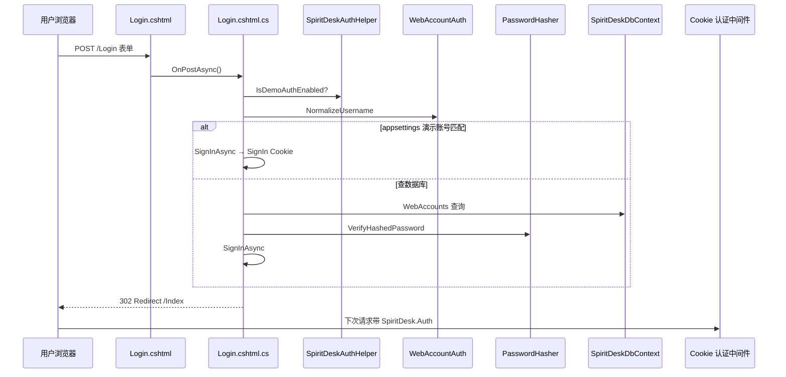
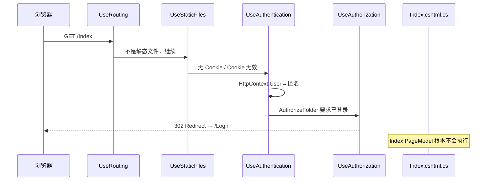
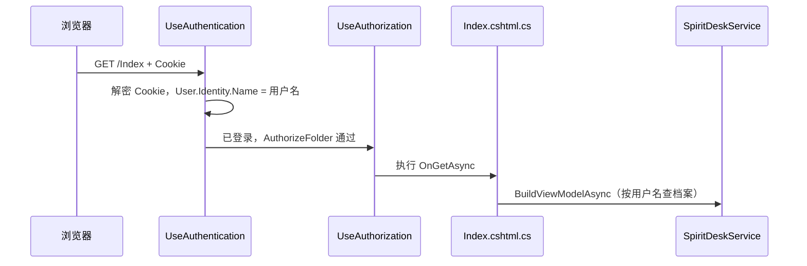
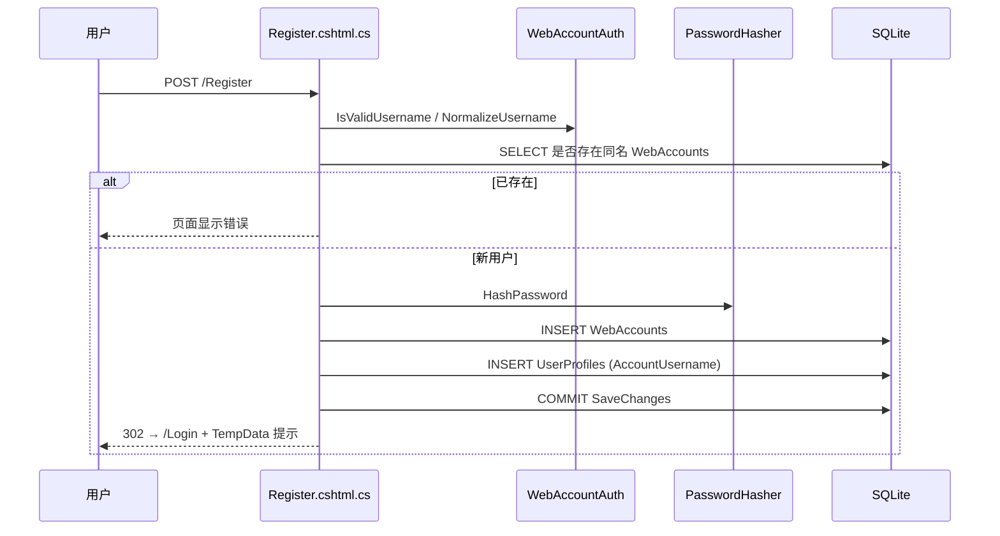
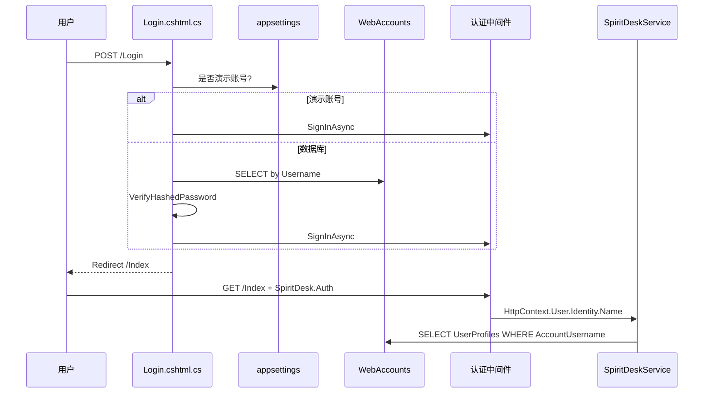
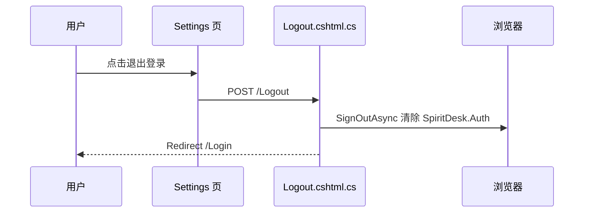
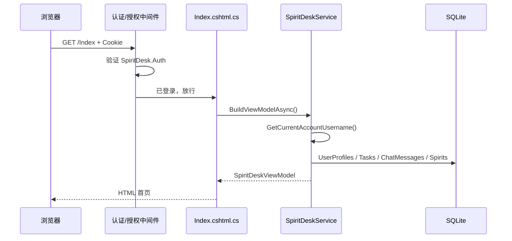

# 07 - 登录注册代码全景与逐行导读（一篇看完）

> **如果你觉得 [02-本项目登录注册怎么做.md](./02-本项目登录注册怎么做.md) 太零散**，请优先读本篇。  
> 本文把 SpiritDesk **所有与登录/注册相关的代码** 集中到一处，并说明：**路由是什么、`cshtml` / `cshtml.cs` 各干什么、页面如何协作、如何读写数据库**。  
> **文中文件路径统一从仓库根的 `src/` 或 `run-*.ps1` 写起**（在 Cursor 里可直接点开）。

---

## 0. 路径约定

- 代码路径：`src/SpiritDesk.Web/...`、`src/SpiritDesk.Core/...`、`src/SpiritDesk.Shell/...`
- 脚本路径：仓库根下的 `run-shell.ps1`、`run-web.ps1` 等
- 运行时数据库（生成物）：`src/SpiritDesk.Web/bin/Debug/net9.0/data/spiritdesk.db` 等


| 说明          | 路径                            |
| ----------- | ----------------------------- |
| 登录页 URL     | `http://127.0.0.1:{端口}/Login` |
| 注册页 URL     | `/Register`                   |
| Cookie 密钥目录 | `.../data/keys/`（相对 Web 输出目录） |


---

## 0.1 怎么用这篇文档定位代码？

### 0.1.1 三个问题 → 去哪个文件


| 你想搞懂什么              | 路径                                                                           |
| ------------------- | ---------------------------------------------------------------------------- |
| 浏览器 `/Login` 对应哪段代码 | `src/SpiritDesk.Web/Pages/Login.cshtml` + `Login.cshtml.cs`                  |
| 点「登录」谁校验密码          | `src/SpiritDesk.Web/Pages/Login.cshtml.cs` → `OnPostAsync`                   |
| 登录后首页任务从哪来          | `src/SpiritDesk.Web/Services/SpiritDeskService.cs` + 表 `Tasks`               |
| 未登录为何跳登录页           | `src/SpiritDesk.Web/SpiritDeskWebHost.cs` → `UseAuthorization`（约 145 行）      |
| 登录用的中间件在哪注册         | 同上：`AddAuthentication`（约 95 行）、`UseAuthentication`（约 142 行）→ **详见 §8**       |
| 注册写入哪几张表            | `src/SpiritDesk.Web/Pages/Register.cshtml.cs` → `WebAccounts`、`UserProfiles` |
| Web 程序入口            | `src/SpiritDesk.Web/Program.cs`                                              |


### 0.1.2 在 VS / Cursor 里怎么搜


| 搜索词                 | 能找到       |
| ------------------- | --------- |
| `LoginModel`        | 登录页后端     |
| `RegisterModel`     | 注册页后端     |
| `SignInAsync`       | 签发 Cookie |
| `WebAccounts`       | 账号表读写     |
| `SpiritDesk.Auth`   | Cookie 名  |
| `IsDemoAuthEnabled` | 门禁开不开     |


---

## 1. 先搞懂：`/Login` 路由、`cshtml`、`cshtml.cs`

### 1.1 `/Login` 是什么？

SpiritDesk 使用 **Razor Pages**。  
文件 `src/SpiritDesk.Web/Pages/Login.cshtml` 第一行：

```cshtml
@page
```

表示：**这个页面对外提供一个路由**。


| 路径                                            | 浏览器 URL              |
| --------------------------------------------- | -------------------- |
| `src/SpiritDesk.Web/Pages/Login.cshtml`       | `/Login`             |
| `src/SpiritDesk.Web/Pages/Login.cshtml.cs`    | （后端，无独立 URL）         |
| `src/SpiritDesk.Web/Pages/Register.cshtml`    | `/Register`          |
| `src/SpiritDesk.Web/Pages/Register.cshtml.cs` | （后端）                 |
| `src/SpiritDesk.Web/Pages/Logout.cshtml`      | `/Logout`（通常 POST）   |
| `src/SpiritDesk.Web/Pages/Logout.cshtml.cs`   | （后端）                 |
| `src/SpiritDesk.Web/Pages/Index.cshtml`       | `/` 或 `/Index`       |
| `src/SpiritDesk.Web/Pages/Index.cshtml.cs`    | （后端，登录后首页）           |
| `src/SpiritDesk.Web/Pages/Settings.cshtml`    | `/Settings`（含退出登录表单） |


规则：`**src/SpiritDesk.Web/Pages/` 下的子路径 ≈ URL 路径**（去掉 `.cshtml`）。

### 1.2 `Login.cshtml` 和 `Login.cshtml.cs` 是一对


| 文件                  | 路径                                         | 类型        | 干什么                     |
| ------------------- | ------------------------------------------ | --------- | ----------------------- |
| **Login.cshtml**    | `src/SpiritDesk.Web/Pages/Login.cshtml`    | 视图        | 画登录表单                   |
| **Login.cshtml.cs** | `src/SpiritDesk.Web/Pages/Login.cshtml.cs` | PageModel | `OnGet` / `OnPostAsync` |


绑定关系在 cshtml 里：

```cshtml
@model SpiritDesk.Web.Pages.LoginModel
```

表示：这个页面的后端逻辑类叫 `LoginModel`。


| HTTP 方法                   | 触发 cshtml.cs 里哪个方法 |
| ------------------------- | ------------------ |
| 浏览器打开 `/Login`            | `OnGet()`          |
| 用户点登录提交表单 `method="post"` | `OnPostAsync()`    |


表单在 `Login.cshtml`：

```cshtml
<form method="post" class="login-form">
    <input asp-for="Username" ... />
    <input asp-for="Password" type="password" ... />
    <button type="submit">登录</button>
</form>
```

`asp-for="Username"` 会绑定到 `LoginModel.Username`（cshtml.cs 里 `[BindProperty]` 的属性）。

### 1.3 一张图：一次 POST 登录谁参与




---

## 2. 登录注册相关文件总表


| #   | 路径                                                   | 角色                     |
| --- | ---------------------------------------------------- | ---------------------- |
| 1   | `src/SpiritDesk.Web/Pages/Login.cshtml`              | 登录页 UI                 |
| 2   | `src/SpiritDesk.Web/Pages/Login.cshtml.cs`           | 登录逻辑                   |
| 3   | `src/SpiritDesk.Web/Pages/Register.cshtml`           | 注册页 UI                 |
| 4   | `src/SpiritDesk.Web/Pages/Register.cshtml.cs`        | 注册逻辑 + 写库              |
| 5   | `src/SpiritDesk.Web/Pages/Logout.cshtml`             | 登出页（几乎无 UI）            |
| 6   | `src/SpiritDesk.Web/Pages/Logout.cshtml.cs`          | 登出逻辑                   |
| 7   | `src/SpiritDesk.Web/Pages/Settings.cshtml`           | 「退出登录」按钮               |
| 8   | `src/SpiritDesk.Web/Auth/SpiritDeskAuthHelper.cs`    | 读配置                    |
| 9   | `src/SpiritDesk.Web/Auth/WebAccountAuth.cs`          | 用户名校验                  |
| 10  | `src/SpiritDesk.Web/SpiritDeskWebHost.cs`            | Cookie 认证 + 授权 + API   |
| 11  | `src/SpiritDesk.Web/Program.cs`                      | Web 入口 `Build` + `Run` |
| 12  | `src/SpiritDesk.Web/appsettings.json`                | 默认配置                   |
| 13  | `src/SpiritDesk.Web/appsettings.Development.json`    | 开发配置（演示账号）             |
| 14  | `src/SpiritDesk.Core/Entities/WebAccount.cs`         | 账号实体                   |
| 15  | `src/SpiritDesk.Core/Entities/UserProfile.cs`        | 档案实体                   |
| 16  | `src/SpiritDesk.Web/Data/SpiritDeskDbContext.cs`     | EF 映射                  |
| 17  | `src/SpiritDesk.Web/Helpers/DatabaseBootstrapper.cs` | 补建 WebAccounts 表       |
| 18  | `src/SpiritDesk.Web/Services/SpiritDeskService.cs`   | 登录后业务 + 档案             |
| 19  | `src/SpiritDesk.Shell/MainWindow.xaml.cs`            | Shell 启 Web、同步 Cookie  |
| 20  | `src/SpiritDesk.Shell/CompanionBubbleWindow.xaml.cs` | 浮球调 API                |
| 21  | `run-shell.ps1`                                      | 默认免登录 Shell            |
| 22  | `run-shell-with-auth.ps1`                            | Shell 要求登录             |
| 23  | `run-web.ps1`                                        | 只启 Web（Development）    |


**依赖登录态、但不在登录三页里的文件：**


| 路径                                                     | 和登录的关系       |
| ------------------------------------------------------ | ------------ |
| `src/SpiritDesk.Web/Pages/Index.cshtml.cs`             | 门禁开时要登录      |
| `src/SpiritDesk.Web/SpiritDeskWebHost.cs`（约 150～257 行） | API 要 Cookie |
| `docs/basic/auth/07-登录注册代码全景与逐行导读.md`                  | 本文档          |


---

## 3. 整体架构：页面、中间件、数据库

> 中间件专讲见 **§8**（认证/授权是什么、在 `SpiritDeskWebHost.cs` 哪一行注册）。

```text
┌─────────────────────────────────────────────────────────────┐
│ 配置（见 §4）                                                │
│   src/SpiritDesk.Web/appsettings.json                        │
│   src/SpiritDesk.Web/appsettings.Development.json            │
└───────────────────────────┬─────────────────────────────────┘
                            ▼
┌─────────────────────────────────────────────────────────────┐
│ src/SpiritDesk.Web/SpiritDeskWebHost.cs → Build()            │
│   AddAuthentication(Cookie) + AuthorizeFolder("/")          │
│   UseAuthentication → UseAuthorization                         │
│ 入口：src/SpiritDesk.Web/Program.cs → Build(args); Run();    │
└───────────────────────────┬─────────────────────────────────┘
                            ▼
        ┌───────────────────┼───────────────────┐
        ▼                   ▼                   ▼
   /Login /Register    /Index /Chat ...    /api/companion/*
   PageModel           PageModel +          Minimal API
                       SpiritDeskService
        │                   │
        └─────────┬─────────┘
                  ▼
        SpiritDeskDbContext (SQLite)
          WebAccounts      ← 登录密码
          UserProfiles     ← 养成数据，AccountUsername 绑定
          Tasks / ChatMessages / DailyActionLogs ← UserProfileId
```

---

## 4. 配置代码（门禁开关从哪来）


| 文件     | 路径                                                |
| ------ | ------------------------------------------------- |
| 默认配置   | `src/SpiritDesk.Web/appsettings.json`             |
| 开发环境配置 | `src/SpiritDesk.Web/appsettings.Development.json` |


### 4.1 `src/SpiritDesk.Web/appsettings.json`

```json
"SpiritDesk": {
  "Auth": {
    "Enabled": true,
    "Username": "",
    "Password": "",
    "AllowRegistration": true
  }
}
```

### 4.2 `src/SpiritDesk.Web/appsettings.Development.json`（开发环境合并后）

```json
"SpiritDesk": {
  "Auth": {
    "Enabled": true,
    "Username": "spiritdesk",
    "Password": "spiritdesk",
    "AllowRegistration": true
  }
}
```


| 配置项                     | 作用                                 |
| ----------------------- | ---------------------------------- |
| `Enabled`               | `true` = 大部分页面要登录；`false` = 免登录进首页 |
| `Username` / `Password` | 可选**内置演示账号**，匹配则登录**不查数据库**        |
| `AllowRegistration`     | 是否允许 `/Register`                   |


Shell 默认启动会把 `SpiritDesk__Auth__Enabled` 设为 `false`（见 §12），除非 `SPIRITDESK_REQUIRE_AUTH=1`。

---

## 5. 配置读取：`src/SpiritDesk.Web/Auth/SpiritDeskAuthHelper.cs`（全文）

```csharp
using Microsoft.Extensions.Configuration;

namespace SpiritDesk.Web.Auth;

public static class SpiritDeskAuthHelper
{
    public static bool IsDemoAuthEnabled(IConfiguration configuration)
    {
        return configuration.GetSection("SpiritDesk:Auth").GetValue<bool>("Enabled");
    }

    public static bool TryGetBootstrapCredentials(
        IConfiguration configuration,
        out string username,
        out string password)
    {
        username = configuration.GetSection("SpiritDesk:Auth")["Username"]?.Trim() ?? string.Empty;
        password = configuration.GetSection("SpiritDesk:Auth")["Password"] ?? string.Empty;
        return !string.IsNullOrWhiteSpace(username) && password.Length > 0;
    }

    public static bool IsRegistrationAllowed(IConfiguration configuration)
    {
        if (!IsDemoAuthEnabled(configuration))
        {
            return false;
        }

        return configuration.GetSection("SpiritDesk:Auth").GetValue("AllowRegistration", true);
    }
}
```


| 方法                           | 谁调用                          | 干什么                         |
| ---------------------------- | ---------------------------- | --------------------------- |
| `IsDemoAuthEnabled`          | Login/Register OnGet、WebHost | 门禁开不开                       |
| `TryGetBootstrapCredentials` | Login/Register               | 读演示账号 spiritdesk/spiritdesk |
| `IsRegistrationAllowed`      | Login 页是否显示注册链接、Register 页   | 能否注册                        |


---

## 6. 用户名工具：`src/SpiritDesk.Web/Auth/WebAccountAuth.cs`（全文）

```csharp
using System.Text.RegularExpressions;

namespace SpiritDesk.Web.Auth;

public static partial class WebAccountAuth
{
    [GeneratedRegex(@"^[\p{L}\p{N}_\-]{3,32}$", RegexOptions.CultureInvariant)]
    private static partial Regex UsernamePattern();

    public static string NormalizeUsername(string username) => username.Trim().ToLowerInvariant();

    public static bool IsValidUsername(string username)
    {
        var t = username.Trim();
        return UsernamePattern().IsMatch(t);
    }
}
```


| 方法                  | 用途                                   |
| ------------------- | ------------------------------------ |
| `NormalizeUsername` | 存库、查库统一小写，避免 `Alice` 和 `alice` 注册两个号 |
| `IsValidUsername`   | 注册时格式校验 3～32 位                       |


---

## 7. 数据库实体（登录注册专用字段）


| 实体文件        | 路径                                            | SQLite 表名      |
| ----------- | --------------------------------------------- | -------------- |
| WebAccount  | `src/SpiritDesk.Core/Entities/WebAccount.cs`  | `WebAccounts`  |
| UserProfile | `src/SpiritDesk.Core/Entities/UserProfile.cs` | `UserProfiles` |


### 7.1 `src/SpiritDesk.Core/Entities/WebAccount.cs`（表 `WebAccounts`）

```csharp
namespace SpiritDesk.Core.Entities;

public class WebAccount
{
    public int Id { get; set; }
    public string Username { get; set; } = string.Empty;      // 规范化小写
    public string PasswordHash { get; set; } = string.Empty;  // 永不存明文
    public DateTimeOffset CreatedAt { get; set; }
}
```

### 7.2 `src/SpiritDesk.Core/Entities/UserProfile.cs`（表 `UserProfiles`，和登录绑定）

```csharp
public class UserProfile
{
    public int Id { get; set; }
    public string Nickname { get; set; } = string.Empty;
    public string? AccountUsername { get; set; }   // ← 与 WebAccounts.Username 对应
    public string CurrentSpiritId { get; set; } = string.Empty;
    public int Mood { get; set; } = 72;
    // ... Level, Coins, 等游戏字段
}
```

**两张表分工：**


| 表              | 管什么                                  |
| -------------- | ------------------------------------ |
| `WebAccounts`  | 能不能登录（用户名 + 密码哈希）                    |
| `UserProfiles` | 登录后的游戏进度（任务、聊天、精灵归属 `UserProfileId`） |


注册时**同时插入两行**（见 §9 Register `OnPostAsync`）。

### 7.3 `src/SpiritDesk.Web/Data/SpiritDeskDbContext.cs`（登录相关片段）

```csharp
public DbSet<WebAccount> WebAccounts => Set<WebAccount>();
public DbSet<UserProfile> UserProfiles => Set<UserProfile>();

protected override void OnModelCreating(ModelBuilder modelBuilder)
{
    modelBuilder.Entity<WebAccount>(entity =>
    {
        entity.HasKey(x => x.Id);
        entity.HasIndex(x => x.Username).IsUnique();
        entity.Property(x => x.Username).HasMaxLength(64).IsRequired();
        entity.Property(x => x.PasswordHash).HasMaxLength(500).IsRequired();
    });

    modelBuilder.Entity<UserProfile>(entity =>
    {
        entity.HasIndex(x => x.AccountUsername).IsUnique();
        entity.Property(x => x.AccountUsername).HasMaxLength(64);
    });
    // ...
}
```

---

## 8. 登录注册用的中间件（是什么、在哪里注册）

> 入门概念见 [../middleware/01-中间件基础知识.md](../middleware/01-中间件基础知识.md)。  
> 本节只讲：**和登录/注册直接相关** 的中间件，以及它们在 `SpiritDeskWebHost.cs` 里的位置。

### 8.1 先分清：中间件 ≠ Login.cshtml.cs


| 层次        | 文件                                         | 干什么                                               |
| --------- | ------------------------------------------ | ------------------------------------------------- |
| **中间件**   | `src/SpiritDesk.Web/SpiritDeskWebHost.cs`  | 每个 HTTP 请求**先经过**这里：认 Cookie、判断要不要登录才能进           |
| **登录页逻辑** | `src/SpiritDesk.Web/Pages/Login.cshtml.cs` | 用户**主动提交账号密码**时：校验、调用 `SignInAsync` **签发** Cookie |


一句话：

> **Login.cshtml.cs 负责「登录成功时发 Cookie」；认证/授权中间件负责「之后每次请求检查 Cookie」**。

### 8.2 中间件是什么？（和登录的关系）

**中间件**是 ASP.NET Core 里按顺序处理请求的组件。  
和登录注册最相关的两个是：


| 中间件       | 注册方法                      | 干什么                                                             |
| --------- | ------------------------- | --------------------------------------------------------------- |
| **认证中间件** | `app.UseAuthentication()` | 读请求里的 `SpiritDesk.Auth` Cookie，解密验证，设置 `HttpContext.User`（当前是谁） |
| **授权中间件** | `app.UseAuthorization()`  | 看目标页面/API 是否要求登录；未登录则 **302 跳转 `/Login`**                       |


另外还有和管道相关、但不单独叫「认证中间件」的配置：


| 配置                                   | 注册位置                                    | 和登录的关系                                          |
| ------------------------------------ | --------------------------------------- | ----------------------------------------------- |
| `AddAuthentication().AddCookie(...)` | `builder.Services`（启动时）                 | 告诉系统：用 Cookie 方式登录，Cookie 名叫 `SpiritDesk.Auth`  |
| `AuthorizeFolder("/")`               | `AddRazorPages` 约定                      | 默认所有 Razor 页要登录，**白名单**里放行 `/Login`、`/Register` |
| `AllowAnonymous`                     | `Login.cshtml.cs` 上的 `[AllowAnonymous]` | 即使全站要登录，登录页本身也能未登录访问                            |


### 8.3 在哪里注册？—— 全在 `SpiritDeskWebHost.cs`

**文件**：`src/SpiritDesk.Web/SpiritDeskWebHost.cs`  
**谁调用**：`src/SpiritDesk.Web/Program.cs` → `SpiritDeskWebHost.Build(args)`

分 **两个阶段**（很多人第一次会混）：

```text
阶段 A：builder.Services.*     ← 启动时「准备能力」（还不是中间件管道）
阶段 B：app.Use* / app.Map*    ← Build() 之后「挂上管道」，请求来了才执行
```

#### 阶段 A：`builder.Build()` 之前（注册服务 + 页面规则）


| 大约行号    | 代码                                       | 作用                                                          |
| ------- | ---------------------------------------- | ----------------------------------------------------------- |
| 77      | `authEnabled = IsDemoAuthEnabled(...)`   | 配置里 `SpiritDesk:Auth:Enabled` 是否为 true                      |
| 80～91   | `AddRazorPages` + `AuthorizeFolder("/")` | 门禁开时：**默认所有页面要登录**                                          |
| 85～89   | `AllowAnonymousToPage("/Login")` 等       | **登录/注册/登出页例外**，未登录也能打开                                     |
| 95～107  | `AddAuthentication().AddCookie(...)`     | 注册 Cookie 认证方案；指定 `/Login`、`SpiritDesk.Auth`、12 小时等         |
| 110     | `AddAuthorization()`                     | 注册授权服务（配合后面的 `UseAuthorization`）                            |
| 117～120 | `AddDataProtection()` + `data/keys/`     | Cookie 加密用的密钥（见 [05-Cookie四个概念详解.md](./05-Cookie四个概念详解.md)） |


#### 阶段 B：`var app = builder.Build()` 之后（挂上中间件管道）


| 大约行号        | 代码                                              | 作用                           |
| ----------- | ----------------------------------------------- | ---------------------------- |
| 133         | `UseExceptionHandler`                           | 异常处理（与登录无直接关系）               |
| 138         | `UseRouting`                                    | 路由                           |
| 139         | `UseStaticFiles`                                | 静态文件（css/图片，一般不要求登录）         |
| **140～143** | `**UseAuthentication()`**                       | **认证中间件**（仅 `authEnabled` 时） |
| **145**     | `**UseAuthorization()`**                        | **授权中间件**（始终有）               |
| 146         | `MapRazorPages()`                               | 映射 `/Login`、`/Index` 等页面     |
| 176～257     | `MapGet` / `MapPost` + `RequireAuthorization()` | 浮球 API 门禁开时也要 Cookie         |


**顺序很重要**（答辩可提）：

```text
UseRouting → UseStaticFiles → UseAuthentication → UseAuthorization → MapRazorPages
```

必须先 `UseAuthentication` 再 `UseAuthorization`，否则授权时还不知道用户是谁。

### 8.4 完整相关代码（`SpiritDeskWebHost.cs` 摘录）

```csharp
// ========== 阶段 A：builder.Build() 之前 ==========
var authEnabled = SpiritDeskAuthHelper.IsDemoAuthEnabled(builder.Configuration);

builder.Services.AddRazorPages(options =>
{
    if (authEnabled)
    {
        options.Conventions.AuthorizeFolder("/");
        options.Conventions.AllowAnonymousToPage("/Login");
        options.Conventions.AllowAnonymousToPage("/Register");
        options.Conventions.AllowAnonymousToPage("/Logout");
        options.Conventions.AllowAnonymousToPage("/Error");
        options.Conventions.AllowAnonymousToPage("/Privacy");
    }
});

if (authEnabled)
{
    builder.Services.AddAuthentication(CookieAuthenticationDefaults.AuthenticationScheme)
        .AddCookie(options =>
        {
            options.LoginPath = "/Login";           // 未登录被拦时跳这里
            options.LogoutPath = "/Logout";
            options.AccessDeniedPath = "/Login";
            options.SlidingExpiration = true;
            options.ExpireTimeSpan = TimeSpan.FromHours(12);
            options.Cookie.Name = "SpiritDesk.Auth";
            options.Cookie.HttpOnly = true;
            options.Cookie.SecurePolicy = CookieSecurePolicy.SameAsRequest;
            options.Cookie.SameSite = SameSiteMode.Lax;
        });
}

builder.Services.AddAuthorization();

// ========== 阶段 B：app.Build() 之后 ==========
var app = builder.Build();
app.UseRouting();
app.UseStaticFiles();
if (authEnabled)
{
    app.UseAuthentication();   // ← 认证中间件
}
app.UseAuthorization();        // ← 授权中间件
app.MapRazorPages();

var companionCurrent = app.MapGet("/api/companion/current", async (...) => { ... });
if (authEnabled)
{
    companionCurrent.RequireAuthorization();
}
```

### 8.5 未登录访问首页时，中间件怎么工作？

用户浏览器请求：`GET /Index`（**没有** Cookie 或 Cookie 无效）




要点：

- **不是** `Index.cshtml.cs` 里写 `if (未登录) return Redirect`；
- 是 **授权中间件** 在进页面前就拦下，并按 `LoginPath` 跳到 `/Login`。

### 8.6 登录成功后，中间件又怎么工作？

用户在 `Login.cshtml.cs` 里 `SignInAsync` 成功后，响应头带上 `Set-Cookie: SpiritDesk.Auth=...`。

下次请求 `GET /Index`：




### 8.7 登录/注册页为什么还能未登录打开？

两道「放行」一起起作用：

1. **Razor 约定**（`SpiritDeskWebHost.cs`）：`AllowAnonymousToPage("/Login")`、`/Register`
2. **PageModel 特性**（`Login.cshtml.cs` / `Register.cshtml.cs`）：`[AllowAnonymous]`

否则会出现：未登录 → 访问 `/Login` → 又被拦 → 再跳 `/Login` 的死循环。

### 8.8 `authEnabled = false` 时中间件怎样？

Shell 默认 `run-shell.ps1` 会给子进程设 `SpiritDesk__Auth__Enabled=false` 时：


| 项目                                        | 行为                                      |
| ----------------------------------------- | --------------------------------------- |
| `AddAuthentication` / `UseAuthentication` | **不注册**                                 |
| `AuthorizeFolder("/")`                    | **不启用**                                 |
| `UseAuthorization`                        | 仍在，但页面没有 `[Authorize]` 要求               |
| 登录/注册页                                    | `OnGet` 里会直接 `RedirectToPage("/Index")` |


所以本地 Shell 常见现象：**看不到登录页，不是登录坏了，是门禁被关掉了**。

### 8.9 和本文其它章节的对照


| 章节                                                               | 内容                                            |
| ---------------------------------------------------------------- | --------------------------------------------- |
| §10 Login                                                        | `SignInAsync` **签发** Cookie                   |
| §11 Logout                                                       | `SignOutAsync` **清除** Cookie                  |
| §12 SpiritDeskService                                            | 中间件认人之后，用 `HttpContext.User` 查 `UserProfiles` |
| [../middleware/02-本项目中间件管道详解.md](../middleware/02-本项目中间件管道详解.md) | 全站中间件顺序（含静态文件、异常处理）                           |


**一句话**：

> 登录注册在 `SpiritDeskWebHost.cs` 里通过 `AddAuthentication().AddCookie` 配置 Cookie 认证，管道中使用 `UseAuthentication` 和 `UseAuthorization`；`AuthorizeFolder` 要求全站登录，`AllowAnonymousToPage` 放行登录注册页；具体校验密码在 `Login.cshtml.cs`，签发 Cookie 后由认证中间件在后续请求中自动识别用户。

---

## 8b. 启动挂载速查表（`SpiritDeskWebHost.cs` 其它登录相关注册）


| 代码                              | 效果                           |
| ------------------------------- | ---------------------------- |
| `AuthorizeFolder("/")`          | 除白名单外，未登录 → 302 `/Login`     |
| `AddCookie` + `SpiritDesk.Auth` | 登录成功写 Cookie                 |
| `IPasswordHasher<WebAccount>`   | 注册哈希、登录校验（**不是**中间件，是 DI 服务） |
| `RequireAuthorization()`        | 浮球 API 也要带 Cookie            |


---

## 9. 注册：`Register.cshtml` + `Register.cshtml.cs`


| 文件  | 路径                                            | URL                  |
| --- | --------------------------------------------- | -------------------- |
| 视图  | `src/SpiritDesk.Web/Pages/Register.cshtml`    | GET/POST `/Register` |
| 后端  | `src/SpiritDesk.Web/Pages/Register.cshtml.cs` | 类 `RegisterModel`    |


### 9.1 视图 `Register.cshtml`（要点）

```cshtml
@page
@model SpiritDesk.Web.Pages.RegisterModel

<form method="post" class="login-form">
    <input asp-for="Username" ... />
    <input asp-for="Password" type="password" ... />
    <input asp-for="ConfirmPassword" type="password" ... />
    <button type="submit">注册</button>
</form>
<a asp-page="/Login">已有账号？去登录</a>
```

### 9.2 后端 `Register.cshtml.cs`（全文 + 分段说明）

```csharp
[AllowAnonymous]
[IgnoreAntiforgeryToken]
public class RegisterModel(
    IConfiguration configuration,
    SpiritDeskDbContext dbContext,
    IPasswordHasher<WebAccount> passwordHasher) : PageModel
{
    [BindProperty] public string Username { get; set; } = string.Empty;
    [BindProperty] public string Password { get; set; } = string.Empty;
    [BindProperty] public string ConfirmPassword { get; set; } = string.Empty;
    public string? ErrorMessage { get; set; }

    public IActionResult OnGet() { /* 见下表 */ }
    public async Task<IActionResult> OnPostAsync() { /* 见下表 */ }
}
```

**OnGet 逻辑：**


| 步骤  | 代码意图         |
| --- | ------------ |
| 1   | 门禁关 → 直接去首页  |
| 2   | 不允许注册 → 去登录页 |
| 3   | 已登录 → 去首页    |
| 4   | 否则显示注册表单     |


**OnPostAsync 逻辑（和数据库的每一步）：**


| 步骤  | 代码                                      | 数据库                      |
| --- | --------------------------------------- | ------------------------ |
| 1   | `IsValidUsername`                       | 无                        |
| 2   | 密码长度、两次一致                               | 无                        |
| 3   | `NormalizeUsername`                     | 无                        |
| 4   | 不能与演示账号同名                               | 无                        |
| 5   | `AnyAsync(WebAccounts)`                 | **读** `WebAccounts` 是否重复 |
| 6   | `HashPassword`                          | 无（内存算哈希）                 |
| 7   | `Add WebAccount` + `Add UserProfile`    | **写** 两行                 |
| 8   | `SaveChangesAsync`                      | **提交** SQLite            |
| 9   | `RedirectToPage("/Login")` + `TempData` | 无                        |


核心写库代码：

```csharp
var account = new WebAccount
{
    Username = normalized,
    CreatedAt = DateTimeOffset.UtcNow
};
account.PasswordHash = passwordHasher.HashPassword(account, Password);

dbContext.WebAccounts.Add(account);
dbContext.UserProfiles.Add(new UserProfile
{
    AccountUsername = normalized,
    Nickname = displayName,
    CurrentSpiritId = string.Empty,
    Mood = 76,
    Affinity = 18,
    Level = 1,
    Coins = 30
});
await dbContext.SaveChangesAsync();

TempData["LoginNotice"] = $"账号「{displayName}」已创建，请登录。";
return RedirectToPage("/Login");
```

**注意：注册成功不会自动登录**，必须再去 `/Login`。

### 9.3 注册时序图（含数据库）




---

## 10. 登录：`Login.cshtml` + `Login.cshtml.cs`


| 文件  | 路径                                         | URL               |
| --- | ------------------------------------------ | ----------------- |
| 视图  | `src/SpiritDesk.Web/Pages/Login.cshtml`    | GET/POST `/Login` |
| 后端  | `src/SpiritDesk.Web/Pages/Login.cshtml.cs` | 类 `LoginModel`    |


### 10.1 视图 `Login.cshtml`（要点）

```cshtml
@page
@model SpiritDesk.Web.Pages.LoginModel

@if (TempData["LoginNotice"] is string loginNotice) { ... }  @* 注册成功提示 *@

<form method="post">
    <input asp-for="Username" />
    <input asp-for="Password" type="password" />
    <button type="submit">登录</button>
</form>

@if (Model.ShowRegisterLink) {
    <a asp-page="/Register">没有账号？注册</a>
}
```

### 10.2 后端 `Login.cshtml.cs`（全文）

```csharp
[AllowAnonymous]
[IgnoreAntiforgeryToken]
public class LoginModel(
    IConfiguration configuration,
    SpiritDeskDbContext dbContext,
    IPasswordHasher<WebAccount> passwordHasher) : PageModel
{
    [BindProperty] public string Username { get; set; } = string.Empty;
    [BindProperty] public string Password { get; set; } = string.Empty;
    [BindProperty(SupportsGet = true)] public string? ReturnUrl { get; set; }
    public string? ErrorMessage { get; set; }
    public bool ShowRegisterLink => SpiritDeskAuthHelper.IsRegistrationAllowed(configuration);

    public IActionResult OnGet()
    {
        if (!SpiritDeskAuthHelper.IsDemoAuthEnabled(configuration))
            return RedirectToPage("/Index");
        if (User.Identity?.IsAuthenticated == true)
            return RedirectToLocal(ReturnUrl);
        ViewData["Title"] = "登录";
        return Page();
    }

    public async Task<IActionResult> OnPostAsync()
    {
        // ... 校验非空 ...
        var normalized = WebAccountAuth.NormalizeUsername(trimmedUser);

        // 路径 A：appsettings 演示账号
        if (SpiritDeskAuthHelper.TryGetBootstrapCredentials(configuration, out var bootUser, out var bootPass)
            && string.Equals(normalized, WebAccountAuth.NormalizeUsername(bootUser), StringComparison.Ordinal)
            && string.Equals(Password, bootPass, StringComparison.Ordinal))
        {
            await SignInAsync(trimmedUser);
            return RedirectToLocal(ReturnUrl);
        }

        // 路径 B：数据库账号
        var account = await dbContext.WebAccounts.AsNoTracking()
            .FirstOrDefaultAsync(u => u.Username == normalized);
        if (account is null) { ErrorMessage = "用户名或密码不正确。"; return Page(); }

        var verify = passwordHasher.VerifyHashedPassword(account, account.PasswordHash, Password);
        if (verify == PasswordVerificationResult.Failed) { ... return Page(); }

        if (verify == PasswordVerificationResult.SuccessRehashNeeded)
        {
            var tracked = await dbContext.WebAccounts.FirstAsync(u => u.Id == account.Id);
            tracked.PasswordHash = passwordHasher.HashPassword(tracked, Password);
            await dbContext.SaveChangesAsync();
        }

        await SignInAsync(trimmedUser);
        return RedirectToLocal(ReturnUrl);
    }

    private async Task SignInAsync(string displayName)
    {
        var claims = new List<Claim> { new(ClaimTypes.Name, displayName) };
        var identity = new ClaimsIdentity(claims, CookieAuthenticationDefaults.AuthenticationScheme);
        await HttpContext.SignInAsync(
            CookieAuthenticationDefaults.AuthenticationScheme,
            new ClaimsPrincipal(identity));
    }
}
```

### 10.3 登录两条路径对照


| 路径         | 条件                                                      | 是否访问数据库           |
| ---------- | ------------------------------------------------------- | ----------------- |
| **A 演示账号** | `appsettings.Development` 里 `spiritdesk` / `spiritdesk` | **否**             |
| **B 注册用户** | `WebAccounts` 表里有该用户名                                   | **是**（查 + 可能更新哈希） |


### 10.4 `SignInAsync` 之后发生了什么？

`HttpContext.SignInAsync` 会：

1. 把 `ClaimTypes.Name` = 显示用户名 打进票据；
2. 用 Data Protection 加密（密钥目录：运行目录下 `data/keys/`，例如 `src/SpiritDesk.Web/bin/Debug/net9.0/data/keys/`）；
3. 响应头 `Set-Cookie: SpiritDesk.Auth=...; HttpOnly`。

**此时还不查 UserProfile**；查档案在进首页时由 `SpiritDeskService` 完成。

### 10.5 登录时序图




---

## 11. 登出：`Logout.cshtml` + `Logout.cshtml.cs`


| 文件      | 路径                                          | URL                  |
| ------- | ------------------------------------------- | -------------------- |
| 视图      | `src/SpiritDesk.Web/Pages/Logout.cshtml`    | POST `/Logout`       |
| 后端      | `src/SpiritDesk.Web/Pages/Logout.cshtml.cs` | 类 `LogoutModel`      |
| 触发登出的按钮 | `src/SpiritDesk.Web/Pages/Settings.cshtml`  | GET `/Settings` 内嵌表单 |


### 11.1 `Logout.cshtml`（几乎为空）

```cshtml
@page
@model SpiritDesk.Web.Pages.LogoutModel
```

没有可见 HTML；实际由设置页 **POST 到 `/Logout`** 触发。

### 11.2 `Logout.cshtml.cs`（全文）

```csharp
[AllowAnonymous]
[IgnoreAntiforgeryToken]
public class LogoutModel(IConfiguration configuration) : PageModel
{
    public async Task<IActionResult> OnPostAsync()
    {
        if (SpiritDeskAuthHelper.IsDemoAuthEnabled(configuration))
        {
            await HttpContext.SignOutAsync(CookieAuthenticationDefaults.AuthenticationScheme);
        }
        return RedirectToPage("/Login");
    }
}
```

设置页按钮（`Settings.cshtml`）：

```cshtml
<form method="post" asp-page="/Logout">
    <button type="submit">退出登录</button>
</form>
```

### 11.3 登出时序图




---

## 12. 登录后业务怎么用数据库：`src/SpiritDesk.Web/Services/SpiritDeskService.cs`

- **被谁调用**：`src/SpiritDesk.Web/Pages/Index.cshtml.cs` 等页面注入 `SpiritDeskService`

登录页**只负责** Cookie；首页/任务/聊天走 `SpiritDeskService`。

### 12.1 从 Cookie 取当前用户名

```csharp
private string? GetCurrentAccountUsername()
{
    var userName = httpContextAccessor.HttpContext?.User.Identity?.Name;
    return string.IsNullOrWhiteSpace(userName)
        ? null
        : WebAccountAuth.NormalizeUsername(userName);
}
```

`ClaimTypes.Name` 里存的是登录时的 **显示名**（`trimmedUser`），规范化后与 `AccountUsername` 对齐。

### 12.2 找或创建 `UserProfile`

```csharp
private async Task<UserProfile> EnsureCurrentProfileAsync()
{
    var accountUsername = GetCurrentAccountUsername();
    if (!string.IsNullOrWhiteSpace(accountUsername))
    {
        var accountProfile = await dbContext.UserProfiles
            .FirstOrDefaultAsync(x => x.AccountUsername == accountUsername);
        if (accountProfile is not null) return accountProfile;

        // 有 Cookie 但库里还没有档案 → 补建
        accountProfile = new UserProfile { AccountUsername = accountUsername, ... };
        dbContext.UserProfiles.Add(accountProfile);
        await dbContext.SaveChangesAsync();
        return accountProfile;
    }

    // 未登录：用 AccountUsername == null 的演示档案
    var fallbackProfile = await dbContext.UserProfiles
        .FirstOrDefaultAsync(x => x.AccountUsername == null);
    // ...
}
```

### 12.3 任务/聊天按档案隔离

```csharp
private IQueryable<TaskItem> QueryTasksForProfile(UserProfile profile)
{
    return string.IsNullOrWhiteSpace(profile.AccountUsername)
        ? dbContext.Tasks.Where(x => x.UserProfileId == profile.Id || x.UserProfileId == null)
        : dbContext.Tasks.Where(x => x.UserProfileId == profile.Id);
}
```

### 12.4 登录后进首页（完整链路）




---

## 13. Shell 与登录的关系（`src/SpiritDesk.Shell/MainWindow.xaml.cs`）


| 启动脚本                      | 环境变量                                  | 登录页是否出现         |
| ------------------------- | ------------------------------------- | --------------- |
| `run-shell.ps1`           | 子进程 `SpiritDesk__Auth__Enabled=false` | **不出现**         |
| `run-shell-with-auth.ps1` | `SPIRITDESK_REQUIRE_AUTH=1`           | **出现** `/Login` |
| `run-web.ps1`             | `ASPNETCORE_ENVIRONMENT=Development`  | **出现**          |


| Shell 代码   | 路径                                                         |
| ---------- | ---------------------------------------------------------- |
| 主窗口启 Web   | `src/SpiritDesk.Shell/MainWindow.xaml.cs`                  |
| 浮球调 API    | `src/SpiritDesk.Shell/CompanionBubbleWindow.xaml.cs`       |
| Web 输出 DLL | `src/SpiritDesk.Web/bin/Release/net9.0/SpiritDesk.Web.dll` |


关键代码：

```csharp
if (!IsShellAuthRequired())
{
    startInfo.Environment["SpiritDesk__Auth__Enabled"] = "false";
}
```

浮球 API 需要 Cookie 时，从 WebView2 复制：

```csharp
var cookies = await Browser.CoreWebView2.CookieManager.GetCookiesAsync(baseUrl);
// 取 SpiritDesk.Auth → 传给 HttpClient 请求 /api/companion/*
```

---

## 14. 页面之间怎么跳转（关系图 + 对应文件路径）


| URL            | 视图路径                                       | 后端路径                                          |
| -------------- | ------------------------------------------ | --------------------------------------------- |
| `/Register`    | `src/SpiritDesk.Web/Pages/Register.cshtml` | `src/SpiritDesk.Web/Pages/Register.cshtml.cs` |
| `/Login`       | `src/SpiritDesk.Web/Pages/Login.cshtml`    | `src/SpiritDesk.Web/Pages/Login.cshtml.cs`    |
| `/Index`       | `src/SpiritDesk.Web/Pages/Index.cshtml`    | `src/SpiritDesk.Web/Pages/Index.cshtml.cs`    |
| `/Settings`    | `src/SpiritDesk.Web/Pages/Settings.cshtml` | `src/SpiritDesk.Web/Pages/Settings.cshtml.cs` |
| POST `/Logout` | `src/SpiritDesk.Web/Pages/Logout.cshtml`   | `src/SpiritDesk.Web/Pages/Logout.cshtml.cs`   |


```text
                    ┌──────────────────────────────────────┐
                    │  GET/POST /Register                  │
                    │  Pages/Register.cshtml[.cs]          │
                    └──────────────────┬───────────────────┘
                                       │ TempData → Login
                                       ▼
┌────────────────────┐  302   ┌────────────────────────────┐
│ 受保护页如 /Index   │ ────► │  GET/POST /Login           │
│ Index.cshtml[.cs]  │       │  Pages/Login.cshtml[.cs]   │
└────────────────────┘       └─────────────┬──────────────┘
       ▲                                   │ Cookie OK
       │                                   ▼
       │                       ┌────────────────────────────┐
       │                       │  /Index                    │
       │                       │  Pages/Index.cshtml[.cs]   │
       │                       └─────────────┬──────────────┘
       │                                     │ Settings
       │                                     ▼
       │                       POST /Logout (Settings 表单)
       └────────────────────── Pages/Logout.cshtml.cs
```

---

## 15. 和数据库通信汇总表


| 操作         | 代码路径                                                          | SQL 表          | 操作         |
| ---------- | ------------------------------------------------------------- | -------------- | ---------- |
| 注册         | `src/SpiritDesk.Web/Pages/Register.cshtml.cs` → `OnPostAsync` | `WebAccounts`  | INSERT     |
| 注册         | 同上                                                            | `UserProfiles` | INSERT     |
| 登录校验       | `src/SpiritDesk.Web/Pages/Login.cshtml.cs` → `OnPostAsync`    | `WebAccounts`  | SELECT     |
| 登录校验       | 同上 + `src/SpiritDesk.Web/appsettings.Development.json`        | 无              | —          |
| 登录写 Cookie | `Login.cshtml.cs` → `SignInAsync`                             | 无              | Set-Cookie |
| 进首页        | `src/SpiritDesk.Web/Services/SpiritDeskService.cs`            | `UserProfiles` | SELECT     |
| 任务         | 同上                                                            | `Tasks`        | SELECT     |
| 聊天         | 同上                                                            | `ChatMessages` | SELECT     |
| 登出         | `src/SpiritDesk.Web/Pages/Logout.cshtml.cs`                   | 无              | 清 Cookie   |


**数据库文件**（运行时生成，不在 Git）：


| 场景                   | 路径                                                         |
| -------------------- | ---------------------------------------------------------- |
| `dotnet run` Web     | `src/SpiritDesk.Web/bin/Debug/net9.0/data/spiritdesk.db`   |
| Shell 启 Web（Release） | `src/SpiritDesk.Web/bin/Release/net9.0/data/spiritdesk.db` |


---

## 16. 简洁版

> SpiritDesk 用 Razor Pages 做登录注册：`Login.cshtml` 负责表单，`Login.cshtml.cs` 的 `OnPostAsync` 校验 appsettings 演示账号或 SQLite 的 `WebAccounts` 密码哈希，成功则 `SignInAsync` 签发 `SpiritDesk.Auth` Cookie。注册在 `Register.cshtml.cs` 里同时写入 `WebAccounts` 和绑定了 `AccountUsername` 的 `UserProfile`。`SpiritDeskWebHost` 配置 Cookie 认证和全站授权，未登录跳转 `/Login`。登录后 `SpiritDeskService` 根据 Cookie 里的用户名查 `UserProfiles`，再按 `UserProfileId` 隔离任务和聊天数据。

---

## 17. 和其他文档的分工


| 文档                                                               | 路径                                       | 何时读         |
| ---------------------------------------------------------------- | ---------------------------------------- | ----------- |
| **本篇（07）**                                                       | `docs/basic/auth/07-登录注册代码全景与逐行导读.md`    | 一篇看完代码 + 路径 |
| [01-登录注册基础知识.md](./01-登录注册基础知识.md)                               | `docs/basic/auth/01-登录注册基础知识.md`         | Cookie、哈希概念 |
| [05-Cookie四个概念详解.md](./05-Cookie四个概念详解.md)                       | `docs/basic/auth/05-Cookie四个概念详解.md`     | Cookie 验证   |
| [03-登录注册如何连接数据库.md](./03-登录注册如何连接数据库.md)                         | `docs/basic/auth/03-登录注册如何连接数据库.md`      | 表结构         |
| [../middleware/02-本项目中间件管道详解.md](../middleware/02-本项目中间件管道详解.md) | `docs/basic/middleware/02-本项目中间件管道详解.md` | 未登录拦截       |
| [04-不同启动方式与常见踩坑.md](./04-不同启动方式与常见踩坑.md)                         | `docs/basic/auth/04-不同启动方式与常见踩坑.md`      | Shell 踩坑    |


---

## 18. 附录：路径速查（`src/` 起）

```text
run-shell-with-auth.ps1
run-shell.ps1
run-web.ps1
src/SpiritDesk.Core/Entities/UserProfile.cs
src/SpiritDesk.Core/Entities/WebAccount.cs
src/SpiritDesk.Shell/CompanionBubbleWindow.xaml.cs
src/SpiritDesk.Shell/MainWindow.xaml.cs
src/SpiritDesk.Web/Auth/SpiritDeskAuthHelper.cs
src/SpiritDesk.Web/Auth/WebAccountAuth.cs
src/SpiritDesk.Web/appsettings.Development.json
src/SpiritDesk.Web/appsettings.json
src/SpiritDesk.Web/Data/SpiritDeskDbContext.cs
src/SpiritDesk.Web/Helpers/DatabaseBootstrapper.cs
src/SpiritDesk.Web/Pages/Index.cshtml.cs
src/SpiritDesk.Web/Pages/Login.cshtml
src/SpiritDesk.Web/Pages/Login.cshtml.cs
src/SpiritDesk.Web/Pages/Logout.cshtml
src/SpiritDesk.Web/Pages/Logout.cshtml.cs
src/SpiritDesk.Web/Pages/Register.cshtml
src/SpiritDesk.Web/Pages/Register.cshtml.cs
src/SpiritDesk.Web/Pages/Settings.cshtml
src/SpiritDesk.Web/Program.cs
src/SpiritDesk.Web/Services/SpiritDeskService.cs
src/SpiritDesk.Web/SpiritDeskWebHost.cs
```

上一篇：[06-HttpOnly与XSS详解.md](./06-HttpOnly与XSS详解.md)