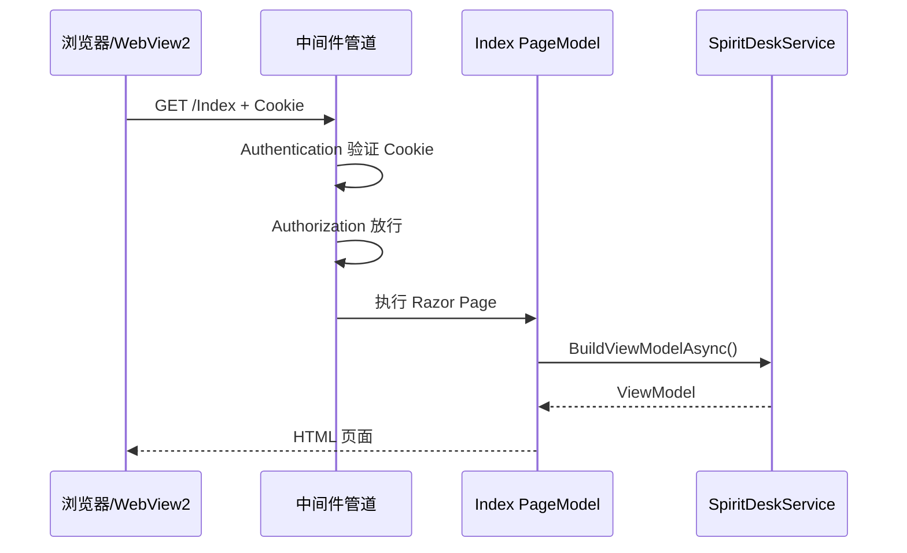

# 03 - 一次请求如何穿过中间件

> 用 SpiritDesk 里四条真实路径，把 [02-本项目中间件管道详解.md](./02-本项目中间件管道详解.md) 里的管道“跑”一遍。

---

## 0. 前提

- Web 已通过 `Program.cs` → `SpiritDeskWebHost.Build()` → `app.Run()` 启动。
- 本地地址例如：`http://127.0.0.1:5188`（端口以实际为准）。
- `SpiritDesk:Auth:Enabled = true`（开发环境常见）。

---

## 场景 1：打开首页 `/` 或 `/Index`（已登录）

### 请求

```http
GET /Index HTTP/1.1
Host: 127.0.0.1:5188
Cookie: SpiritDesk.Auth=密文...
```

### 经过的中间件（简化）

| 顺序 | 中间件 | 发生了什么 |
|------|--------|------------|
| 1 | `UseExceptionHandler` | 正常通过，暂不处理 |
| 2 | `UseForwardedHeaders` | 本地直连，一般无影响 |
| 3 | `UseRouting` | 匹配到 Razor Page `Index` |
| 4 | `UseStaticFiles` | 路径不是静态文件，继续 |
| 5 | `UseAuthentication` | 解密 Cookie → `User = spiritdesk` |
| 6 | `UseAuthorization` | Index 需要登录 → 已通过 |
| 7 | `MapRazorPages` | 执行 `Index.cshtml.cs` → `SpiritDeskService.BuildViewModelAsync()` |
| 响应 | HTML | 返回工作台页面 |

### 时序图



---

## 场景 2：加载样式 `/css/site.css`（已登录或未登录均可）

### 请求

```http
GET /css/site.css HTTP/1.1
```

### 经过的中间件

| 顺序 | 中间件 | 发生了什么 |
|------|--------|------------|
| 1～3 | 异常/转发/路由 | 通过 |
| 4 | **`UseStaticFiles`** | 在 `wwwroot/css/site.css` 找到文件 → **直接返回 CSS** |
| 5～7 | 认证/授权/Map | **通常不再执行**（已短路） |

要点：

> 静态资源往往不需要登录；且不必走 Razor，效率更高。

这也是 [11-cshtml与wwwroot一次请求如何生成页面.md](../11-cshtml与wwwroot一次请求如何生成页面.md) 里“页面一条线、CSS 另一条线”的原因。

---

## 场景 3：未登录访问 `/Index`

### 请求

```http
GET /Index HTTP/1.1
（无 Cookie 或 Cookie 无效）
```

| 顺序 | 中间件 | 发生了什么 |
|------|--------|------------|
| 5 | `UseAuthentication` | 没有合法用户 → `User` 匿名 |
| 6 | **`UseAuthorization`** | `AuthorizeFolder("/")` 要求登录 → **拒绝** |
| 响应 | **302** | 跳转到 `LoginPath` = `/Login` |

浏览器 / WebView2 接下来会再发：

```http
GET /Login HTTP/1.1
```

`/Login` 在 `AllowAnonymousToPage` 列表里，授权中间件放行。

---

## 场景 4：桌面浮球调用 `/api/companion/current`

### 请求

```http
GET /api/companion/current HTTP/1.1
Cookie: SpiritDesk.Auth=密文...
```

| 顺序 | 中间件 | 发生了什么 |
|------|--------|------------|
| 1～4 | 异常/转发/路由/静态 | `/api/...` 不是静态文件，继续 |
| 5～6 | 认证 + 授权 | `RequireAuthorization()` → 需登录 |
| 7 | **`MapGet` 端点** | 调用 `SpiritDeskService` + `SpiritPersonaService` |
| 响应 | JSON | 精灵名、心情、立绘 URL 等 |

Shell 里 `CompanionBubbleWindow` 通过 `HttpClient` 访问；Cookie 由 `BuildAuthCookieHeaderAsync` 从 WebView2 同步，见 `MainWindow.xaml.cs`。

若未带 Cookie 且开启门禁：

> 返回 401 或未授权，浮球拿不到数据。

---

## 对比表：四条路径一眼看懂

| 场景 | URL 示例 | 关键中间件 | 终点 | 响应类型 |
|------|----------|------------|------|----------|
| 工作台 | `/Index` | 认证 + 授权 + Razor | PageModel | HTML |
| 样式 | `/css/site.css` | **StaticFiles** | 文件系统 | CSS |
| 未登录 | `/Index` | **Authorization 拦截** | 无（重定向） | 302 → `/Login` |
| 浮球 | `/api/companion/current` | 认证 + 授权 + MapGet | 委托函数 | JSON |

---

## 和 Shell 的关系

```text
MainWindow 启动 dotnet run SpiritDesk.Web
        ↓
同一套 SpiritDeskWebHost 管道
        ↓
WebView2 GET /Index     → 场景 1
WebView2 GET /css/...   → 场景 2
浮球 GET /api/companion/current → 场景 4
```

桌面壳 **不实现** 自己的 ASP.NET 中间件；所有 HTTP 安全检查都在 Web 项目管道里完成。

---

## 答辩一句话

> 打开首页时请求依次经过路由、静态文件、认证和授权中间件，最后由 Razor Page 调 Service 生成 HTML；加载 CSS 则在静态文件中间件直接返回；浮球 API 走同一管道末端的 MapGet，并 RequireAuthorization 与网页共用 Cookie。

上一篇：[02-本项目中间件管道详解.md](./02-本项目中间件管道详解.md)
