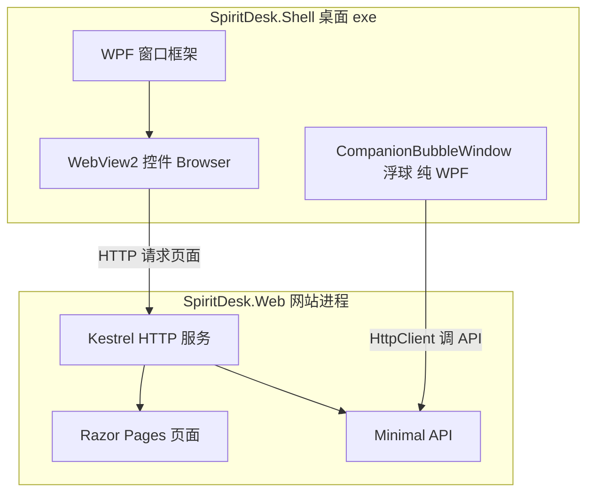

# 01 - WebView2 是什么

## 1. 用一句话说

**WebView2** = 微软提供的一个**控件（组件）**，让你能在 **Windows 桌面程序**里嵌入一块「和小 Edge 浏览器一样」的区域，用来显示网页（HTML / CSS / JavaScript）。

SpiritDesk 主窗口中间那一块「能点链接、能登录、能看精灵」的区域，就是 WebView2。

---

## 2. 它不是什么

| 误解 | 正解 |
|------|------|
| WebView2 = 整个桌面程序 | ❌ 只是窗口里的**一块显示网页的区域** |
| WebView2 会自己启动 Web 服务 | ❌ **不会**。本项目是 Shell 先用 `dotnet` 启动 `SpiritDesk.Web`，再把地址交给 WebView2 |
| WebView2 会随机设端口 | ❌ **不会**。端口由 Shell 或 `launchSettings.json` 决定 |
| WebView2 = 前端框架 | ❌ 它是**宿主**，里面跑的还是普通网页（Razor 生成的 HTML） |
| 必须用 WebView2 才能写桌面软件 | ❌ 也可以纯 WPF 画界面，或 Electron 等别的方案 |

---

## 3. 和 Edge / Chrome 的关系

WebView2 底层用的是 **Chromium 内核**（和 Microsoft Edge 同系）。

可以粗略理解成：

```text
你的 WPF 窗口
  └── WebView2 控件（壳）
        └── 内嵌的 Chromium（真正渲染网页）
              └── 加载 http://127.0.0.1:xxxx 的 SpiritDesk 页面
```

| 对比 | 独立 Edge 浏览器 | WebView2 |
|------|------------------|----------|
| 谁打开 | 用户点 Edge 图标 | 你的 `.exe` 里的窗口 |
| 地址栏 | 有 | 一般没有（你程序控制跳哪） |
| Cookie / 缓存 | Edge 用户配置里 | **WebView2 自己的一份**，和外面 Edge 默认不共用 |
| 适合 | 上网 | **桌面软件里嵌网页** |

---

## 4. 为什么桌面程序要嵌网页

很多现代桌面应用采用 **「桌面壳 + Web 界面」**：

| 好处 | 说明 |
|------|------|
| UI 好做 | 页面用 HTML/CSS，改样式、做响应式比纯 WPF 省事 |
| 前后端一套 | 同一套 `SpiritDesk.Web` 既能浏览器打开，也能塞进桌面 |
| 业务集中 | 登录、数据库、API 都在 Web 项目，桌面只管窗口和系统能力 |

SpiritDesk 就是这种架构：**WPF 负责窗口和浮球，WebView2 负责显示网站界面**。

---

## 5. WebView2 在本项目里的物理位置

文件：`src/SpiritDesk.Shell/MainWindow.xaml`

```xml
xmlns:wv2="clr-namespace:Microsoft.Web.WebView2.Wpf;assembly=Microsoft.Web.WebView2.Wpf"
...
<wv2:WebView2 x:Name="Browser" />
```

- **XAML 标签** `wv2:WebView2`：在界面里占一块区域  
- **C# 名字** `Browser`：代码里用 `Browser.Source`、`Browser.CoreWebView2` 操作  

NuGet 包：`Microsoft.Web.WebView2`（见 `SpiritDesk.Shell.csproj`）。

---

## 6. 常用 API（本项目用到的）

| 代码 | 作用 |
|------|------|
| `await Browser.EnsureCoreWebView2Async()` | 初始化内嵌浏览器引擎（第一次会稍慢） |
| `Browser.Source = new Uri(baseUrl)` | 让控件打开某个网址（如 `http://127.0.0.1:端口`） |
| `Browser.CoreWebView2.CookieManager.GetCookiesAsync(...)` | 读取当前站点 Cookie（给浮球 API 带登录态） |

「CoreWebView2」可以理解为：**真正干活的浏览器实例**，`WebView2` 控件是它的 WPF 外壳。

---

## 7. 运行时还要装什么

Windows 10/11 上通常已带 **WebView2 Runtime**（随 Edge 更新）。  
若没有，需要安装 [WebView2 Runtime](https://developer.microsoft.com/microsoft-edge/webview2/)，否则 `EnsureCoreWebView2Async` 可能失败。

答辩可说：用户机器需要 WebView2 运行时，和 .NET 9、本程序 exe 是分开的依赖。

---

## 8. 一张总览图



---

## 9. 答辩一句话

> WebView2 是微软的嵌入式浏览器控件，基于 Chromium。SpiritDesk 用 WPF 做桌面窗口，用 WebView2 加载本地 SpiritDesk.Web 站点，这样主界面是网页，桌面壳还能做浮球、起本地服务等系统能力。

下一篇：[02-前端Web与桌面端分工.md](./02-前端Web与桌面端分工.md)
