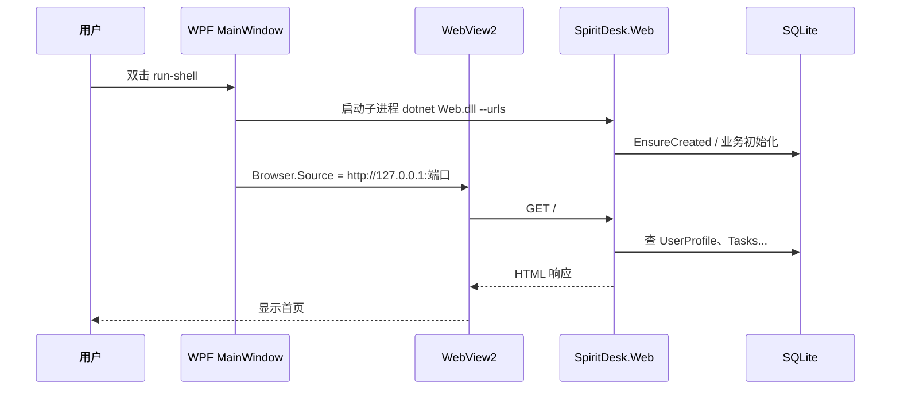

# 02 - 前端 Web 与桌面端分工

## 1. 先分清三个词

| 词 | 在本项目里指什么 |
|----|------------------|
| **前端（界面）** | 用户看到的页面：`.cshtml` 生成的 HTML、`wwwroot` 里的 CSS/JS/图片 |
| **后端（Web 服务）** | `SpiritDesk.Web`：处理请求、登录、数据库、API |
| **桌面端（Shell）** | `SpiritDesk.Shell`：WPF 窗口、WebView2、桌面浮球、启动本地 Web 进程 |

注意：**「前端」不等于「桌面」**。  
SpiritDesk 的前端页面跑在 **WebView2 里**；桌面端是 **托着 WebView2 的壳**。

---

## 2. 两种使用方式，同一套 Web

```text
方式 A：只跑 Web（run-web.ps1）
  用户 → Chrome/Edge 浏览器 → SpiritDesk.Web

方式 B：跑桌面（run-shell.ps1）
  用户 → SpiritDesk.Shell.exe
           → WebView2 里打开 SpiritDesk.Web
           → 另有一个 WPF 浮球窗口
```

**同一套** Razor 页面、`wwwroot` 静态资源、登录逻辑、SQLite。  
差别只在 **谁来显示网页**、**有没有桌面浮球**。

---

## 3. 四层结构（建议背下来）

```text
┌─────────────────────────────────────────┐
│  SpiritDesk.Shell（桌面层）              │
│  WPF 窗口、WebView2、浮球、起 Web 进程   │
└─────────────────┬───────────────────────┘
                  │ HTTP
┌─────────────────▼───────────────────────┐
│  SpiritDesk.Web（Web 服务层）            │
│  Kestrel、Razor Pages、认证、API         │
└─────────────────┬───────────────────────┘
                  │ EF Core
┌─────────────────▼───────────────────────┐
│  spiritdesk.db（数据层）                 │
└─────────────────────────────────────────┘

SpiritDesk.Core：实体类，Web 和 Shell 共用定义
```

| 层 | 技术 | 负责 |
|----|------|------|
| 桌面层 | WPF + WebView2 | 窗口、嵌网页、浮球、启动/杀 Web 子进程 |
| Web 层 | ASP.NET Core | 页面、登录、业务服务、JSON API |
| 数据层 | SQLite + EF | 账号、档案、任务、聊天 |
| 共享层 | Core 类库 | `WebAccount`、`UserProfile` 等实体 |

---

## 4. 什么算「前端工作」、什么算「桌面工作」

### 偏前端 / Web（在 SpiritDesk.Web）

| 内容 | 位置 |
|------|------|
| 页面长什么样 | `Pages/*.cshtml`、`wwwroot/css/site.css` |
| 登录注册表单 | `Login.cshtml`、`Register.cshtml` |
| 侧边栏、首页布局 | `_Layout.cshtml`、各页面 |
| 页面内小交互 | `wwwroot/js/site.js` |
| 精灵图片 | `wwwroot/assets/images/` |

### 偏桌面（在 SpiritDesk.Shell）

| 内容 | 位置 |
|------|------|
| 主窗口外框、顶栏「SpiritDesk」 | `MainWindow.xaml` |
| 中间嵌网页的区域 | `WebView2` |
| 启动本地 Web、等服务器就绪 | `MainWindow.xaml.cs` |
| 桌面浮球、拖拽、置顶 | `CompanionBubbleWindow.xaml(.cs)` |
| 浮球调 `/api/companion/*` | `CompanionBubbleWindow.xaml.cs` + `HttpClient` |

### 两边都要懂一点的

| 内容 | 说明 |
|------|------|
| 登录 Cookie | Web 签发；WebView2 存储；浮球从 WebView2 读 Cookie 调 API |
| 端口 | Shell 随机端口 + 传给 Web；浏览器模式固定 5160 |

---

## 5. 请求从用户点击到数据显示

以「桌面模式打开首页」为例：



网页里的按钮、表单 POST，仍然是 **WebView2 → SpiritDesk.Web**，不经过 WPF 画按钮。

---

## 6. 浮球为什么不用 WebView2

`CompanionBubbleWindow` 是 **纯 WPF**（XAML 画圆球、面板、按钮），里面**没有** WebView2。

原因：

- 要系统级置顶、透明、拖拽、不占浏览器区域；
- 只需少量状态（精灵名、心情），用 **HTTP API** 拉 JSON 即可。

```text
浮球 (WPF)  --HttpClient-->  /api/companion/current  (SpiritDesk.Web)
主窗口 (WebView2)  -------->  /Index 等 Razor 页面     (SpiritDesk.Web)
```

---

## 7. 和「纯网站」的能力对比

| 能力 | 浏览器打开 Web | Shell + WebView2 |
|------|----------------|------------------|
| 访问首页、聊天、任务 | ✅ | ✅ |
| 登录注册（门禁开时） | ✅ | ✅ |
| 系统桌面浮球 | ❌（仅网页内悬浮组件） | ✅ WPF 浮球 |
| 自动启动本地 Web | ❌ 需自己 run-web | ✅ Shell 自动起 |
| 窗口标题栏、原生窗口 | 浏览器标签 | 独立 exe |

---

## 8. 答辩可用说法

> 我们把界面主要放在 Web 项目里用 Razor Pages 和静态资源实现，桌面项目用 WPF 提供原生窗口和 WebView2 嵌入同一站点，另外用纯 WPF 做系统浮球并通过 API 与后端同步状态。这样前后端逻辑集中在一套 Web 服务里，桌面只负责宿主和系统级交互。

下一篇：[03-本项目WebView2怎么用.md](./03-本项目WebView2怎么用.md)
