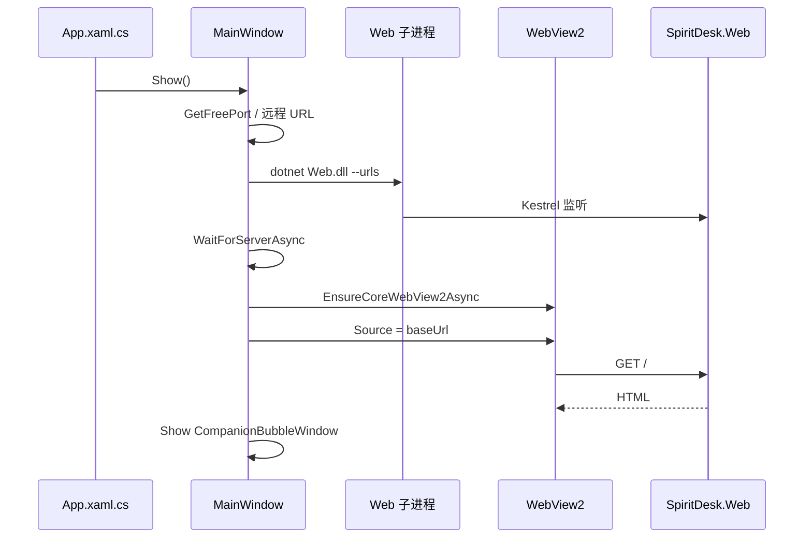

# 03 - 本项目 WebView2 怎么用

本文对照 SpiritDesk 仓库里的真实文件，说明 WebView2 从启动到显示页面的完整过程。

---

## 1. 涉及文件

| 文件 | 作用 |
|------|------|
| `SpiritDesk.Shell.csproj` | 引用 `Microsoft.Web.WebView2` 包 |
| `MainWindow.xaml` | 放置 `<wv2:WebView2 x:Name="Browser" />` |
| `MainWindow.xaml.cs` | 起 Web 进程、初始化 WebView2、设 `Source`、读 Cookie |
| `SpiritDesk.Web` | 被加载的网站（不是 WebView2 的一部分） |
| `CompanionBubbleWindow.*` | 浮球（不用 WebView2） |

---

## 2. XAML：把浏览器嵌进窗口

```7:8:src/SpiritDesk.Shell/MainWindow.xaml
        xmlns:wv2="clr-namespace:Microsoft.Web.WebView2.Wpf;assembly=Microsoft.Web.WebView2.Wpf"
```

```48:48:src/SpiritDesk.Shell/MainWindow.xaml
            <wv2:WebView2 x:Name="Browser" />
```

布局结构：

```text
Window
  ├── 顶栏 Border（WPF TextBlock：标题、StatusText）
  └── 内容 Border
        └── WebView2（整块显示网页）
```

顶栏是 **WPF 原生控件**；下面整块是 **网页**。

---

## 3. 启动顺序（OnLoaded）

`MainWindow` 加载时执行 `OnLoaded`（简化步骤）：

| 步骤 | 代码意图 |
|------|----------|
| 1 | `ResolveBaseUrl` → 本地随机端口 或 云端 URL |
| 2 | 本地模式：`StartWebProcess` 启动 `SpiritDesk.Web.dll` |
| 3 | `WaitForServerAsync` 轮询直到 HTTP 能访问 |
| 4 | `await Browser.EnsureCoreWebView2Async()` 初始化 WebView2 |
| 5 | `Browser.Source = new Uri(baseUrl)` 打开站点根路径 |
| 6 | 创建并显示 `CompanionBubbleWindow` |

核心片段：

```csharp
await Browser.EnsureCoreWebView2Async();
Browser.Source = new Uri(baseUrl);
```

**顺序不能乱**：必须先有 Web 服务在监听，再让 WebView2 去访问，否则白屏或报错。

---

## 4. WebView2 里实际打开的是什么 URL

| 模式 | baseUrl 示例 | 用户看到 |
|------|--------------|----------|
| 本地 Shell | `http://127.0.0.1:52401` | 该端口下的 SpiritDesk 首页 |
| 云端 | `https://你的域名` | 远程站点 |
| 门禁开 | 可能先被重定向到 `/Login` | 登录页 |

WebView2 **不会**自动加路径；首次是根路径 `/`，后续跳转由 **网页里的链接和服务器重定向** 完成（和浏览器一样）。

---

## 5. 关闭程序时发生什么

`OnClosing`：

1. 关闭浮球窗口  
2. 释放 `HttpClient`  
3. 若存在本地 Web 子进程 → `Kill(entireProcessTree: true)`  

WebView2 随 WPF 窗口销毁而释放；**本地 Web 进程必须显式杀掉**，否则会残留后台 `dotnet` 进程。

---

## 6. Cookie：WebView2 和浮球怎么配合

登录成功后，`SpiritDesk.Auth` Cookie 存在 **WebView2 的 Cookie 存储**里。

浮球用 `HttpClient` 调 API 时**不会自动**带上 WebView2 的 Cookie，所以 `MainWindow` 提供了：

```csharp
BuildAuthCookieHeaderAsync(baseUrl)
// 从 Browser.CoreWebView2.CookieManager 读取 SpiritDesk.Auth
// 拼成 Cookie 请求头给浮球用
```

仅在 **云端且需要登录** 等场景需要把登录态带给 API；本地免登录模式通常不需要。

---

## 7. 时序图（桌面 + WebView2）



---

## 8. 和 `run-web.ps1` 的对比

| 项目 | run-web | run-shell |
|------|---------|-----------|
| 谁显示页面 | 系统浏览器 | WebView2 |
| 谁起 Web | `dotnet run` 直接 | Shell 子进程 |
| 端口 | 5160（launchSettings） | 随机 127.0.0.1 |
| WebView2 | 不用 | 用 |

**网站代码完全相同**；只是宿主从 Chrome 换成 WebView2。

---

## 9. 常见问题

**Q：改 cshtml 后 Shell 里还是旧页面？**  
先重新编译 `SpiritDesk.Web`，再启动 Shell；子进程加载的是 `bin/Release/net9.0/SpiritDesk.Web.dll`。

**Q：WebView2 白屏？**  
看 `StatusText` 是否「启动失败」；常见原因：Web 子进程没起来、端口未就绪、WebView2 Runtime 未装。

**Q：浮球和主窗口数据不一致？**  
浮球走 API 轮询；主窗口走 Razor 页面；两者应连同一 `baseUrl` 和同一数据库。

下一篇：[04-端口Cookie与本地Web子进程.md](./04-端口Cookie与本地Web子进程.md)
