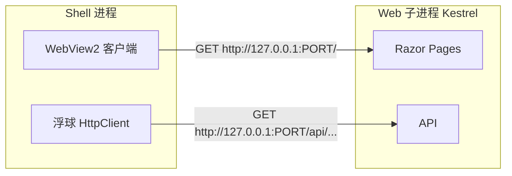

# 04 - 端口、Cookie 与本地 Web 子进程

本文专门回答和 WebView2 **配套** 的三个容易混在一起的点：**谁设端口、Web 子进程是什么、Cookie 存在哪**。

---

## 1. WebView2 不设端口

再次强调：

| 组件 | 是否监听 HTTP 端口 |
|------|-------------------|
| WebView2 | ❌ 否，只是客户端 |
| SpiritDesk.Web（Kestrel） | ✅ 是，真正提供网页服务 |
| SpiritDesk.Shell | ❌ 本身不提供网页，但会 **启动** Web 并指定 `--urls` |

WebView2 只做一件事：向某个 `http://...` **发请求并显示结果**。

---

## 2. 端口三种来源

### 2.1 桌面本地模式（run-shell）

```csharp
var port = GetFreePort();  // 系统分配空闲端口
return $"http://127.0.0.1:{port}";
```

```csharp
Arguments = $"\"{webEntryAssembly}\" --urls {baseUrl}"
```

- **每次启动可能不同**（如 5188、52401）  
- 目的：避免固定端口被占用导致启动失败  

### 2.2 只跑 Web（run-web）

`launchSettings.json`：

```json
"applicationUrl": "http://localhost:5160"
```

- **固定 5160**（控制台会打印实际 URL）  

### 2.3 云端模式

环境变量 `SPIRITDESK_REMOTE_BASEURL=https://example.com`  

- WebView2 直接打开该地址  
- **不启动**本地 Web 子进程  

---

## 3. 本地 Web 子进程是什么

`run-shell.ps1` 启动的是 **WPF exe**，不是直接启动网站。

在 `MainWindow.OnLoaded` 里又启动了一个 **子进程**：

```text
dotnet "...\SpiritDesk.Web.dll" --urls http://127.0.0.1:端口
```

可以理解成：

```text
父进程：SpiritDesk.Shell.exe（窗口 + WebView2 + 浮球）
子进程：dotnet SpiritDesk.Web.dll（真正的网站服务器）
```

| 角色 | 进程 |
|------|------|
| 你看到的窗口 | Shell |
| 提供 /Index、/Login、API 的 | Web 子进程 |

关掉 Shell 窗口时，代码会 **Kill** 这个子进程，避免后台残留。

---

## 4. 一张「端口 + 进程」关系图



**PORT** 由 Shell 的 `GetFreePort()` 决定，通过 `--urls` 传给子进程。

---

## 5. Cookie 存在哪（和 WebView2 的关系）

| 存储位置 | 内容 |
|----------|------|
| SQLite `WebAccounts` | 账号、密码哈希（长期） |
| WebView2 Cookie 库 | `SpiritDesk.Auth` 登录会话（临时，有过期） |

流程：

1. 用户在 **WebView2 里** 打开 `/Login` 并登录成功；  
2. **Web 子进程** 响应 `Set-Cookie`；  
3. **WebView2** 把 Cookie 存到本机（按 `127.0.0.1:端口`）；  
4. 之后 WebView2 访问同站点自动带 Cookie；  
5. Web 子进程验证 Cookie → 知道当前用户。

详细概念见 [auth/05-Cookie四个概念详解.md](../auth/05-Cookie四个概念详解.md)。

---

## 6. 端口变了为什么像「没登录」

Cookie 作用域包含 **端口**：

- 上次：`http://127.0.0.1:5188` 登录  
- 这次：`http://127.0.0.1:52401` 启动  

→ WebView2 视为**新站点**，不带旧 Cookie → 要重新登录（账号仍在数据库）。

**不是 WebView2 清空了账号**，是 **会话 Cookie 绑在旧端口上**。

若要答辩演示登录且少踩坑，可用 `run-web.ps1`（固定 5160）或 `run-shell-with-auth.ps1` 并说明端口随机的影响。

---

## 7. 环境变量对 Web 子进程的影响

Shell 启动子进程时还会设：

| 变量 | 典型效果 |
|------|----------|
| `ASPNETCORE_ENVIRONMENT=Development` | 合并 `appsettings.Development.json` |
| `SpiritDesk__Auth__Enabled=false` | 默认 run-shell **关闭**登录页 |
| `SPIRITDESK_REQUIRE_AUTH=1` | 不覆盖 Auth，**保留**登录注册 |

这些影响 **Web 子进程** 的行为，WebView2 只是显示结果。

---

## 8. 自检清单

1. 看 Shell 窗口 `StatusText`：`本地服务已启动：http://127.0.0.1:xxxx` → 记下端口  
2. 任务管理器是否有多一个 `dotnet`（Web 子进程）  
3. 浏览器开发者工具（WebView2 可开 DevTools）→ Application → Cookies → 是否有 `SpiritDesk.Auth`  
4. 数据库路径：`SpiritDesk.Web/bin/Release/net9.0/data/spiritdesk.db`（Shell 常用 Release）

返回目录：[README.md](./README.md)
