# SpiritDesk 项目汇总：架构层次、类关系与控件交互流程

本文汇总当前 `DesktopCompanion / SpiritDesk` 项目的整体分层、主要类/窗口关系、控件交互时序与技术栈选型。项目定位是一个“桌面精灵伴侣 Agent”应用：既可以作为 ASP.NET Core Web 站点运行，也可以由 Windows WPF Shell 承载为桌面应用，并提供系统级桌面浮球。

## 1. 项目层次

### 1.1 解决方案与工程划分

当前解决方案由三个主要 .NET 工程组成：

| 层次 | 工程/目录 | 类型 | 职责 |
| --- | --- | --- | --- |
| 核心模型层 | `src/SpiritDesk.Core` | .NET 类库，`net9.0` | 存放实体模型、精灵 ID 常量；不依赖 UI、Web、数据库实现细节 |
| Web 应用层 | `src/SpiritDesk.Web` | ASP.NET Core Web，`net9.0` | Razor Pages 页面、业务服务、EF Core 数据访问、Cookie 登录、Companion API、静态资源 |
| 桌面宿主层 | `src/SpiritDesk.Shell` | WPF 桌面应用，`net9.0-windows` | 启动/连接 Web 站点，使用 WebView2 嵌入网页，并提供桌面浮球窗口 |
| 文档层 | `docs` | Markdown | 项目结构、C#、数据库、Web 页面、认证、部署等说明 |
| 部署与脚本 | `deploy`、根目录 `run-*.ps1` | 配置/脚本 | 本地运行、云端部署、Nginx/systemd 等运行辅助 |

工程引用关系如下：

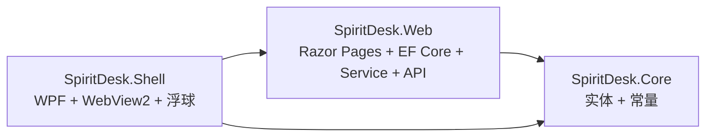

关键点：

- `SpiritDesk.Core` 是最底层共享库，被 `Web` 和 `Shell` 引用。
- `SpiritDesk.Web` 引用 `Core`，负责业务闭环与页面渲染。
- `SpiritDesk.Shell` 同时引用 `Core` 和 `Web`，目的是在桌面启动时能确保 Web 工程被构建，并通过 WebView2 加载同一个 Web 站点。
- `Web` 不引用 `Shell`，因此云端部署时只需要部署 `SpiritDesk.Web`。

### 1.2 Web 层内部结构

`SpiritDesk.Web` 内部可以继续拆成以下子层：

| 子层 | 代表目录/文件 | 职责 |
| --- | --- | --- |
| 宿主启动层 | `Program.cs`、`SpiritDeskWebHost.cs` | 构建 `WebApplication`，注册 DI、EF、Razor Pages、认证、健康检查和 Minimal API |
| 页面层 | `Pages/*.cshtml`、`Pages/*.cshtml.cs` | Razor Pages 视图与 PageModel，处理 GET/POST 表单 |
| 业务服务层 | `Services/SpiritDeskService.cs`、`SpiritPersonaService.cs`、`LlmReplyService.cs` | 统一处理任务、聊天、互动、精灵选择、LLM 回复等业务逻辑 |
| 数据访问层 | `Data/SpiritDeskDbContext.cs` | EF Core DbContext，映射实体到 SQLite 表 |
| 认证层 | `Auth/SpiritDeskAuthHelper.cs`、`WebAccountAuth.cs` | Cookie 登录开关、注册开关、用户名规范化和校验 |
| 展示模型层 | `Models/*.cs` | 页面 ViewModel、操作反馈 DTO、Companion API 请求模型 |
| 辅助层 | `Helpers/*.cs` | 数据库兼容引导、时间问候、`.env` 加载 |
| 静态资源层 | `wwwroot/css`、`wwwroot/js`、`wwwroot/assets` | 页面样式、前端交互脚本、精灵图片资源 |

### 1.3 Shell 层内部结构

`SpiritDesk.Shell` 主要包含两个窗口和一个配置服务：

| 类/文件 | 类型 | 职责 |
| --- | --- | --- |
| `App.xaml` / `App.xaml.cs` | WPF Application | 应用入口，启动时手动创建并显示 `MainWindow` |
| `MainWindow.xaml` / `MainWindow.xaml.cs` | WPF 主窗口 | 启动本地 Web 子进程或连接远端站点，等待服务就绪，WebView2 加载页面，并创建桌面浮球 |
| `CompanionBubbleWindow.xaml` / `.xaml.cs` | WPF 浮球窗口 | 常驻桌面，支持拖拽、展开/收起、右键切换精灵、轮询 Web API 同步状态 |
| `ShellSettings.cs` | JSON DTO | 保存浮球位置、展开状态、面板尺寸、主题、置顶状态 |
| `ShellSettingsService.cs` | 配置服务 | 从 `%AppData%/SpiritDesk/shell-settings.json` 读写浮球设置 |

## 2. 技术栈选型

### 2.1 后端与 Web

| 技术 | 项目中的用途 | 选型原因 |
| --- | --- | --- |
| .NET 9 / C# | 三个工程统一使用 | 语言、运行时和桌面/Web 技术栈一致，便于共享实体和服务模型 |
| ASP.NET Core Razor Pages | `SpiritDesk.Web` 页面渲染 | 页面以表单驱动为主，Razor Pages 的 `cshtml + PageModel` 模式比完整 MVC 更轻量 |
| Minimal API | `/api/companion/current`、`/api/companion/select-spirit` | 为桌面浮球提供小型 JSON API，无需额外 Controller |
| EF Core | 数据访问 | 通过实体类映射 SQLite，适合任务、聊天、档案等本地数据 |
| SQLite | 本地持久化数据库 | 零部署、文件型数据库，适合桌面演示；账号、档案、任务、聊天等数据都保存在本地文件中 |
| Cookie Authentication | 登录注册门禁 | Web 端和 Shell WebView2 可共享 Cookie；登录用户名用于绑定各自的养成档案 |
| ASP.NET Identity PasswordHasher | `WebAccount` 密码哈希 | 避免自写密码哈希，注册/登录安全性更可靠 |
| HttpClient + OpenAI 兼容 Chat Completions | `LlmReplyService` | 可接入 OpenAI 兼容模型或火山 Ark；失败时使用规则回复兜底 |

### 2.2 桌面端

| 技术 | 项目中的用途 | 选型原因 |
| --- | --- | --- |
| WPF | `SpiritDesk.Shell` 桌面窗口和浮球 | 适合 Windows 原生桌面窗口、透明浮窗、置顶、拖拽等系统级体验 |
| WebView2 | `MainWindow` 内嵌 Web 页面 | 复用已有 Razor Pages UI，不需要为桌面端重写一套完整界面 |
| DispatcherTimer | 浮球单击延迟与状态轮询 | 与 WPF UI 线程模型匹配，适合周期性刷新和单击/双击区分 |
| `%AppData%` JSON 配置 | 保存浮球状态 | 用户级配置与数据库分离，位置/主题等 Shell 设置不进入 EF 数据库 |

### 2.3 前端资源

| 技术 | 项目中的用途 | 选型原因 |
| --- | --- | --- |
| Razor + Tag Helpers | 表单提交、链接生成、模型绑定 | 与 PageModel 的 `asp-page-handler` 直接对应，减少手写路由 |
| 原生 JavaScript | `site.js`、`desk-calendar.js` | 项目交互较轻，无需引入前端构建链 |
| CSS 自定义变量 | 精灵主题色、布局样式 | 根据当前精灵 `AccentColor` 动态改变页面风格 |
| localStorage | 侧栏折叠状态 | 属于浏览器 UI 偏好，不需要进入后端数据库 |

## 3. 主要类、窗口和页面关系

### 3.1 继承关系

| 类 | 继承/基类 | 说明 |
| --- | --- | --- |
| `App` | `System.Windows.Application` | WPF 应用入口 |
| `MainWindow` | `System.Windows.Window` | 桌面主窗口，承载 WebView2 |
| `CompanionBubbleWindow` | `System.Windows.Window` | 桌面浮球窗口 |
| `SpiritDeskDbContext` | `Microsoft.EntityFrameworkCore.DbContext` | EF Core 数据上下文 |
| `IndexModel`、`ChatModel`、`AssistantModel`、`SettingsModel`、`SelectModel`、`LoginModel`、`RegisterModel` 等 | `Microsoft.AspNetCore.Mvc.RazorPages.PageModel` | Razor Pages 的后台逻辑类 |
| `SpiritIds`、`SpiritDeskWebHost`、`SpiritDeskAuthHelper`、`WebAccountAuth`、`DateTimeHelper`、`DotEnvLoader`、`DatabaseBootstrapper` | `static class` | 工具/常量/宿主组装类，不需要实例化 |
| `ShellSettings`、`ShellSettingsService`、`CompanionSelectBody` | `sealed class` | 明确不作为继承基类使用 |

### 3.2 Core 实体关系

`SpiritDesk.Core` 中的类都是 POCO 实体或常量，它们不直接依赖 EF Core，但会被 `SpiritDeskDbContext` 映射成表。

| 实体 | 表/角色 | 关键关系 |
| --- | --- | --- |
| `UserProfile` | 用户档案 | `AccountUsername` 绑定登录账号，`CurrentSpiritId` 指向 `SpiritDefinition.Id`，保存心情、亲密度、等级、金币等养成状态 |
| `SpiritDefinition` | 精灵定义 | `Id` 与 `SpiritIds` 常量一致，保存五精灵静态配置、文案、人设和数值加成 |
| `TaskItem` | 待办任务 | `UserProfileId` 指向所属档案，完成后只影响该档案的心情、亲密度、金币、等级 |
| `ChatMessage` | 聊天消息 | `UserProfileId` 隔离不同账号的聊天，`SpiritId` 指向精灵会话，`Sender` 区分 `user` / `spirit` |
| `DailyActionLog` | 每日互动计数 | 通过 `UserProfileId + ActionDate + ActionType` 记录每个档案的签到、投喂、猜拳等次数 |
| `WebAccount` | Web 登录账号 | 保存用户名和密码哈希；注册时同步创建 `UserProfile`，登录后业务层按用户名找到对应档案 |
| `SpiritIds` | 常量集合 | 防止 `"light"`、`"water"` 等魔法字符串散落在代码中 |

逻辑关系图：

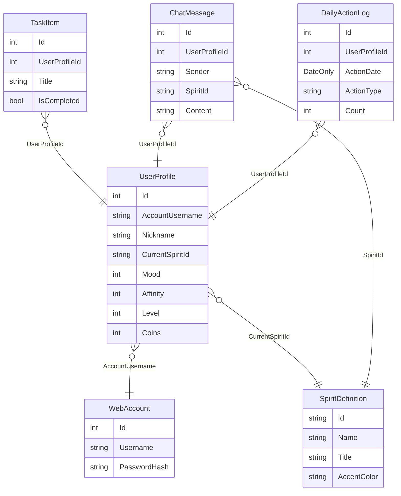

说明：`UserProfile.AccountUsername` 与 `WebAccount.Username` 使用同一套规范化规则；任务、聊天和互动日志通过 `UserProfileId` 与当前档案关联。

### 3.3 Web 服务组合关系

`SpiritDeskService` 是 Web 业务的核心协调者，PageModel 通常只做薄封装。

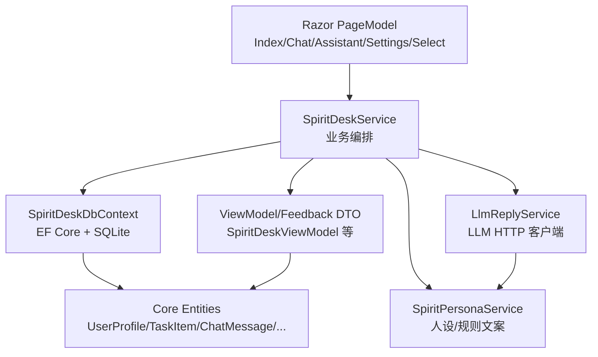

主要调用关系：

- `IndexModel` 调用 `SpiritDeskService.BuildViewModelAsync()` 展示首页；POST 时调用 `AddTaskAsync`、`CompleteTaskAsync`、`SendMessageAsync`、`PerformActionAsync`、`PlayGameAsync` 等。
- `ChatModel` 调用 `BuildChatHistoryViewModelAsync()` 展示聊天历史；发送消息时调用 `SendMessageAsync(message, spiritId)`。
- `AssistantModel` 复用 `BuildViewModelAsync()` 和 `PerformActionAsync()`。
- `SettingsModel` 调用 `BuildSettingsViewModelAsync()`、`RenameAsync()`、`SelectSpiritAsync()`、`ResetDemoDataAsync()`。
- `SelectModel` 首次建档时先 `RenameAsync()`，再 `SelectSpiritAsync()`。
- `LoginModel` / `RegisterModel` 直接使用 `SpiritDeskDbContext`、`WebAccountAuth`、`IPasswordHasher<WebAccount>` 处理账号登录注册；注册成功时同步创建同名 `UserProfile`。
- `SpiritDeskService` 通过当前 Cookie 中的用户名定位 `UserProfile`，再过滤任务、聊天和每日互动数据，避免不同账号共享同一档案。

### 3.4 Shell 窗口组合关系

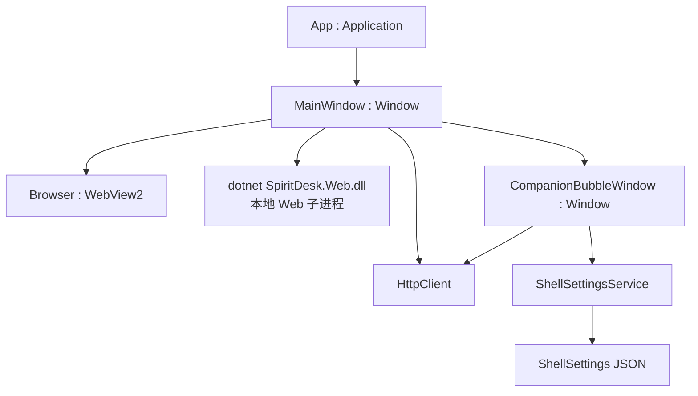

关键包含关系：

- `App.OnStartup()` 创建 `MainWindow`。
- `MainWindow` 持有 `_webProcess`、`_httpClient` 和 `_companionBubble`。
- `MainWindow` 的 XAML 中包含 `Browser : WebView2`。
- `MainWindow` 创建 `CompanionBubbleWindow(baseUrl, httpClient, this, BuildAuthCookieHeaderAsync)`。
- `CompanionBubbleWindow` 持有 `_mainWindow` 引用，用于双击/按钮打开主窗口。
- `CompanionBubbleWindow` 持有 `ShellSettingsService`，用于加载和保存浮球状态。
- `CompanionBubbleWindow` 通过 `HttpClient` 调用 Web 层 `/api/companion/*`。

## 4. 主要控件交互时序流程

### 4.1 桌面 Shell 启动流程

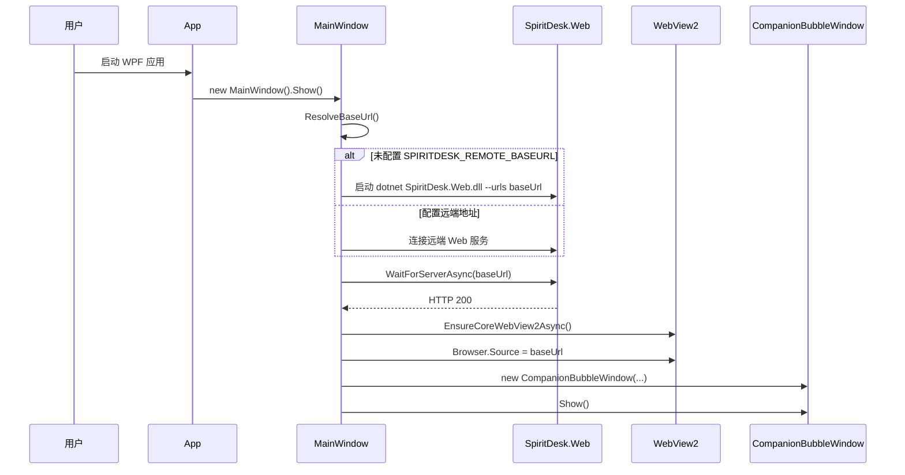

说明：

- 本地模式下，`MainWindow` 会启动 `SpiritDesk.Web.dll` 子进程。
- 远端模式下，`MainWindow` 读取 `SPIRITDESK_REMOTE_BASEURL`，不启动本地 Web 子进程。
- WebView2 加载的是同一个 Razor Pages 站点，所以桌面版和浏览器版共享 Web UI。

### 4.2 首次建档与选择精灵流程

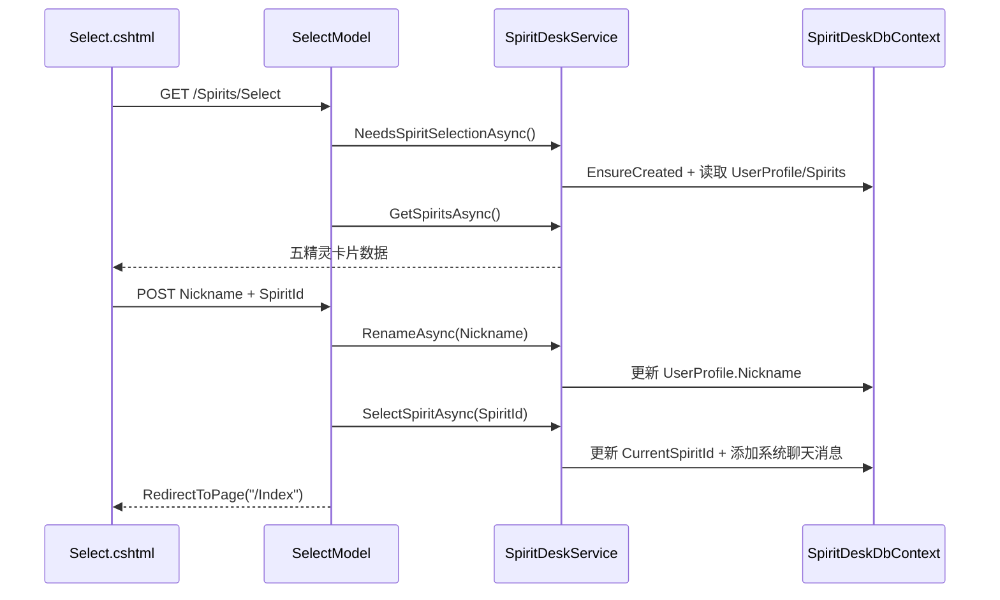

涉及控件：

- `Nickname` 输入框绑定 `SelectModel.Nickname`。
- 每张精灵卡片底部按钮使用 `name="SpiritId" value="@spirit.Id"` 提交选择。
- 如果昵称或精灵为空，`ErrorMessage` 回显在页面。

### 4.3 首页任务新增/编辑/完成/删除流程

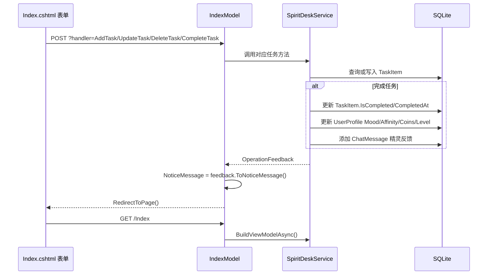

涉及控件：

- 侧栏快速任务表单：`NewTaskTitle`、`NewTaskDescription`、`NewTaskDueAt`。
- 任务列表“完成”按钮：提交 `TaskId` 到 `OnPostCompleteTaskAsync()`。
- 编辑区域 `
` 内表单：提交 `TaskId`、`EditTaskTitle`、`EditTaskDescription`、`EditTaskDueAt`。
- 删除按钮通过 `onsubmit="return confirm(...)"` 做浏览器确认。
- 日历中的完成按钮由 `desk-calendar.js` 动态创建隐藏表单，提交到 `?handler=CompleteTask`。

### 4.4 聊天发送流程

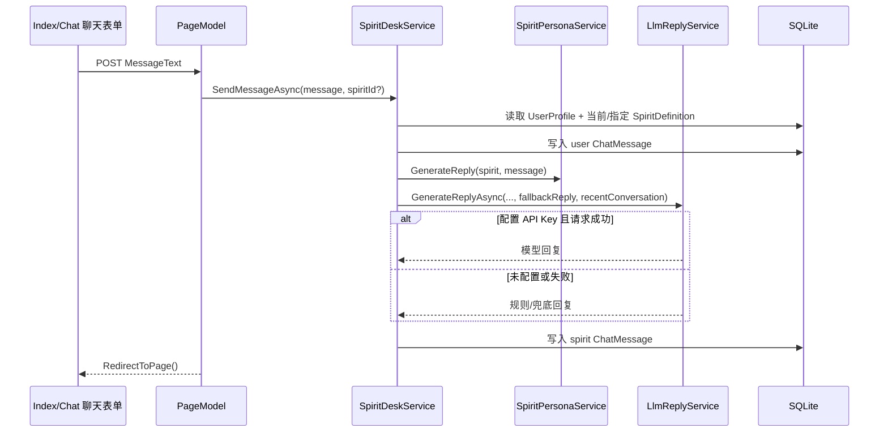

涉及控件：

- 首页聊天摘要区的 `MessageText` 文本框提交到 `IndexModel.OnPostSendMessageAsync()`。
- 聊天页发送框提交到 `ChatModel.OnPostSendMessageAsync()`，同时保留当前 `SpiritId`。
- 聊天页左侧精灵池按钮提交到 `OnPostSwitchSpiritAsync()`，本质是切换 URL 查询参数，不立即修改全局当前精灵。

### 4.5 签到、投喂、互动、猜拳流程

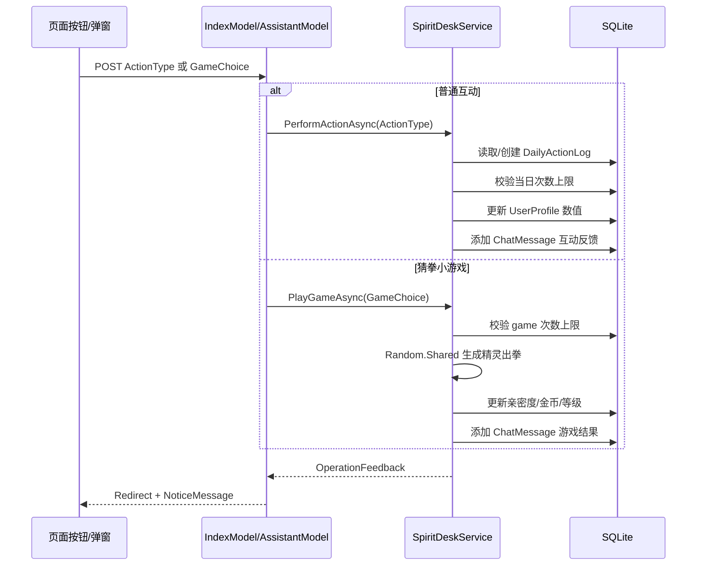

涉及控件：

- `site.js` 负责打开/关闭猜拳弹窗：点击 `.game-panel-open` 打开，点击 `[data-close-game-modal]` 或按 `Escape` 关闭。
- 猜拳弹窗内三个按钮分别提交 `GameChoice=rock/paper/scissors` 到 `OnPostPlayGameAsync()`。
- 普通互动按钮提交 `ActionType` 到 `OnPostInteractAsync()`。

### 4.6 桌面浮球展开、拖拽与打开主窗口流程

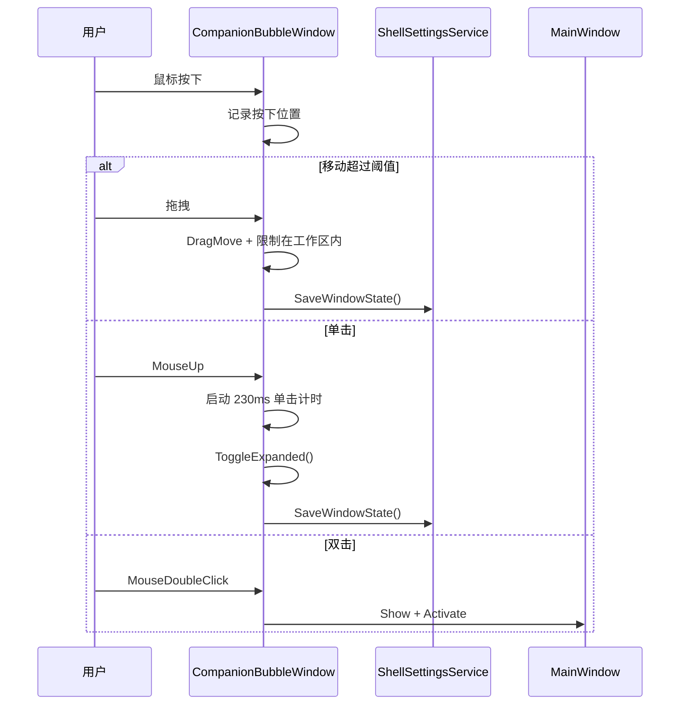

涉及控件：

- `RootDragArea` 绑定 `MouseLeftButtonDown`、`MouseLeftButtonUp`、`MouseMove`。
- `Window` 绑定 `MouseDoubleClick` 和 `SizeChanged`。
- `BubbleView` 是收起圆球，`PanelView` 是展开面板。
- 展开面板内“打开 SpiritDesk”按钮调用 `OpenMainWindow()`。
- “收起面板”按钮调用 `Collapse()`。
- 控件按下时通过 `Control_PreviewMouseLeftButtonDown()` 阻止误触发拖拽/单击展开。

### 4.7 桌面浮球状态同步流程

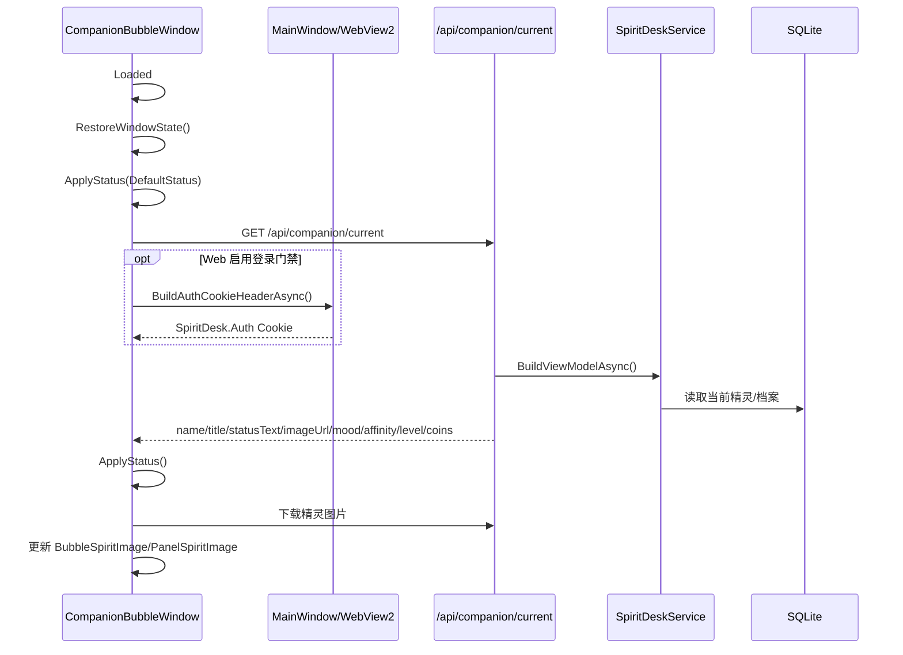

触发状态同步的时机：

- 浮球 `Loaded` 后立即同步一次。
- `_pollTimer` 每 12 秒同步一次。
- 展开面板时调用 `ExpandRefreshAsync()`。
- 主窗口激活时，`MainWindow.Activated` 调用 `CompanionBubbleWindow.NotifyHostActivated()`。
- 右键切换精灵成功后再次 `RefreshStatusAsync()`。

### 4.8 桌面浮球右键菜单切换精灵流程

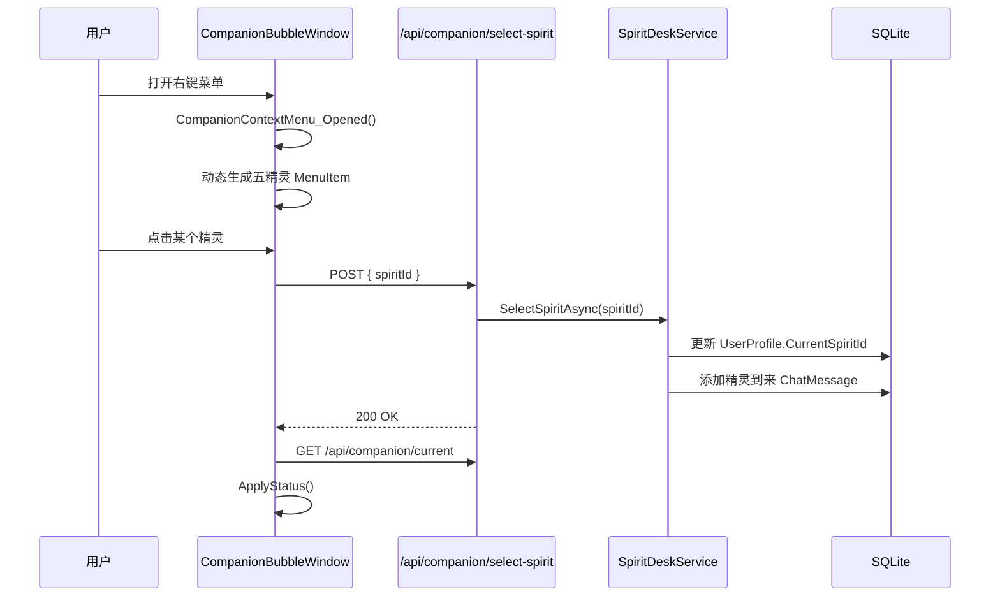

右键菜单还包含：

- “打开 SpiritDesk”：激活 `MainWindow`。
- “重置位置”：回到主屏工作区右下角。
- “切换主题”：在 `mint` 与 `warm` 两套 WPF 颜色之间切换。
- “置顶/取消置顶”：切换 `Topmost`。
- “退出”：关闭主窗口或直接 `Application.Current.Shutdown()`。

### 4.9 Web 页面日历控件流程

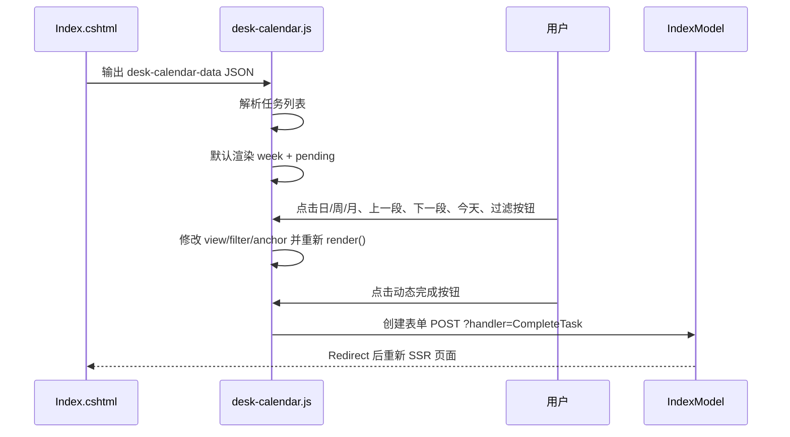

说明：

- 日历只在前端负责视图切换和局部渲染。
- 真正改变任务完成状态仍然回到 Razor Page 的 POST handler，最终由 `SpiritDeskService.CompleteTaskAsync()` 写数据库。

### 4.10 登录注册流程

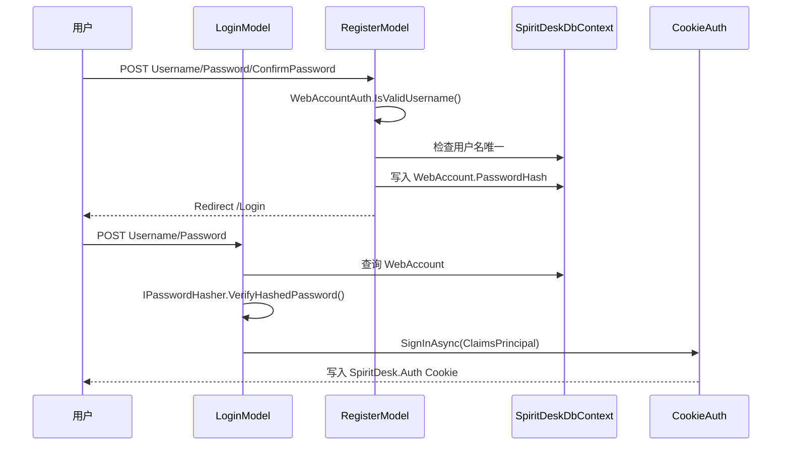

门禁开关由 `SpiritDesk:Auth:Enabled` 控制：

- 关闭时，`Login` / `Register` 会重定向首页。
- 开启时，`SpiritDeskWebHost` 会对根目录 Razor Pages 授权，只放行登录、注册、注销、错误页和隐私页。
- Shell 浮球访问 Companion API 时，如果 WebView2 已登录，会从 CookieManager 读取 `SpiritDesk.Auth` 并附加到 API 请求。

## 5. 页面与 PageModel 对照

| 页面 | PageModel | 主要职责 | 主要 Service 调用 |
| --- | --- | --- | --- |
| `/Index` | `IndexModel` | 精灵主页、任务、聊天摘要、互动、猜拳、日历 | `BuildViewModelAsync`、`AddTaskAsync`、`UpdateTaskAsync`、`DeleteTaskAsync`、`CompleteTaskAsync`、`SendMessageAsync`、`PerformActionAsync`、`PlayGameAsync` |
| `/Chat` | `ChatModel` | 按精灵分线程聊天、完整历史记录 | `BuildChatHistoryViewModelAsync`、`SendMessageAsync` |
| `/Assistant` | `AssistantModel` | 任务助手与互动入口 | `BuildViewModelAsync`、`PerformActionAsync`、`SelectSpiritAsync` |
| `/Settings` | `SettingsModel` | 昵称、切换精灵、重置演示数据 | `BuildSettingsViewModelAsync`、`RenameAsync`、`SelectSpiritAsync`、`ResetDemoDataAsync` |
| `/Spirits/Select` | `SelectModel` | 首次建档、昵称和精灵选择 | `NeedsSpiritSelectionAsync`、`GetSpiritsAsync`、`RenameAsync`、`SelectSpiritAsync` |
| `/Login` | `LoginModel` | 登录、签发 Cookie | 直接使用 `SpiritDeskDbContext`、`WebAccountAuth`、`IPasswordHasher` |
| `/Register` | `RegisterModel` | 注册账号、写入密码哈希 | 直接使用 `SpiritDeskDbContext`、`WebAccountAuth`、`IPasswordHasher` |
| `/Logout` | `LogoutModel` | 注销 Cookie | 使用 ASP.NET Core Authentication |
| `/Privacy`、`/Error` | `PrivacyModel`、`ErrorModel` | 静态说明/错误页 | 无核心业务调用 |

## 6. 数据流闭环

项目核心闭环可以概括为：

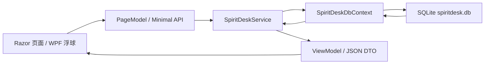

典型数据变化：

- 用户完成任务：当前档案下的 `TaskItem` 状态改变，`UserProfile` 数值增加，追加一条同档案的 `ChatMessage`。
- 用户发消息：追加用户消息，调用 LLM 或规则回复，再追加精灵消息。
- 用户投喂/签到/互动：更新当前档案的 `DailyActionLog` 次数，更新 `UserProfile` 数值，追加精灵反馈。
- 用户切换精灵：更新 `UserProfile.CurrentSpiritId`，追加精灵到来消息。
- 桌面浮球刷新：读取当前 `UserProfile + SpiritDefinition`，以 JSON DTO 返回 WPF。

## 7. 运行形态

### 7.1 本地桌面形态

1. 运行 `SpiritDesk.Shell`。
2. `MainWindow` 启动本地 `SpiritDesk.Web.dll`。
3. WebView2 打开本地地址。
4. `CompanionBubbleWindow` 作为桌面级浮球常驻。
5. SQLite 数据保存在 Web 运行目录下的 `data/spiritdesk.db`，Shell 设置保存在 `%AppData%/SpiritDesk/shell-settings.json`。

### 7.2 浏览器 Web 形态

1. 运行 `SpiritDesk.Web`。
2. 浏览器访问本地或云端站点。
3. 页面内可以显示网页悬浮精灵 `_FloatingCompanion.cshtml`。
4. 该形态没有系统级桌面浮球；系统级浮球只属于 WPF Shell。

### 7.3 云端 + 本地 Shell 形态

1. 云端只部署 `SpiritDesk.Web`。
2. 本地 Shell 设置 `SPIRITDESK_REMOTE_BASEURL` 后连接远端。
3. WebView2 加载远端页面。
4. 桌面浮球通过远端 `/api/companion/*` 同步状态。
5. 如果远端启用认证，浮球通过 WebView2 CookieManager 带上 `SpiritDesk.Auth`。

## 8. 总结

SpiritDesk 的架构特点是“Web 业务优先、桌面 Shell 承载复用”。核心业务、数据、页面都集中在 `SpiritDesk.Web`，`SpiritDesk.Shell` 负责把同一套 Web 体验包装成 Windows 桌面应用，并额外提供系统级浮球能力。`SpiritDesk.Core` 则作为共享模型层，保持低依赖、可复用。

这种结构的优点是：

- Web 端和桌面端共享同一套业务逻辑与页面，维护成本低。
- WPF 只承担桌面系统能力，不重复实现业务页面。
- SQLite + EF Core 适合本地演示和轻量持久化。
- Minimal API 为浮球提供低成本状态同步接口。
- LLM 接入有规则兜底，未配置 API Key 时仍可完整演示。
